# Internship Portal - User Flow & Journey Diagrams

This document contains comprehensive Mermaid diagrams illustrating user flows, journeys, and system interactions for the PlaceIntern Internship Management Portal.

---

## Table of Contents
1. [System Overview](#1-system-overview)
2. [Authentication Flow](#2-authentication-flow)
3. [State Directorate Flows](#3-state-directorate-flows)
4. [Principal Flows](#4-principal-flows)
5. [Teacher (Faculty Mentor) Flows](#5-teacher-faculty-mentor-flows)
6. [Student Flows](#6-student-flows)
7. [System Admin Flows](#7-system-admin-flows)
8. [Grievance Management Flow](#8-grievance-management-flow)
9. [Report Builder Flow](#9-report-builder-flow)
10. [User Journeys](#10-user-journeys)

---

## 1. System Overview

### 1.1 High-Level System Architecture

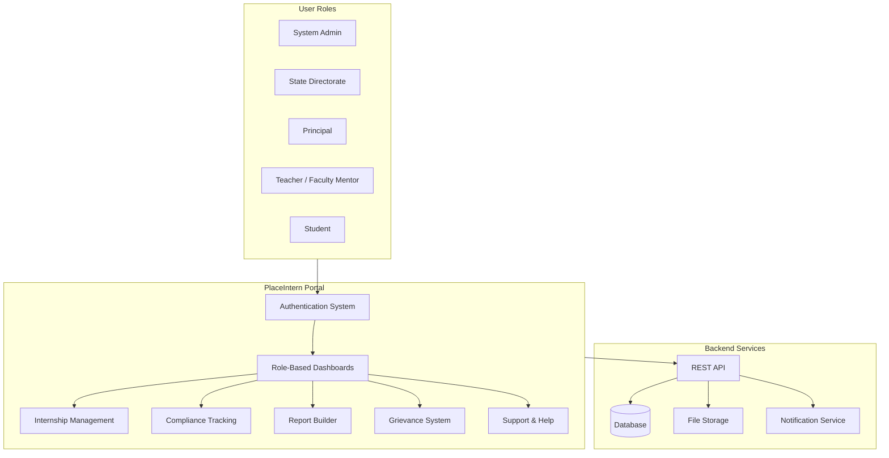

### 1.2 Role Hierarchy & Access Control

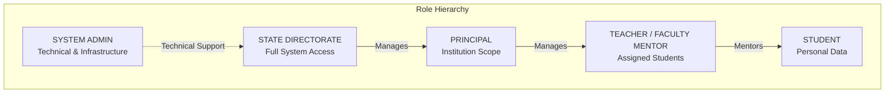

### 1.3 Portal Feature Map

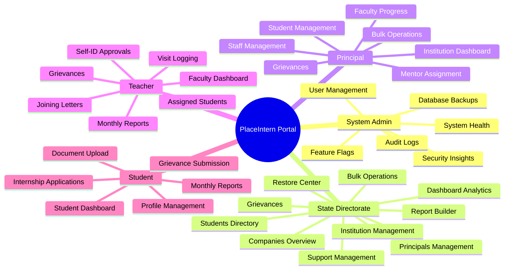

---

## 2. Authentication Flow

### 2.1 Login Flow

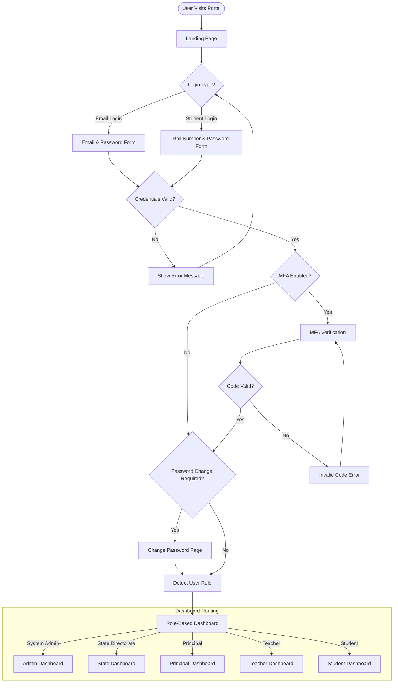

### 2.2 Password Recovery Flow

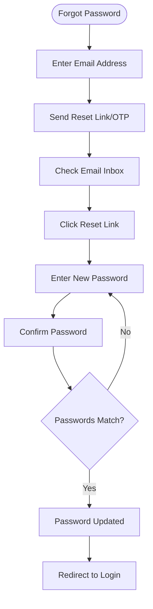

### 2.3 Session Management Flow

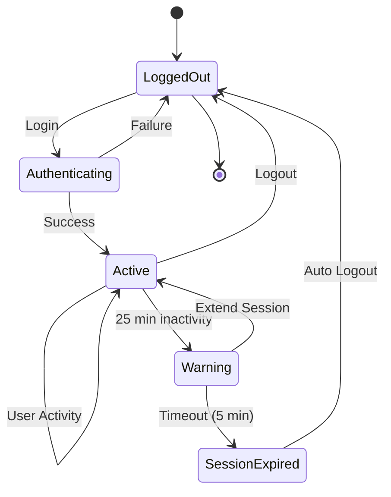

### 2.4 Login Type Selection

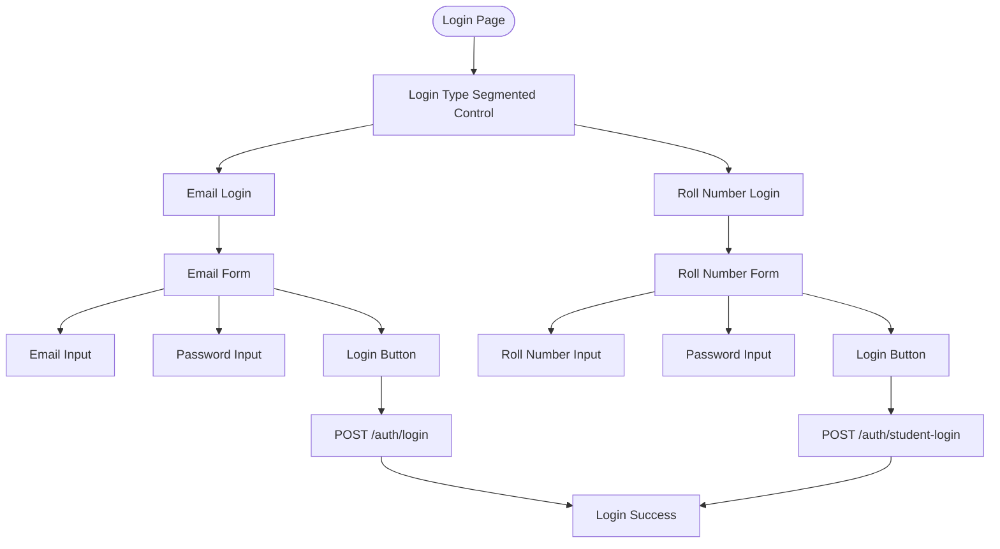

---

## 3. State Directorate Flows

### 3.1 Dashboard Overview Flow

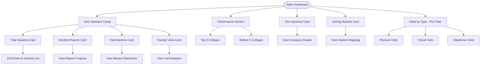

### 3.2 Institution Management Flow

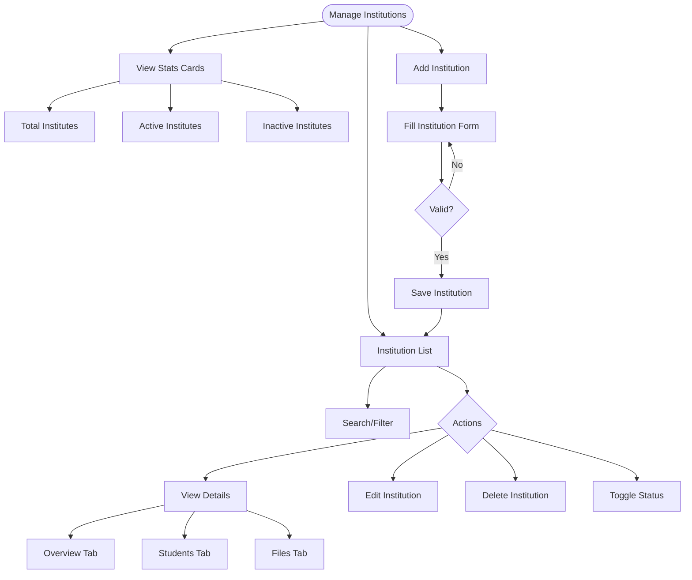

### 3.3 Internship Overview Flow

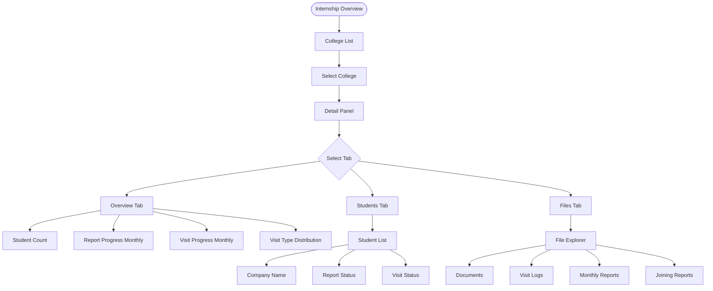

### 3.4 Principals Management Flow

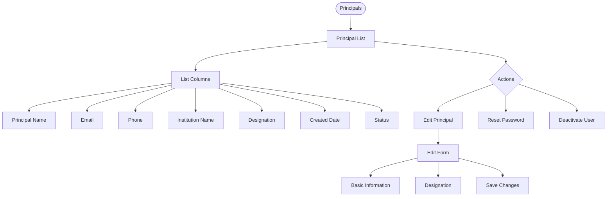

### 3.5 Bulk Operations Flow

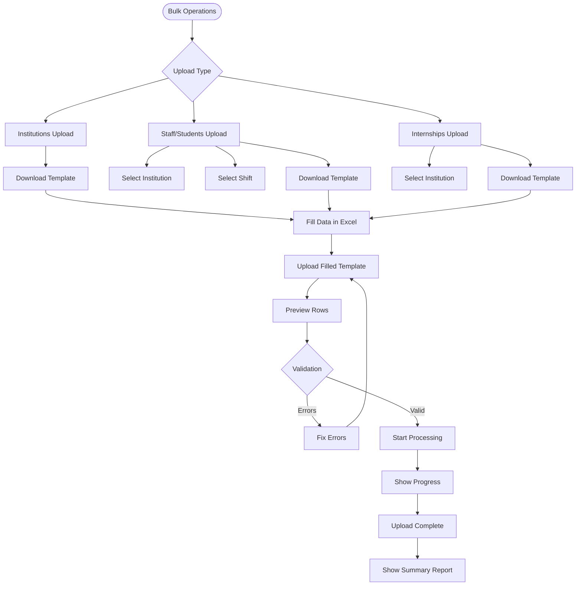

### 3.6 Companies Overview Flow

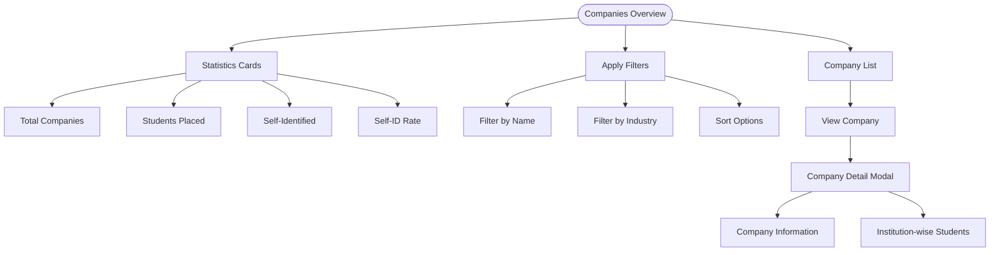

### 3.7 System Management Flow

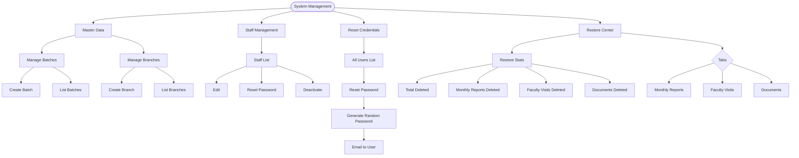

---

## 4. Principal Flows

### 4.1 Principal Dashboard Flow

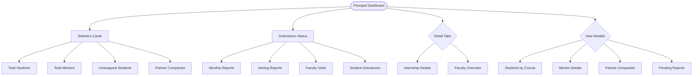

### 4.2 Student Management Flow

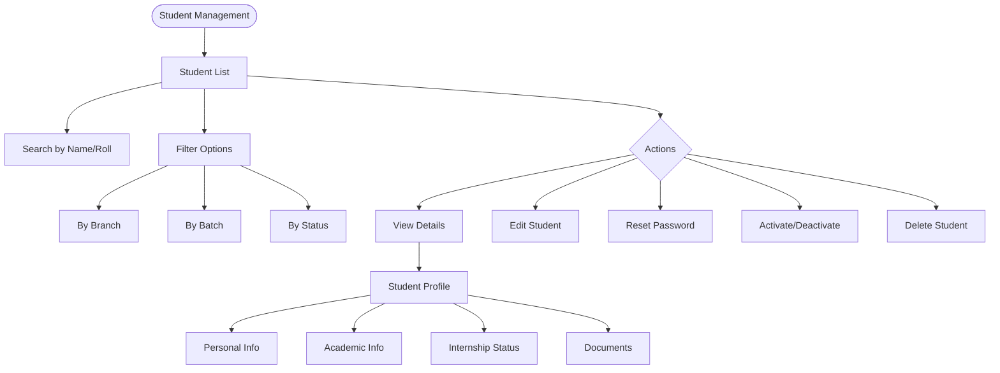

### 4.3 Staff Management Flow

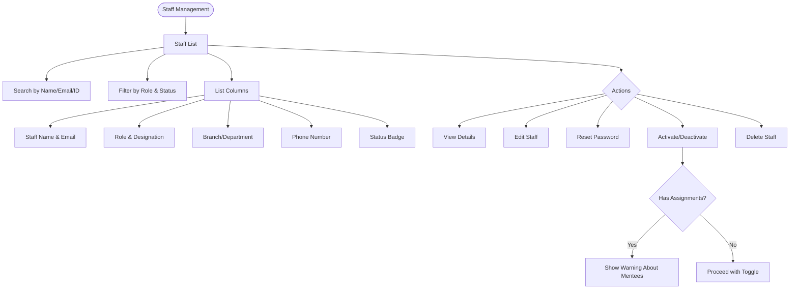

### 4.4 Mentor Assignment Flow

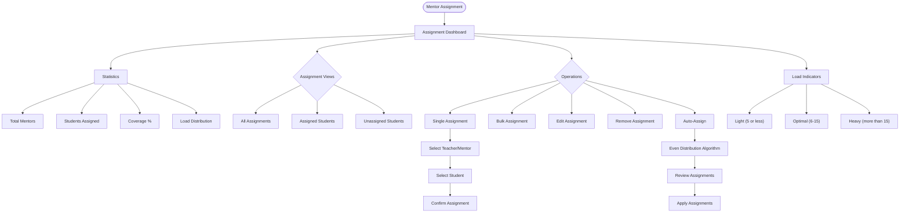

### 4.5 Grievance Management Flow (Principal)

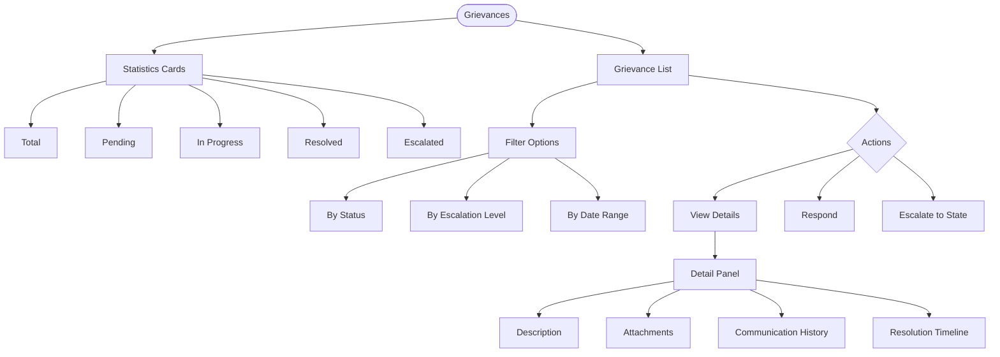

---

## 5. Teacher (Faculty Mentor) Flows

### 5.1 Teacher Dashboard Flow

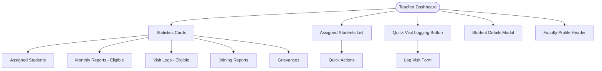

### 5.2 Visit Logging Flow

```mermaid
flowchart TD
    VISIT_LOG([Visit Logging]) --> SELECT_TYPE{Visit Type}

    SELECT_TYPE --> PHYSICAL[Physical Visit]
    SELECT_TYPE --> VIRTUAL[Virtual Visit]
    SELECT_TYPE --> TELEPHONIC[Telephonic Visit]

    PHYSICAL --> GPS_CAPTURE[GPS Location Capture]
    GPS_CAPTURE --> ACCURACY[Check Accuracy]

    SELECT_TYPE --> CORE_INFO[Core Information]
    CORE_INFO --> SELECT_STUDENT[Select Student]
    CORE_INFO --> DATE_TIME[Visit Date & Time]
    CORE_INFO --> STATUS[Visit Status]
    CORE_INFO --> NEXT_VISIT[Schedule Next Visit]
    CORE_INFO --> FOLLOWUP[Follow-up Required?]

    CORE_INFO --> PROJECT_INFO[Project Information]
    PROJECT_INFO --> TITLE[Project Title - Max 200 chars]
    PROJECT_INFO --> ASSIST[Assistance Required]
    PROJECT_INFO --> ORG_RESPONSE[Organization Response]
    PROJECT_INFO --> SUPERVISOR_REMARKS[Supervisor Remarks]
    PROJECT_INFO --> CHANGES[Significant Changes - Max 300 chars]

    PROJECT_INFO --> OBSERVATIONS[Observations & Feedback]
    OBSERVATIONS --> STU_OBS[Student Observations - Min 25 words]
    OBSERVATIONS --> FEEDBACK[Feedback Shared - Min 25 words]

    OBSERVATIONS --> ATTACHMENTS[Attachments]
    ATTACHMENTS --> PHOTOS[Photos - Up to 5, WebP optimized]
    ATTACHMENTS --> SIGNED_DOC[Signed Document - PDF/JPG/PNG, Max 10MB]

    ATTACHMENTS --> VALIDATE{Complete?}
    VALIDATE --> |No| SAVE_DRAFT[Save as Draft]
    VALIDATE --> |Yes| SUBMIT[Submit Visit Log]
    SUBMIT --> CONFIRM[Confirmation]
```

### 5.3 Monthly Reports Management Flow

```mermaid
flowchart TD
    REPORTS([Monthly Reports]) --> STATS[Statistics]
    STATS --> EXPECTED[Expected This Month]
    STATS --> SUBMITTED[Submitted]
    STATS --> APPROVED[Approved]
    STATS --> DRAFT[Draft]

    REPORTS --> FILTERS[Filters]
    FILTERS --> BY_STATUS[Filter by Status]
    FILTERS --> BY_STUDENT[Search Student]

    REPORTS --> LIST[Report List]
    LIST --> SELECT[Select Report]

    SELECT --> ACTIONS{Actions}
    ACTIONS --> VIEW_PDF[View PDF]
    ACTIONS --> VIEW_HISTORY[Version History]
    ACTIONS --> VIEW_STUDENT[Student Details]
    ACTIONS --> APPROVE[Approve Report]
    ACTIONS --> REJECT[Reject Report]
    ACTIONS --> DELETE[Delete Report]

    APPROVE --> ADD_REMARKS[Add Remarks]
    ADD_REMARKS --> CONFIRM_APPROVE[Confirm Approval]

    REJECT --> REASON[Enter Reason - Min 10 chars]
    REASON --> CONFIRM_REJECT[Confirm Rejection]
```

### 5.4 Self-Identified Internship Approval Flow

```mermaid
flowchart TD
    APPROVALS([Self-ID Approvals]) --> STATS[Statistics]
    STATS --> PENDING_APP[Pending Approval]
    STATS --> APPROVED_APP[Approved]
    STATS --> TOTAL_APP[Total Applications]

    APPROVALS --> TABS{Tabs}
    TABS --> PENDING_TAB[Pending Approval]
    TABS --> APPROVED_TAB[Approved]
    TABS --> ALL_TAB[All Applications]

    APPROVALS --> LIST[Application List]
    LIST --> VIEW_APP[View Application]

    VIEW_APP --> MODAL[Application Modal]
    MODAL --> STUDENT_INFO[Student Info]
    MODAL --> COMPANY_INFO[Company Info]
    MODAL --> HR_INFO[HR Contact]
    MODAL --> INTERN_PERIOD[Internship Period]
    MODAL --> JOINING_LETTER[Joining Letter]

    VIEW_APP --> DECISION{Decision}
    DECISION --> APPROVE[Approve]
    DECISION --> REJECT[Reject]

    APPROVE --> SET_DATE[Set Joining Date]
    SET_DATE --> CONFIRM_APP[Confirm Approval]
    CONFIRM_APP --> NOTIFY_STU[Notify Student]

    REJECT --> CONFIRM_REJ[Confirm Rejection]
    CONFIRM_REJ --> NOTIFY_STU2[Notify Student]
```

### 5.5 Joining Letters Management Flow

```mermaid
flowchart TD
    JOINING([Joining Letters]) --> STATS[Statistics]
    STATS --> TOTAL[Total Letters]
    STATS --> UPLOADED[Uploaded vs Expected]
    STATS --> PENDING[Pending Count]

    JOINING --> LIST[Letter List]
    LIST --> SEARCH[Search by Student]
    LIST --> FILTER[Filter by Status]

    LIST --> ACTIONS{Actions}
    ACTIONS --> VIEW_DOC[View Document]
    ACTIONS --> VERIFY[Verify Letter]
    ACTIONS --> REJECT[Reject Letter]
    ACTIONS --> DELETE[Delete Letter]
    ACTIONS --> UPLOAD_BEHALF[Upload on Behalf]

    VERIFY --> ADD_REMARKS[Add Verification Remarks]
    ADD_REMARKS --> CONFIRM_VER[Confirm Verification]

    REJECT --> ADD_REASON[Add Rejection Reason]
    ADD_REASON --> CONFIRM_REJ[Confirm Rejection]

    UPLOAD_BEHALF --> SELECT_STUDENT[Select Student]
    SELECT_STUDENT --> UPLOAD_FILE[Upload PDF/Image - Max 1MB]
    UPLOAD_FILE --> SUBMIT[Submit]
```

### 5.6 Student Progress Tracking Flow

```mermaid
flowchart TD
    PROGRESS([Student Progress]) --> STUDENT_LIST[Student List]

    STUDENT_LIST --> SEARCH[Search Students]
    STUDENT_LIST --> FILTER[Filter by Branch]
    STUDENT_LIST --> SELECT[Select Student]

    SELECT --> PROFILE[Student Profile]
    PROFILE --> NAME_INFO[Name, Roll, Branch]
    PROFILE --> CONTACT[Email, Phone]
    PROFILE --> AVATAR[Profile Image]
    PROFILE --> COUNTS[Applications, Visits, Reports Count]

    SELECT --> TABS{Progress Tabs}
    TABS --> OVERVIEW[Overview Tab]
    TABS --> VISITS[Visits Tab]
    TABS --> FEEDBACK[Monthly Feedback Tab]

    OVERVIEW --> ACTIVE_INTERN[Active Internship]
    OVERVIEW --> RECENT_APPS[Recent Applications - Latest 3]
    OVERVIEW --> RECENT_ACTIVITY[Recent Activity - Latest 4 Visits]

    VISITS --> ALL_VISITS[All Visit Logs]
    VISITS --> VISIT_METRICS[Completed vs Expected]
    VISITS --> VISIT_BREAKDOWN[Visit Type Breakdown]
    VISITS --> AVG_RATING[Average Satisfaction Rating]

    FEEDBACK --> ATTENDANCE_RATE[Attendance Rating 0-5]
    FEEDBACK --> PERFORMANCE_RATE[Performance Rating 0-5]
    FEEDBACK --> PUNCTUALITY_RATE[Punctuality Rating 0-5]
    FEEDBACK --> TECH_RATE[Technical Skills Rating 0-5]
    FEEDBACK --> COMMENTS[Feedback Comments]
```

---

## 6. Student Flows

### 6.1 Student Dashboard Flow

```mermaid
flowchart TD
    STU_DASH([Student Dashboard]) --> WELCOME[Welcome Banner]

    STU_DASH --> INTERN_SELECT[Internship Selector]
    INTERN_SELECT --> ACTIVE_INTERN[Active Internship Info]

    STU_DASH --> STATUS_CARDS{Status Cards}
    STATUS_CARDS --> DATA_STATUS[Internship Data Status]
    STATUS_CARDS --> JOINING_STATUS[Joining Report Status]
    STATUS_CARDS --> GRIEV_STATUS[Grievances Status]
    STATUS_CARDS --> REPORT_STATUS[Monthly Reports Status]

    DATA_STATUS --> CHECK_COMPLETE{Complete?}
    CHECK_COMPLETE --> |No| SHOW_PENDING[Show Pending Fields]
    CHECK_COMPLETE --> |Yes| COMPLETE_BADGE[Show Complete Badge]

    JOINING_STATUS --> UPLOADED{Uploaded?}
    UPLOADED --> |No| UPLOAD_BTN[Show Upload Button]
    UPLOADED --> |Yes| VIEW_BTN[Show View/Download]

    REPORT_STATUS --> OVERDUE{Overdue?}
    OVERDUE --> |Yes| SHOW_OVERDUE[Show Overdue Months - Red]
    OVERDUE --> |No| PENDING{Pending?}
    PENDING --> |Yes| SHOW_PENDING2[Show Pending - Yellow]
    PENDING --> |No| ALL_SUBMITTED[All Submitted - Green]

    STU_DASH --> MENTOR_CARD[Faculty Mentor Card]
    STU_DASH --> SUPERVISOR_CARD[Industry Supervisor Card]

    STU_DASH --> PLACEMENT_MODAL{First Visit?}
    PLACEMENT_MODAL --> |Yes| SHOW_MODAL[Placement Interest Form]
```

### 6.2 Self-Identified Internship Application Flow

```mermaid
flowchart TD
    ADD_INTERN([Add Self-ID Internship]) --> CHECK{Has Active Internship?}

    CHECK --> |Yes| ERROR[Cannot Add - Active Exists]
    CHECK --> |No| FORM[Application Form]

    FORM --> COMPANY_SEC[Company Information]
    COMPANY_SEC --> CO_NAME[Company Name - Autocomplete]
    COMPANY_SEC --> CO_ADDRESS[Company Address]
    COMPANY_SEC --> CO_CONTACT[Company Contact]
    COMPANY_SEC --> CO_EMAIL[Company Email]

    FORM --> INTERN_SEC[Internship Details]
    INTERN_SEC --> JOB_PROFILE[Job Profile/Title]
    INTERN_SEC --> START_DATE[Start Date]
    INTERN_SEC --> END_DATE[End Date]
    INTERN_SEC --> DURATION[Duration - Auto Calculated]

    FORM --> HR_SEC[HR/Supervisor Info]
    HR_SEC --> HR_NAME[HR Name]
    HR_SEC --> HR_CONTACT[HR Contact]
    HR_SEC --> HR_EMAIL[HR Email]
    HR_SEC --> HR_DESG[HR Designation]

    FORM --> MENTOR_SEC[Faculty Mentor]
    MENTOR_SEC --> SELECT_MENTOR[Select Teacher/Mentor]
    SELECT_MENTOR --> AUTO_POPULATE[Auto-populate Contact]

    FORM --> UPLOAD_SEC[Joining Letter]
    UPLOAD_SEC --> UPLOAD_PDF[Upload PDF]

    FORM --> VALIDATE{All Valid?}
    VALIDATE --> |No| FIX[Fix Errors]
    FIX --> FORM
    VALIDATE --> |Yes| SUBMIT[Submit Application]

    SUBMIT --> PENDING[Status: Pending Approval]
    PENDING --> NOTIFY_TEACHER[Notify Teacher/Mentor]
```

### 6.3 Monthly Report Submission Flow

```mermaid
flowchart TD
    SUBMIT_REP([Submit Monthly Report]) --> SELECT_APP[Select Application/Internship]

    SELECT_APP --> SELECT_PERIOD[Select Month & Year]
    SELECT_PERIOD --> FILTER_MONTHS[Filter Allowed Months]
    FILTER_MONTHS --> |Within Internship Period| PROCEED[Proceed]
    FILTER_MONTHS --> |Outside Period| DISABLE[Month Disabled]

    PROCEED --> GUIDELINES[Show Guidelines Modal]
    GUIDELINES --> ACCEPT[Accept Guidelines]
    ACCEPT --> UPLOAD[Upload Report PDF]

    UPLOAD --> VALIDATE{Valid PDF? Max 1MB?}
    VALIDATE --> |No| ERROR[Show Error]
    ERROR --> UPLOAD
    VALIDATE --> |Yes| PREVIEW[Preview Upload]

    PREVIEW --> SAVE_DRAFT[Save as Draft]
    PREVIEW --> SUBMIT[Submit for Review]

    SUBMIT --> STATUS[Status: Submitted]
    STATUS --> NOTIFY[Notify Teacher/Mentor]

    SUBMIT --> TRACK{Track Status}
    TRACK --> UNDER_REVIEW[Under Review]
    TRACK --> APPROVED[Approved]
    TRACK --> REJECTED[Rejected]
    TRACK --> REVISION[Revision Required]
```

### 6.4 Grievance Submission Flow

```mermaid
flowchart TD
    GRIEV([Submit Grievance]) --> CHECK{Has Mentor Assigned?}

    CHECK --> |No| ERROR[Must Have Assigned Mentor]
    CHECK --> |Yes| FORM[Grievance Form]

    FORM --> CATEGORY[Select Category]
    CATEGORY --> CAT_INTERN[Internship Related]
    CATEGORY --> CAT_MENTOR[Mentor Related]
    CATEGORY --> CAT_INDUSTRY[Industry Related]
    CATEGORY --> CAT_PAYMENT[Payment Issue]
    CATEGORY --> CAT_HARASS[Workplace Harassment]
    CATEGORY --> CAT_WORK[Work Condition]
    CATEGORY --> CAT_SAFETY[Safety Concern]
    CATEGORY --> CAT_OTHER[Other]

    FORM --> PRIORITY[Select Priority]
    PRIORITY --> LOW["Low (Green)"]
    PRIORITY --> MEDIUM["Medium (Orange)"]
    PRIORITY --> HIGH["High (Red)"]
    PRIORITY --> URGENT["Urgent (Magenta)"]

    FORM --> SUBJECT[Enter Subject/Title]
    FORM --> DESCRIPTION[Enter Description]
    FORM --> ESCALATION[Select Escalation Level]

    FORM --> SUBMIT[Submit Grievance]
    SUBMIT --> AUTO_ASSIGN[Auto-assign to Teacher/Mentor]
    AUTO_ASSIGN --> NOTIFY[Notify Mentor]

    SUBMIT --> TRACK[Track Grievance]
    TRACK --> VIEW_STATUS[View Status]
    TRACK --> VIEW_TIMELINE[View Timeline]
    TRACK --> VIEW_RESPONSE[View Response]
```

### 6.5 Placement Interest Form Flow

```mermaid
flowchart TD
    PLACEMENT([Placement Interest Form]) --> CHECK{Already Filled?}

    CHECK --> |Yes| SHOW_STATUS[Show Current Selection]
    CHECK --> |No| MODAL[Show Modal - Non-dismissible]

    MODAL --> PLAN[Select Plan After Diploma]
    PLAN --> PRIVATE[Private Job]
    PLAN --> HIGHER_ED[B.Tech - Higher Education]
    PLAN --> GOVT[Govt Job Preparation]

    PRIVATE --> CONDITIONAL[Show Conditional Fields]
    CONDITIONAL --> LOCATION[Job Location Preference]
    LOCATION --> WITHIN_PB[Within Punjab]
    LOCATION --> OUTSIDE_PB[Outside Punjab]

    CONDITIONAL --> SALARY[Expected Salary Range]
    SALARY --> RANGE1[Rs 10,000-15,000]
    SALARY --> RANGE2[Rs 15,000-20,000]
    SALARY --> RANGE3[Rs 20,000+]

    HIGHER_ED --> SKIP_COND[Skip Conditional Fields]
    GOVT --> SKIP_COND

    PLAN --> SUBMIT[Submit Form]
    SUBMIT --> CLOSE_MODAL[Close Modal]
    CLOSE_MODAL --> DASHBOARD[Continue to Dashboard]
```

### 6.6 Profile Management Flow

```mermaid
flowchart TD
    PROFILE([Profile Management]) --> PERSONAL[Personal Information]
    PERSONAL --> ROLL[Roll Number]
    PERSONAL --> NAME[Name]
    PERSONAL --> EMAIL[Email]
    PERSONAL --> PHONE[Phone]
    PERSONAL --> DOB[Date of Birth]
    PERSONAL --> GENDER[Gender]
    PERSONAL --> ADDRESS[Address, State, District, Tehsil]

    PROFILE --> CONTACT[Contact Information]
    CONTACT --> MASKED[Masked Contact Fields]
    CONTACT --> REVEAL[Reveal via API]
    CONTACT --> PARENT[Parent Contact]

    PROFILE --> AVATAR[Profile Image]
    AVATAR --> UPLOAD_IMG[Upload Image]
    UPLOAD_IMG --> CROP[Image Cropping]
    CROP --> OPTIMIZE[WebP Optimization]

    PROFILE --> EDUCATION[Educational Information]
    EDUCATION --> INSTITUTION[Institution Details]
    EDUCATION --> COURSE[Course/Program]
    EDUCATION --> SEMESTER[Semester/Year]

    PROFILE --> DOCUMENTS[Document Management]
    DOCUMENTS --> UPLOAD_DOC[Upload Documents]
    DOCUMENTS --> DOC_TYPE[Select Document Type]
    DOCUMENTS --> VIEW_DOCS[View/Delete Documents]
```

---

## 7. System Admin Flows

### 7.1 Admin Dashboard Flow

```mermaid
flowchart TD
    ADMIN_DASH([Admin Dashboard]) --> SYSTEM_HEALTH[System Health Overview]

    SYSTEM_HEALTH --> CPU[CPU Usage]
    SYSTEM_HEALTH --> MEMORY[Memory Usage]
    SYSTEM_HEALTH --> DISK[Disk Space]
    SYSTEM_HEALTH --> UPTIME[System Uptime]

    ADMIN_DASH --> USER_STATS[User Statistics]
    USER_STATS --> TOTAL_USERS[Total Users]
    USER_STATS --> ACTIVE_SESSIONS[Active Sessions]
    USER_STATS --> NEW_USERS[New Users Today]

    ADMIN_DASH --> API_STATS[API Statistics]
    API_STATS --> REQUESTS[Request Count]
    API_STATS --> LATENCY[Average Latency]
    API_STATS --> ERRORS[Error Rate]

    ADMIN_DASH --> DB_STATS[Database Statistics]
    DB_STATS --> CONNECTIONS[Active Connections]
    DB_STATS --> QUERY_TIME[Avg Query Time]
```

### 7.2 User Management Flow

```mermaid
flowchart TD
    USER_MGMT([User Management]) --> LIST[User List]

    LIST --> SEARCH[Search Users]
    LIST --> FILTER[Filter by Role/Status]

    LIST --> COLS[Columns]
    COLS --> NAME[Name]
    COLS --> EMAIL[Email]
    COLS --> ROLE[Role]
    COLS --> LAST_LOGIN[Last Login]
    COLS --> STATUS[Status]

    LIST --> ACTIONS{Actions}
    ACTIONS --> VIEW[View Details]
    ACTIONS --> EDIT[Edit User]
    ACTIONS --> RESET_PWD[Reset Password]
    ACTIONS --> TOGGLE[Enable/Disable]
    ACTIONS --> DELETE[Delete User]

    USER_MGMT --> SESSIONS[Active Sessions]
    SESSIONS --> VIEW_SESSION[View Session Details]
    SESSIONS --> TERMINATE[Terminate Session]
```

### 7.3 Database Management Flow

```mermaid
flowchart TD
    DB_MGMT([Database Management]) --> BACKUPS[Backup Management]

    BACKUPS --> MANUAL[Manual Backup]
    MANUAL --> START_BACKUP[Start Backup]
    START_BACKUP --> PROGRESS[Show Progress]
    PROGRESS --> COMPLETE[Backup Complete]

    BACKUPS --> SCHEDULED[Scheduled Backups]
    SCHEDULED --> VIEW_SCHEDULE[View Schedules]
    SCHEDULED --> ADD_SCHEDULE[Add Schedule]
    SCHEDULED --> EDIT_SCHEDULE[Edit Schedule]
    SCHEDULED --> DELETE_SCHEDULE[Delete Schedule]

    BACKUPS --> HISTORY[Backup History]
    HISTORY --> LIST_BACKUPS[List Backups]
    LIST_BACKUPS --> DOWNLOAD[Download Backup]
    LIST_BACKUPS --> RESTORE[Restore from Backup]
    LIST_BACKUPS --> DELETE_BACKUP[Delete Backup]
```

### 7.4 Security & Audit Flow

```mermaid
flowchart TD
    SECURITY([Security Management]) --> INSIGHTS[Security Insights]

    INSIGHTS --> FAILED_LOGINS[Failed Login Attempts]
    INSIGHTS --> SUSPICIOUS[Suspicious Activities]
    INSIGHTS --> LOCKED[Locked Accounts]

    SECURITY --> AUDIT[Audit Logs]
    AUDIT --> FILTER_LOGS[Filter Logs]
    FILTER_LOGS --> BY_USER[By User]
    FILTER_LOGS --> BY_ACTION[By Action Type]
    FILTER_LOGS --> BY_DATE[By Date Range]
    FILTER_LOGS --> BY_ENTITY[By Entity Type]

    AUDIT --> LOG_DETAILS[Log Details]
    LOG_DETAILS --> USER_INFO[User Information]
    LOG_DETAILS --> ACTION_DESC[Action Description]
    LOG_DETAILS --> TIMESTAMP[Timestamp]
    LOG_DETAILS --> IP_DEVICE[IP/Device Metadata]

    SECURITY --> ALERTS[System Alerts]
    ALERTS --> VIEW_ALERTS[View Active Alerts]
    ALERTS --> CREATE_ALERT[Create Alert]
    ALERTS --> RESOLVE[Resolve Alert]
```

### 7.5 Feature Flags Flow

```mermaid
flowchart TD
    FEATURES([Feature Flags]) --> LIST[Feature List]

    LIST --> FEATURE_ITEM[Feature Item]
    FEATURE_ITEM --> NAME[Feature Name]
    FEATURE_ITEM --> DESC[Description]
    FEATURE_ITEM --> STATUS[Enabled/Disabled]
    FEATURE_ITEM --> SCOPE[Scope - Global/Role]

    LIST --> ACTIONS{Actions}
    ACTIONS --> TOGGLE[Toggle Feature]
    ACTIONS --> EDIT[Edit Configuration]
    ACTIONS --> VIEW_USAGE[View Usage Stats]

    TOGGLE --> CONFIRM[Confirmation Dialog]
    CONFIRM --> APPLY[Apply Change]
    APPLY --> NOTIFY_USERS[Notify Affected Users]
```

---

## 8. Grievance Management Flow

### 8.1 Complete Grievance Lifecycle

```mermaid
stateDiagram-v2
    [*] --> Submitted: Student Submits

    Submitted --> Pending: Auto-assign to Teacher
    Pending --> UnderReview: Teacher Reviews

    UnderReview --> InProgress: Teacher Responds
    UnderReview --> Rejected: Teacher Rejects
    UnderReview --> Escalated: Escalate to Principal

    InProgress --> Resolved: Issue Resolved
    InProgress --> Escalated: Escalate to Principal

    Escalated --> UnderReviewP: Principal Reviews
    UnderReviewP --> InProgressP: Principal Responds
    UnderReviewP --> EscalatedState: Escalate to State

    InProgressP --> Resolved: Issue Resolved
    InProgressP --> EscalatedState: Escalate to State

    EscalatedState --> UnderReviewS: State Reviews
    UnderReviewS --> InProgressS: State Responds
    InProgressS --> Resolved: Issue Resolved

    Resolved --> Closed: Final Closure
    Rejected --> [*]
    Closed --> [*]
```

### 8.2 Escalation Chain Flow

```mermaid
flowchart TD
    STUDENT([Student Submits Grievance]) --> TEACHER[Level 1: Teacher/Faculty Mentor]

    TEACHER --> TEACH_ACTIONS{Teacher Actions}
    TEACH_ACTIONS --> RESPOND1[Respond & Resolve]
    TEACH_ACTIONS --> ESCALATE1[Escalate to Principal]

    RESPOND1 --> RESOLVED1[Resolved]

    ESCALATE1 --> PRINCIPAL[Level 2: Principal]
    PRINCIPAL --> PRIN_ACTIONS{Principal Actions}
    PRIN_ACTIONS --> RESPOND2[Respond & Resolve]
    PRIN_ACTIONS --> ESCALATE2[Escalate to State]

    RESPOND2 --> RESOLVED2[Resolved]

    ESCALATE2 --> STATE[Level 3: State Directorate]
    STATE --> STATE_ACTIONS{State Actions}
    STATE_ACTIONS --> RESPOND3[Respond & Resolve]
    STATE_ACTIONS --> FINAL[Final Decision]

    RESPOND3 --> RESOLVED3[Resolved]
    FINAL --> RESOLVED3
```

### 8.3 Grievance Response Flow

```mermaid
flowchart TD
    VIEW_GRIEV([View Grievance]) --> DETAILS[Grievance Details]

    DETAILS --> INFO[Basic Information]
    INFO --> SUBJECT[Subject]
    INFO --> CATEGORY[Category]
    INFO --> PRIORITY[Priority]
    INFO --> STATUS[Current Status]
    INFO --> CREATED[Created Date]

    DETAILS --> DESCRIPTION[Full Description]
    DETAILS --> STUDENT_INFO[Student Information]
    DETAILS --> TIMELINE[Status Timeline]

    VIEW_GRIEV --> ACTIONS{Available Actions}
    ACTIONS --> RESPOND[Add Response]
    ACTIONS --> UPDATE_STATUS[Update Status]
    ACTIONS --> ESCALATE[Escalate]
    ACTIONS --> REJECT[Reject]

    RESPOND --> RESPONSE_FORM[Response Form]
    RESPONSE_FORM --> RESPONSE_TEXT[Response Text]
    RESPONSE_FORM --> NEW_STATUS[Select New Status]
    RESPONSE_FORM --> SUBMIT[Submit Response]

    ESCALATE --> ESCALATE_FORM[Escalation Form]
    ESCALATE_FORM --> REASON[Escalation Reason]
    ESCALATE_FORM --> CONFIRM_ESC[Confirm Escalation]
```

---

## 9. Report Builder Flow

### 9.1 Report Generation Flow

```mermaid
flowchart TD
    BUILDER([Report Builder]) --> CATALOG[Report Catalog]

    CATALOG --> CATEGORIES{Select Category}
    CATEGORIES --> STUDENT_REP[Student Reports]
    CATEGORIES --> MENTOR_REP[Mentor Reports]
    CATEGORIES --> INTERN_REP[Internship Reports]
    CATEGORIES --> COMPLY_REP[Compliance Reports]
    CATEGORIES --> INST_REP[Institution Reports]
    CATEGORIES --> PENDING_REP[Pending Reports]
    CATEGORIES --> USER_REP[User Activity Reports]
    CATEGORIES --> INDUSTRY_REP[Industry Reports]

    CATALOG --> SELECT[Select Report Type]
    SELECT --> CONFIG[Configuration Panel]

    CONFIG --> COLUMNS[Select Columns]
    COLUMNS --> DEFAULT_COL[Default Columns]
    COLUMNS --> OPTIONAL_COL[Optional Columns]

    CONFIG --> FILTERS[Apply Filters]
    FILTERS --> CONTEXT_FILTERS[Contextual Filters]

    CONFIG --> SORT[Set Sort Order]
    SORT --> SORTABLE_COL[Select Sortable Column]
    SORT --> ASC_DESC[Ascending/Descending]

    CONFIG --> PREVIEW[Preview Report]
    PREVIEW --> GENERATE[Generate Report]

    GENERATE --> EXPORT[Export to Excel]
    EXPORT --> DOWNLOAD[Download File]

    DOWNLOAD --> METADATA[Includes Metadata]
    METADATA --> REPORT_NAME[Report Name]
    METADATA --> GEN_DATE[Generated Date/Time]
    METADATA --> FILTERS_APPLIED[Filters Applied]
    METADATA --> GEN_BY[Generated By]
```

### 9.2 Report Types Overview

```mermaid
flowchart LR
    subgraph StudentReports["Student Reports"]
        S1[Student Directory]
        S2[Student Compliance]
        S3[Students by Branch]
        S4[Without Internship]
    end

    subgraph MentorReports["Mentor Reports"]
        M1[Mentor List]
        M2[Mentor-Student Assignments]
        M3[Unassigned Students]
    end

    subgraph InternshipReports["Internship Reports"]
        I1[By Institution]
        I2[Self-Identified]
    end

    subgraph ComplianceReports["Compliance Reports"]
        C1[Faculty Visit Compliance]
        C2[Monthly Report Compliance]
        C3[Joining Report Status]
    end

    subgraph InstitutionReports["Institution Reports"]
        IN1[Institution Summary]
        IN2[Institution Comparison]
        IN3[Branch-wise Summary]
    end

    subgraph PendingReports["Pending Reports"]
        P1[Pending Visits]
        P2[Pending Reports]
        P3[Pending Letters]
        P4[Pending Assignments]
    end
```

---

## 10. User Journeys

### 10.1 Student Complete Internship Journey

```mermaid
journey
    title Student Internship Journey
    section Registration
      Create Account: 5: Student
      Complete Profile: 4: Student
      Upload Documents: 3: Student
    section Internship Setup
      Apply Self-ID Internship: 4: Student
      Wait for Approval: 2: Student
      Get Approved: 5: Teacher
      Upload Joining Letter: 4: Student
    section During Internship
      Submit Monthly Reports: 3: Student
      Receive Faculty Visits: 4: Teacher
      Track Progress: 4: Student
    section Completion
      Submit Final Report: 4: Student
      Receive Final Visit: 4: Teacher
      Complete Internship: 5: Student
```

### 10.2 Teacher/Faculty Mentor Journey

```mermaid
journey
    title Teacher/Faculty Mentor Journey
    section Assignment
      Get Students Assigned: 5: Principal
      View Student List: 4: Teacher
      Review Student Profiles: 4: Teacher
    section Approvals
      Review Self-ID Applications: 3: Teacher
      Approve/Reject Applications: 4: Teacher
      Verify Joining Letters: 3: Teacher
    section Monitoring
      Log Physical Visits: 3: Teacher
      Log Virtual Visits: 4: Teacher
      Review Monthly Reports: 3: Teacher
      Approve/Reject Reports: 4: Teacher
    section Grievances
      Receive Grievances: 2: Teacher
      Respond to Students: 3: Teacher
      Escalate if Needed: 3: Teacher
```

### 10.3 Principal Oversight Journey

```mermaid
journey
    title Principal Oversight Journey
    section Setup
      Manage Staff: 4: Principal
      Configure Institution: 4: Principal
      Assign Mentors: 4: Principal
    section Monitoring
      View Dashboard: 5: Principal
      Track Compliance: 3: Principal
      Review Faculty Progress: 4: Principal
    section Management
      Handle Escalations: 3: Principal
      Review Applications: 4: Principal
      Generate Reports: 4: Principal
    section Bulk Operations
      Upload Students: 3: Principal
      Upload Internships: 3: Principal
```

### 10.4 State Directorate Journey

```mermaid
journey
    title State Directorate Journey
    section System Setup
      Add Institutions: 4: State
      Add Principals: 4: State
      Configure Master Data: 4: State
    section Oversight
      Monitor All Colleges: 5: State
      Track Compliance: 4: State
      View Top/Bottom Performers: 4: State
    section Reporting
      Generate Custom Reports: 4: State
      Export Data: 4: State
      Audit Activities: 4: State
    section Support
      Handle Escalated Grievances: 3: State
      Manage Support Tickets: 3: State
      Maintain Help Center: 4: State
```

---

## 11. Sequence Diagrams

### 11.1 Login Sequence

```mermaid
sequenceDiagram
    participant User
    participant Frontend
    participant AuthAPI
    participant Database
    participant Session

    User->>Frontend: Enter Credentials
    Frontend->>AuthAPI: POST /auth/login or /auth/student-login
    AuthAPI->>Database: Validate Credentials
    Database-->>AuthAPI: User Data

    alt MFA Enabled
        AuthAPI-->>Frontend: Require MFA
        Frontend->>User: Show MFA Input
        User->>Frontend: Enter MFA Code
        Frontend->>AuthAPI: POST /auth/mfa/verify
        AuthAPI->>Database: Validate Code
        Database-->>AuthAPI: Valid
    end

    AuthAPI->>Session: Create Session
    Session-->>AuthAPI: Token Generated
    AuthAPI-->>Frontend: JWT + User Data
    Frontend->>Frontend: Store Token

    alt Password Change Required
        Frontend->>User: Redirect to Change Password
    else Normal Login
        Frontend->>User: Redirect to Dashboard
    end
```

### 11.2 Monthly Report Submission Sequence

```mermaid
sequenceDiagram
    participant Student
    participant Frontend
    participant API
    participant Storage
    participant Teacher
    participant Notification

    Student->>Frontend: Select Month & Upload PDF
    Frontend->>Frontend: Validate File (Max 1MB, PDF)
    Frontend->>API: POST /reports/monthly
    API->>Storage: Upload File
    Storage-->>API: File URL
    API->>API: Create Report Record
    API-->>Frontend: Report Created

    API->>Notification: Notify Teacher
    Notification->>Teacher: New Report Notification

    Teacher->>Frontend: View Report
    Frontend->>API: GET /reports/{id}
    API->>Storage: Get Presigned URL
    Storage-->>API: URL
    API-->>Frontend: Report Details

    alt Approve
        Teacher->>API: POST /reports/{id}/approve
        API->>Notification: Notify Student
    else Reject
        Teacher->>API: POST /reports/{id}/reject
        API->>Notification: Notify Student with Reason
    end
```

### 11.3 Visit Logging Sequence

```mermaid
sequenceDiagram
    participant Teacher
    participant Frontend
    participant GPS
    participant API
    participant Storage
    participant Student

    Teacher->>Frontend: Start New Visit
    Teacher->>Frontend: Select Student & Type

    alt Physical Visit
        Frontend->>GPS: Request Location
        GPS-->>Frontend: Coordinates + Accuracy
    end

    Teacher->>Frontend: Fill Visit Details
    Teacher->>Frontend: Add Photos (Max 5)
    Frontend->>Frontend: Optimize to WebP
    Teacher->>Frontend: Upload Signed Document

    Teacher->>Frontend: Submit Visit
    Frontend->>API: POST /visits
    API->>Storage: Upload Attachments
    Storage-->>API: File URLs
    API->>API: Create Visit Record
    API-->>Frontend: Visit Saved

    API->>Student: Visit Notification
```

---

## 12. Entity Relationship Overview

### 12.1 Core Entities Relationship

```mermaid
erDiagram
    INSTITUTION ||--o{ STUDENT : has
    INSTITUTION ||--o{ TEACHER : has
    INSTITUTION ||--|| PRINCIPAL : has

    TEACHER ||--o{ STUDENT : mentors
    TEACHER ||--o{ VISIT_LOG : creates
    TEACHER ||--o{ REPORT_REVIEW : reviews

    STUDENT ||--o{ INTERNSHIP : applies
    STUDENT ||--o{ MONTHLY_REPORT : submits
    STUDENT ||--o{ DOCUMENT : uploads
    STUDENT ||--o{ GRIEVANCE : submits

    INTERNSHIP ||--o{ MONTHLY_REPORT : requires
    INTERNSHIP ||--o{ VISIT_LOG : receives
    INTERNSHIP ||--|| JOINING_LETTER : has

    COMPANY ||--o{ INTERNSHIP : provides
    COMPANY ||--o{ INDUSTRY_SUPERVISOR : has

    GRIEVANCE }o--|| TEACHER : assigned_to
    GRIEVANCE }o--|| PRINCIPAL : escalated_to
    GRIEVANCE }o--|| STATE_DIRECTORATE : escalated_to
```

---

## 13. Data Flow Diagrams

### 13.1 Internship Data Flow

```mermaid
flowchart TD
    subgraph Input["Data Input"]
        STU_INPUT[Student Application]
        BULK_INPUT[Bulk Upload]
        TEACH_INPUT[Teacher Entry]
    end

    subgraph Processing["Processing"]
        VALIDATE[Validation]
        APPROVAL[Approval Workflow]
        ASSIGN[Mentor Assignment]
    end

    subgraph Storage["Data Storage"]
        DB[(Database)]
        FILES[(File Storage)]
    end

    subgraph Output["Data Output"]
        DASHBOARD[Dashboards]
        REPORTS[Reports]
        EXPORTS[Excel Exports]
        NOTIFY[Notifications]
    end

    STU_INPUT --> VALIDATE
    BULK_INPUT --> VALIDATE
    TEACH_INPUT --> VALIDATE

    VALIDATE --> APPROVAL
    APPROVAL --> ASSIGN
    ASSIGN --> DB

    STU_INPUT --> FILES
    TEACH_INPUT --> FILES

    DB --> DASHBOARD
    DB --> REPORTS
    DB --> EXPORTS
    DB --> NOTIFY
    FILES --> REPORTS
```

---

## Appendix: Role Access Matrix

| Feature | System Admin | State Directorate | Principal | Teacher | Student |
|---------|-------------|-------------------|-----------|---------|---------|
| System Health | Yes | No | No | No | No |
| User Management | Yes | Limited | Limited | No | No |
| Institution Management | No | Yes | No | No | No |
| Student Management | No | View All | Own Institution | Assigned Only | Own Profile |
| Staff Management | No | Yes | Own Institution | No | No |
| Mentor Assignment | No | No | Yes | No | No |
| Visit Logging | No | View | View | Yes | View Own |
| Monthly Reports | No | View | View | Review | Submit |
| Grievances | No | Level 3 | Level 2 | Level 1 | Submit |
| Report Builder | No | Yes | Limited | No | No |
| Bulk Operations | No | Yes | Yes | No | No |

---

## Appendix: Color Legend

| Color | Meaning |
|-------|---------|
| Green | Success / Complete / Approved |
| Yellow | Pending / Warning |
| Red | Error / Rejected / Overdue |
| Blue | Information / Not Started |
| Magenta | Urgent |
| Orange | Medium Priority |

---

*Document generated for PlaceIntern Portal - Comprehensive User Flow Documentation*
