# Internship Portal - Flow Diagrams

## 1. System Overview

### 1.1 High-Level Architecture
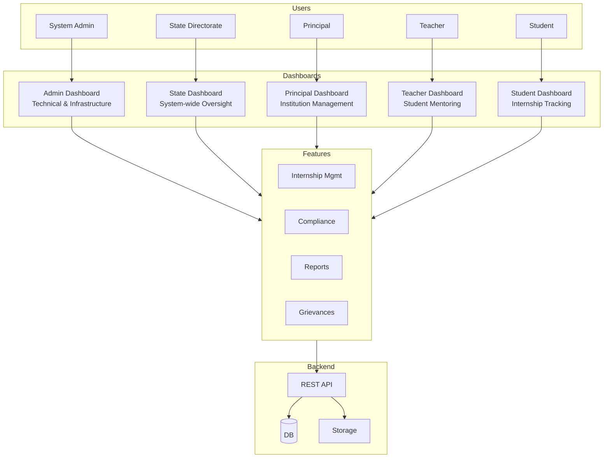

### 1.2 Role Hierarchy
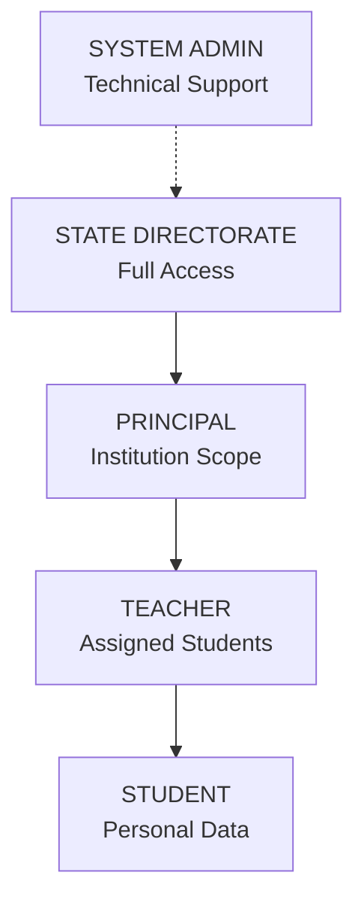

### 1.3 Feature Map
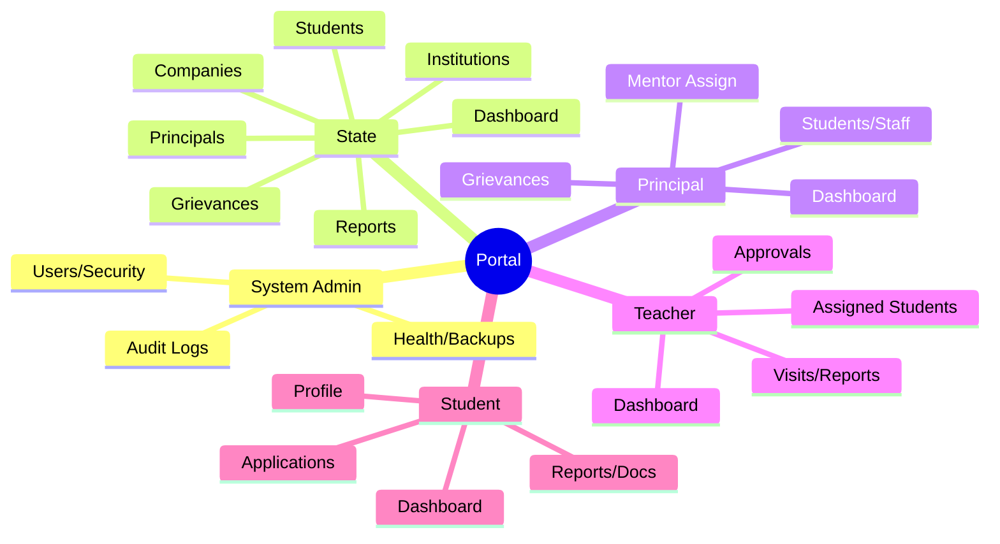

---

## 2. Authentication

### 2.1 Login Flow
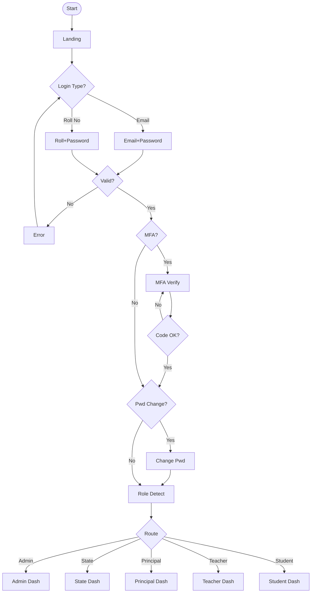

### 2.2 Password Recovery
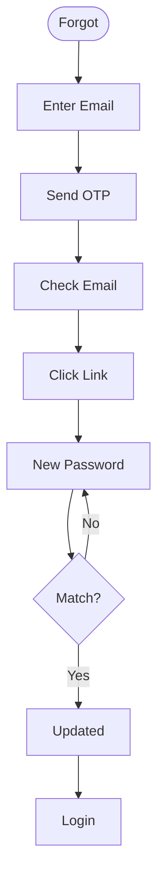

### 2.3 Session States
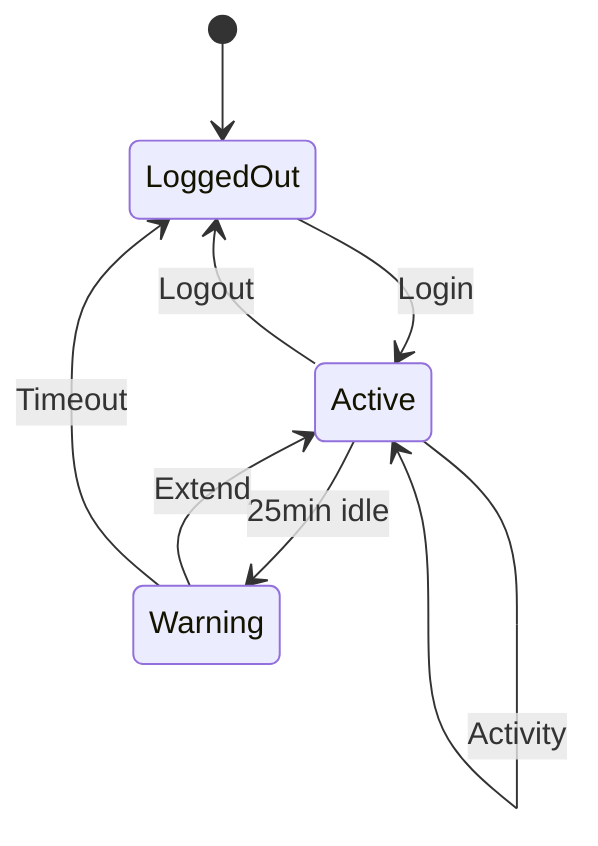

---

## 3. State Directorate Flows

### 3.1 Dashboard
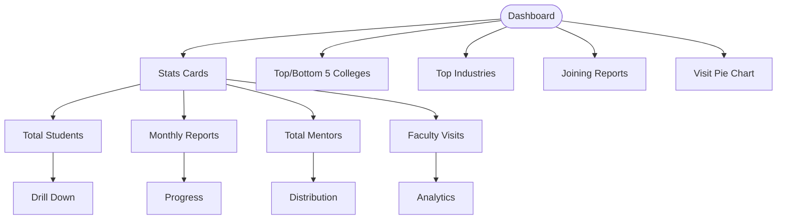

### 3.2 Institution Management
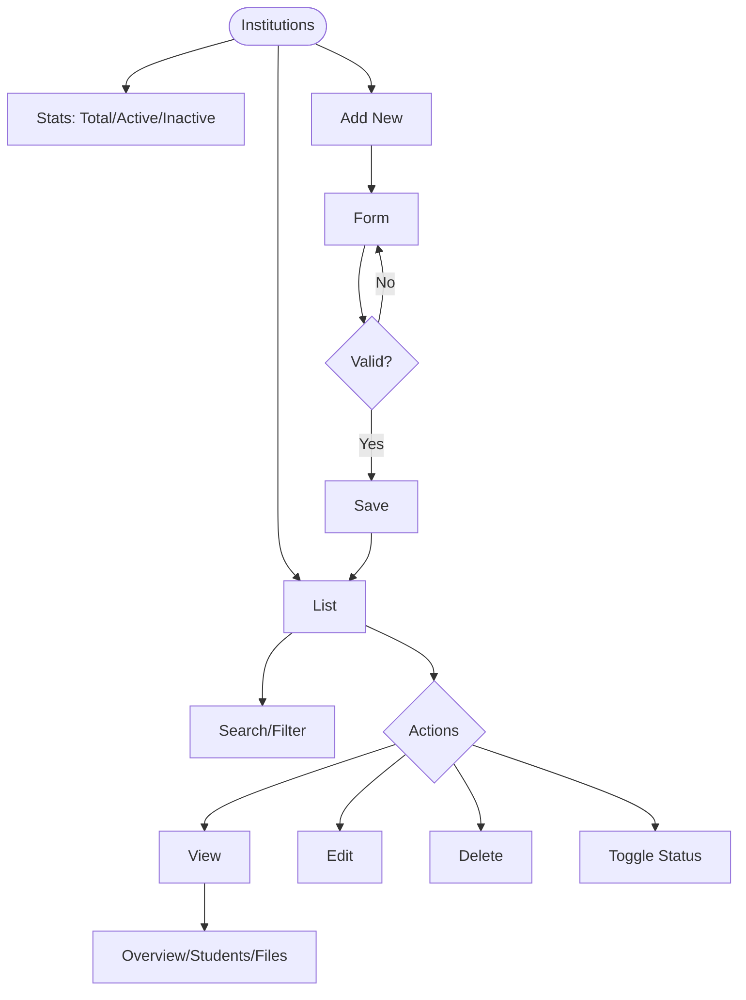

### 3.3 Internship Overview
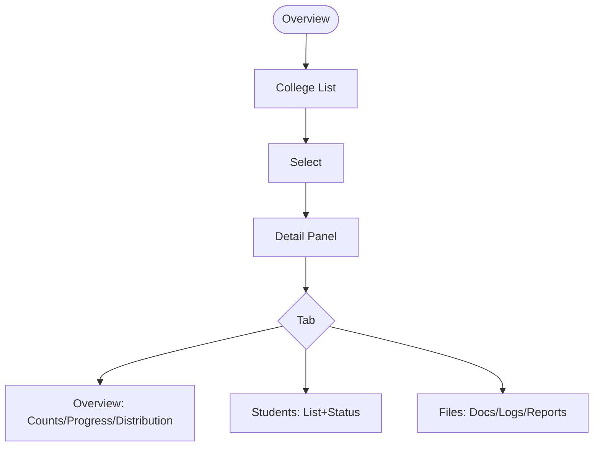

### 3.4 Principals Management
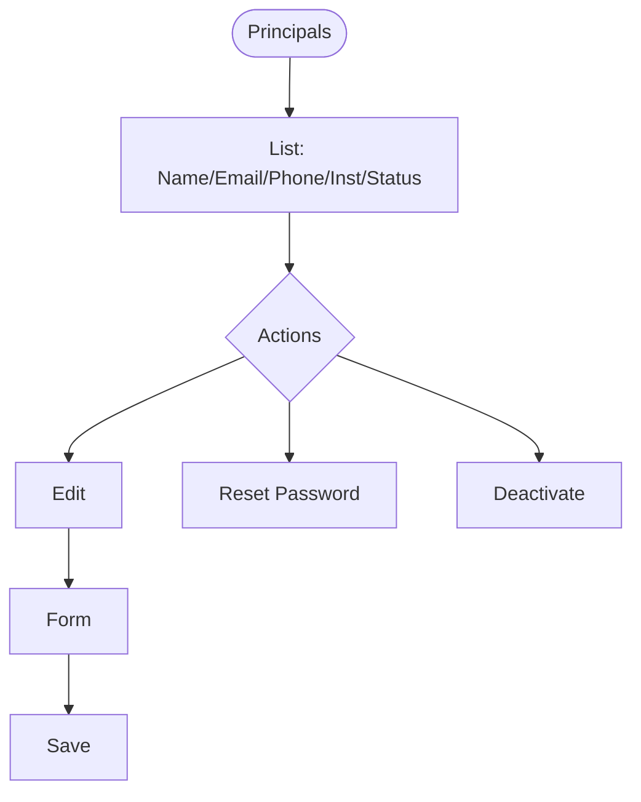

### 3.5 Bulk Operations
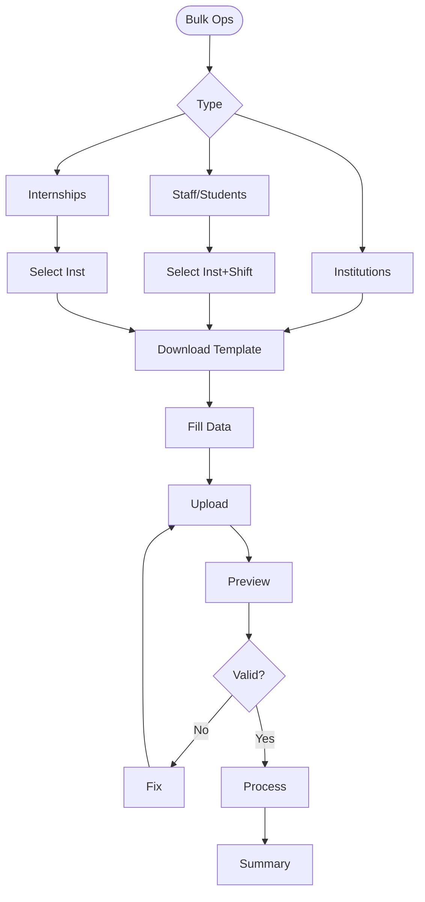

### 3.6 Companies Overview
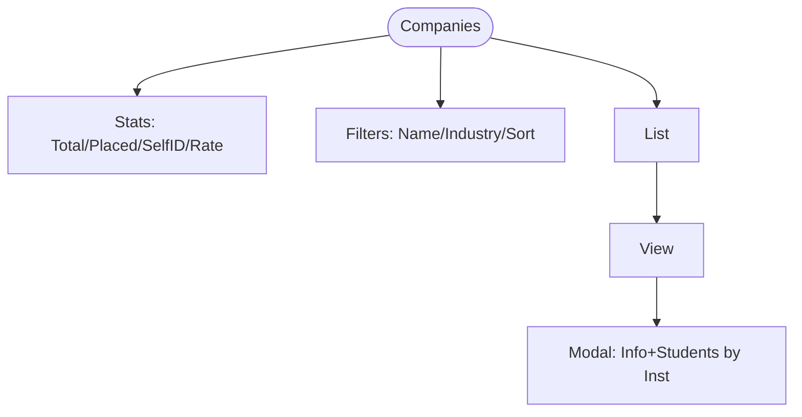

### 3.7 System Management
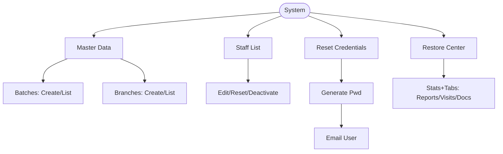

---

## 4. Principal Flows

### 4.1 Dashboard
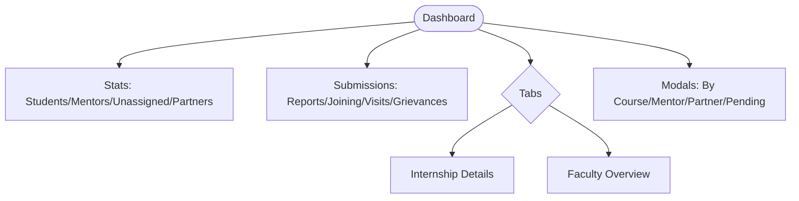

### 4.2 Student Management
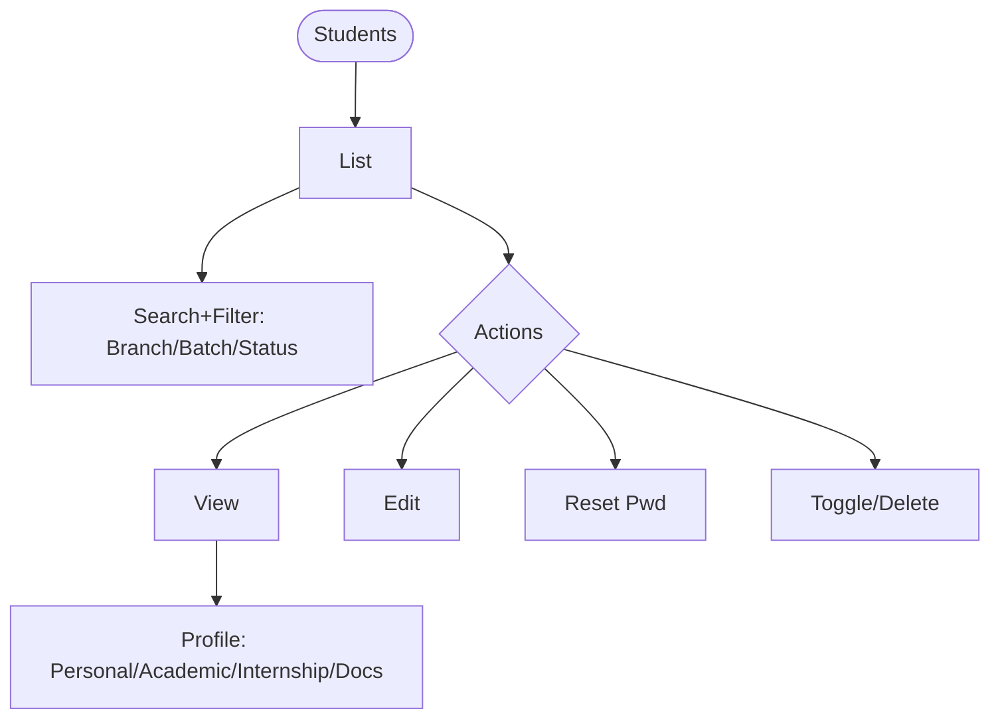

### 4.3 Staff Management
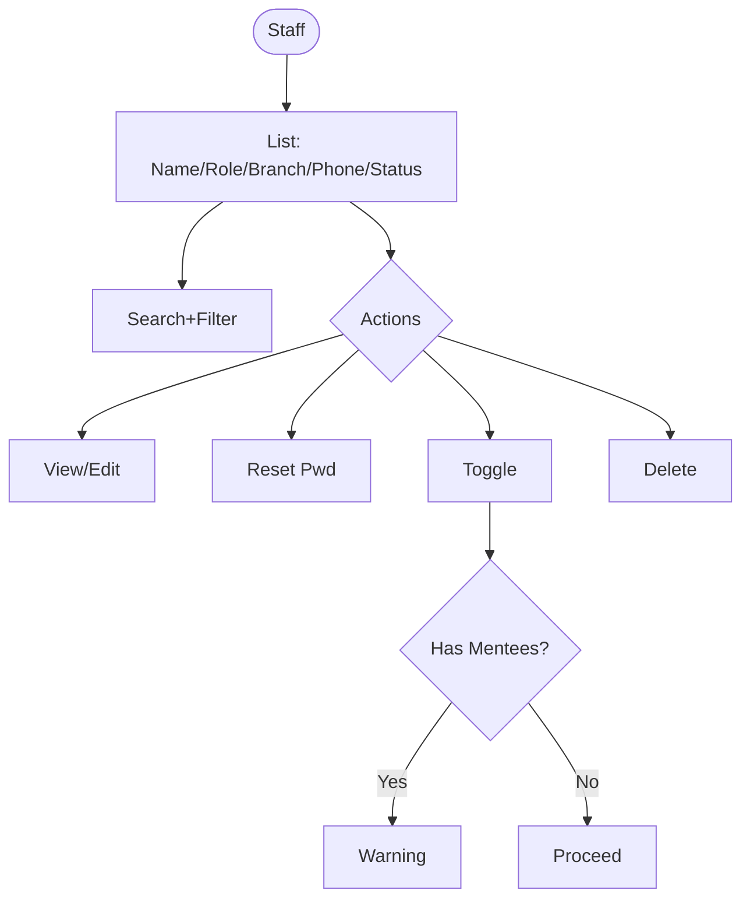

### 4.4 Mentor Assignment
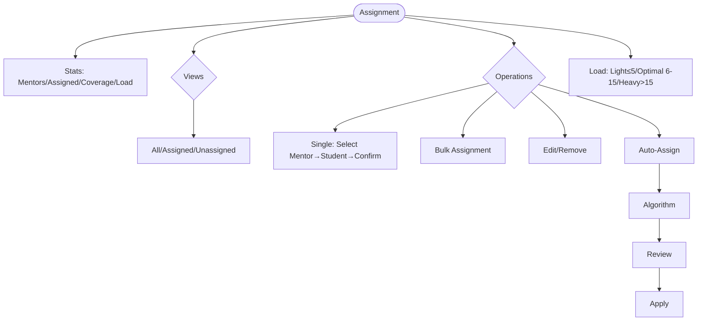

### 4.5 Grievances
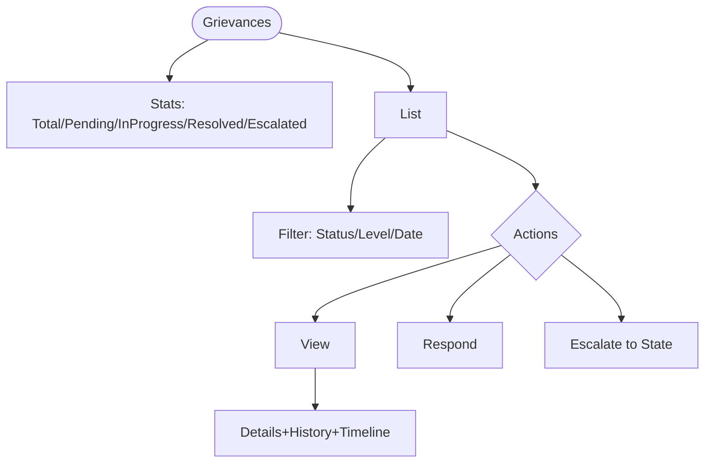

---

## 5. Teacher Flows

### 5.1 Dashboard
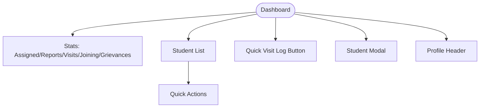

### 5.2 Visit Logging
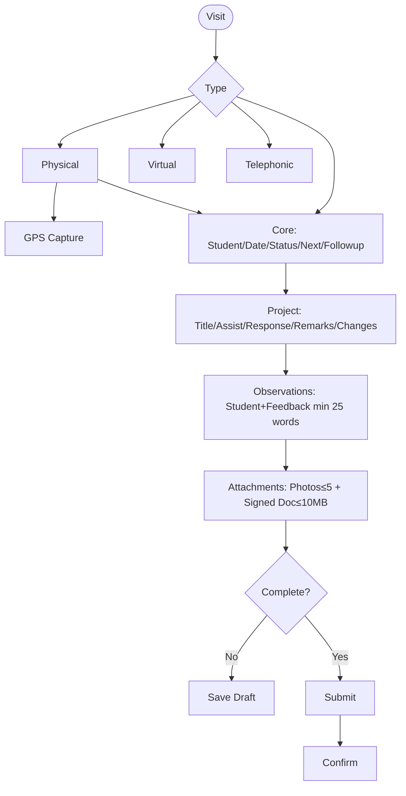

### 5.3 Monthly Reports
```mermaid
flowchart TD
    A([Reports])-->B[Stats: Expected/Submitted/Approved/Draft]
    A-->C[Filter: Status/Student]
    A-->D[List]-->E[Select]-->F{Actions}
    F-->G[View PDF/History/Student]
    F-->H[Approve]-->I[Remarks]-->J[Confirm]
    F-->K[Reject]-->L[Reason min 10 chars]-->M[Confirm]
    F-->N[Delete]
```

### 5.4 Self-ID Approvals
```mermaid
flowchart TD
    A([Approvals])-->B[Stats: Pending/Approved/Total]
    A-->C{Tabs: Pending/Approved/All}
    A-->D[List]-->E[View]-->F[Modal: Student/Company/HR/Period/Letter]
    E-->G{Decision}
    G-->H[Approve]-->I[Set Date]-->J[Confirm]-->K[Notify]
    G-->L[Reject]-->M[Confirm]-->K
```

### 5.5 Joining Letters
```mermaid
flowchart TD
    A([Letters])-->B[Stats: Total/Uploaded/Pending]
    A-->C[List]-->D[Search+Filter]
    C-->E{Actions}
    E-->F[View Doc]
    E-->G[Verify]-->H[Remarks]-->I[Confirm]
    E-->J[Reject]-->K[Reason]-->L[Confirm]
    E-->M[Delete]
    E-->N[Upload on Behalf]-->O[Select Student]-->P[Upload≤1MB]
```

### 5.6 Student Progress
```mermaid
flowchart TD
    A([Progress])-->B[List]-->C[Search+Filter]-->D[Select]
    D-->E[Profile: Name/Roll/Contact/Counts]
    D-->F{Tabs}
    F-->G[Overview: Active Intern/Recent Apps/Activity]
    F-->H[Visits: All Logs/Metrics/Breakdown/Rating]
    F-->I[Feedback: Attendance/Performance/Punctuality/Tech 0-5]
```

---

## 6. Student Flows

### 6.1 Dashboard
```mermaid
flowchart TD
    A([Dashboard])-->B[Welcome]
    A-->C[Internship Selector]-->D[Active Info]
    A-->E{Status Cards}
    E-->F[Data Status]-->F1{Complete?}-->F2[Pending/Complete Badge]
    E-->G[Joining Status]-->G1{Uploaded?}-->G2[Upload/View Btn]
    E-->H[Report Status]-->H1{Overdue?}-->H2[Red/Yellow/Green]
    A-->I[Mentor Card]
    A-->J[Supervisor Card]
    A-->K{First Visit?}-->L[Placement Form Modal]
```

### 6.2 Self-ID Application
```mermaid
flowchart TD
    A([Add Intern])-->B{Has Active?}
    B-->|Yes|C[Error]
    B-->|No|D[Form]
    D-->E[Company: Name/Address/Contact/Email]
    D-->F[Intern: Profile/Start/End/Duration]
    D-->G[HR: Name/Contact/Email/Designation]
    D-->H[Select Mentor]-->I[Auto-populate]
    D-->J[Upload Letter PDF]
    D-->K{Valid?}
    K-->|No|L[Fix]-->D
    K-->|Yes|M[Submit]-->N[Pending]-->O[Notify Teacher]
```

### 6.3 Monthly Report Submit
```mermaid
flowchart TD
    A([Submit])-->B[Select Internship]-->C[Select Month]-->D{In Period?}
    D-->|No|E[Disabled]
    D-->|Yes|F[Guidelines]-->G[Accept]-->H[Upload PDF≤1MB]
    H-->I{Valid?}
    I-->|No|J[Error]-->H
    I-->|Yes|K[Preview]-->L[Draft/Submit]
    L-->M[Status]-->N[Notify Teacher]
    M-->O{Track: Review/Approved/Rejected/Revision}
```

### 6.4 Grievance Submit
```mermaid
flowchart TD
    A([Grievance])-->B{Has Mentor?}
    B-->|No|C[Error]
    B-->|Yes|D[Form]
    D-->E[Category: Intern/Mentor/Industry/Payment/Harass/Work/Safety/Other]
    D-->F[Priority: Low/Medium/High/Urgent]
    D-->G[Subject+Description]
    D-->H[Escalation Level]
    D-->I[Submit]-->J[Auto-assign Teacher]-->K[Notify]
    I-->L[Track: Status/Timeline/Response]
```

### 6.5 Placement Interest
```mermaid
flowchart TD
    A([Placement])-->B{Filled?}
    B-->|Yes|C[Show Status]
    B-->|No|D[Modal]-->E[Plan: Private/BTech/Govt]
    E-->|Private|F[Location: Punjab/Outside]
    F-->G[Salary: 10-15k/15-20k/20k+]
    E-->|BTech/Govt|H[Skip]
    E-->I[Submit]-->J[Close]-->K[Dashboard]
```

### 6.6 Profile Management
```mermaid
flowchart TD
    A([Profile])-->B[Personal: Roll/Name/Email/Phone/DOB/Gender/Address]
    A-->C[Contact: Masked+Reveal/Parent]
    A-->D[Avatar: Upload→Crop→WebP]
    A-->E[Education: Institution/Course/Semester]
    A-->F[Documents: Upload/Type/View/Delete]
```

---

## 7. System Admin Flows

### 7.1 Dashboard
```mermaid
flowchart TD
    A([Admin])-->B[Health: CPU/Memory/Disk/Uptime]
    A-->C[Users: Total/Active Sessions/New Today]
    A-->D[API: Requests/Latency/Errors]
    A-->E[DB: Connections/Avg Query Time]
```

### 7.2 User Management
```mermaid
flowchart TD
    A([Users])-->B[List: Name/Email/Role/LastLogin/Status]
    B-->C[Search+Filter]
    B-->D{Actions: View/Edit/Reset/Toggle/Delete}
    A-->E[Sessions]-->F[View/Terminate]
```

### 7.3 Database Management
```mermaid
flowchart TD
    A([DB])-->B[Manual Backup]-->C[Start]-->D[Progress]-->E[Complete]
    A-->F[Scheduled]-->G[View/Add/Edit/Delete]
    A-->H[History]-->I[List]-->J[Download/Restore/Delete]
```

### 7.4 Security & Audit
```mermaid
flowchart TD
    A([Security])-->B[Insights: Failed Logins/Suspicious/Locked]
    A-->C[Audit Logs]-->D[Filter: User/Action/Date/Entity]
    C-->E[Details: User/Action/Time/IP]
    A-->F[Alerts]-->G[View/Create/Resolve]
```

### 7.5 Feature Flags
```mermaid
flowchart TD
    A([Features])-->B[List: Name/Desc/Status/Scope]
    B-->C{Actions}
    C-->D[Toggle]-->E[Confirm]-->F[Apply]-->G[Notify Users]
    C-->H[Edit Config]
    C-->I[View Usage]
```

---

## 8. Grievance System

### 8.1 Lifecycle
```mermaid
stateDiagram-v2
    [*]-->Submitted: Student
    Submitted-->Pending: Auto-assign Teacher
    Pending-->UnderReview: Teacher Reviews
    UnderReview-->InProgress: Responds
    UnderReview-->Rejected
    UnderReview-->Escalated: To Principal
    InProgress-->Resolved
    InProgress-->Escalated
    Escalated-->UnderReviewP: Principal
    UnderReviewP-->InProgressP
    UnderReviewP-->EscalatedS: To State
    InProgressP-->Resolved
    EscalatedS-->UnderReviewS: State
    UnderReviewS-->InProgressS
    InProgressS-->Resolved
    Resolved-->Closed
    Rejected-->[*]
    Closed-->[*]
```

### 8.2 Escalation Chain
```mermaid
flowchart TD
    A([Student])-->B[L1: Teacher]
    B-->C{Action}
    C-->D[Resolve]-->E[Done]
    C-->F[Escalate]-->G[L2: Principal]
    G-->H{Action}
    H-->I[Resolve]-->J[Done]
    H-->K[Escalate]-->L[L3: State]
    L-->M{Action}
    M-->N[Resolve/Final]-->O[Done]
```

### 8.3 Response Flow
```mermaid
flowchart TD
    A([View])-->B[Info: Subject/Category/Priority/Status/Date]
    A-->C[Description+Student Info+Timeline]
    A-->D{Actions}
    D-->E[Respond]-->F[Text+Status]-->G[Submit]
    D-->H[Update Status]
    D-->I[Escalate]-->J[Reason]-->K[Confirm]
    D-->L[Reject]
```

---

## 9. Report Builder

### 9.1 Main Flow
```mermaid
flowchart TD
    A([Report Builder])-->B[Report Catalog]
    B-->C{Select Category}
    C-->D[Student Reports]
    C-->E[Mentor Reports]
    C-->F[Internship Reports]
    C-->G[Compliance Reports]
    C-->H[Institution Reports]
    C-->I[Pending Reports]
    C-->J[User Activity Reports]
    C-->K[Industry Reports]
    D & E & F & G & H & I & J & K-->L[Select Report Type]
    L-->M[Config Panel]
    M-->N[Select Columns]
    M-->O[Apply Filters]
    M-->P[Set Sort Order]
    M-->Q[Preview Data]
    Q-->R[Generate]-->S[Export Excel]
    S-->T[Download with Metadata]
```

### 9.2 Report Categories
```mermaid
flowchart TD
    subgraph S["1. Student Reports"]
        S1[Directory: Details/Mentor/Institution/Status]
        S2[Compliance: Joining/Reports/LastDate]
        S3[By Branch: Distribution/Placed/Compliance%]
        S4[Without Internship: No Applications]
    end
    subgraph M["2. Mentor Reports"]
        M1[Mentor List: Profile/Dept/StudentCount]
        M2[Assignments: Mapping/Status/LastVisit]
        M3[Unassigned Students: No Mentor]
    end
    subgraph I["3. Internship Reports"]
        I1[By Institution: Active/Completed/Pending]
        I2[Self-ID: Company/HR/Timeline/Stipend]
    end
```

### 9.3 More Report Categories
```mermaid
flowchart TD
    subgraph C["4. Compliance Reports"]
        C1[Visit Compliance: Required/Done/Pending%]
        C2[Report Compliance: Expected/Submitted/Approved]
        C3[Joining Status: Letter/StartDate/DaysSince]
    end
    subgraph IN["5. Institution Reports"]
        IN1[Summary: Profile/Students/Faculty/Metrics]
        IN2[Comparison: Rates/Scores Across Inst]
        IN3[Branch-wise: Students/Mentors/Compliance]
    end
    subgraph P["6. Pending Reports"]
        P1[Pending Visits: DaysSince/Due/Urgency]
        P2[Pending Reports: Month/DaysPastDue]
        P3[Pending Letters: DaysSinceStart]
        P4[Pending Assignments: DaysPending]
    end
```

### 9.4 User & Industry Reports
```mermaid
flowchart TD
    subgraph U["7. User Activity Reports"]
        U1[Login Activity: Count/Last/Previous]
        U2[Session History: Duration/IP/Device]
        U3[Never Logged In: Since Creation]
        U4[Default Password: Not Changed]
        U5[Inactive Users: Days Inactive]
        U6[Audit Log: Actions/Entity/Timestamp]
    end
    subgraph IND["8. Industry Reports"]
        IND1[Distribution: Company/Students/Stipend]
        IND2[Top 3 Institutes per Company]
    end
```

### 9.5 Configuration Panel
```mermaid
flowchart TD
    A([Config Panel])-->B[Column Selection]
    B-->C[Default Columns: Pre-selected]
    B-->D[Optional Columns: Add/Remove]
    B-->E[Column Order: Drag to Reorder]
    A-->F[Filters]
    F-->G[Contextual: Based on Report Type]
    F-->H[Institution/Branch/Batch/Status]
    F-->I[Date Range/Search]
    A-->J[Sort Options]
    J-->K[Select Sortable Column]
    J-->L[Ascending/Descending]
    A-->M[Preview]-->N{Data Available?}
    N-->|Yes|O[Show Preview Table]
    N-->|No|P[Empty State Message]
```

### 9.6 Export Flow
```mermaid
flowchart TD
    A([Export])-->B[Generate Excel]
    B-->C[Add Metadata Sheet]
    C-->D[Report Name]
    C-->E[Generated DateTime]
    C-->F[Filters Applied]
    C-->G[Generated By User]
    B-->H[Add Data Sheet]
    H-->I[Headers from Selected Columns]
    H-->J[Data in Selected Order]
    H-->K{Has Data?}
    K-->|Yes|L[Populate Rows]
    K-->|No|M[No Records Message]
    L & M-->N[Download File]
```

### 9.7 Student Directory Report Flow
```mermaid
flowchart TD
    A([Student Directory])-->B[Default Columns]
    B-->C[Name/Roll/Email/Phone]
    B-->D[Institution/Branch/Batch]
    B-->E[Mentor Name]
    B-->F[Internship Status]
    B-->G[Active Status]
    A-->H[Optional Columns]
    H-->I[Address/DOB/Gender]
    H-->J[Company Name]
    H-->K[Join Date]
    A-->L[Filters]
    L-->M[By Institution]
    L-->N[By Branch/Batch]
    L-->O[By Status]
    L-->P[By Internship Status]
```

### 9.8 Compliance Report Flow
```mermaid
flowchart TD
    A([Compliance Reports])-->B{Type}
    B-->C[Visit Compliance]
    B-->D[Report Compliance]
    B-->E[Joining Status]
    C-->F[Cols: Student/Mentor/Inst]
    C-->G[Required/Completed/Pending Visits]
    C-->H[Compliance%/Last Visit Date]
    D-->I[Cols: Student/Mentor/Inst]
    D-->J[Expected/Submitted/Approved Reports]
    D-->K[Compliance%/Latest Submit Date]
    E-->L[Cols: Student/Mentor/Inst]
    E-->M[Letter Status/Start Date]
    E-->N[Days Since Start/Active Status]
```

### 9.9 User Activity Report Flow
```mermaid
flowchart TD
    A([User Activity])-->B{Type}
    B-->C[Login Activity]-->C1[Account/LoginCount/Last/Role]
    B-->D[Session History]-->D1[Start/End/Duration/IP/Device]
    B-->E[Never Logged In]-->E1[Since Creation/Password/Role]
    B-->F[Default Password]-->F1[Not Changed/LoginCount/Role]
    B-->G[Inactive Users]-->G1[Last Login/Inactive Days/Status]
    B-->H[Audit Log]-->H1[User/Action/Entity/Time/IP]
```

### 9.10 Report Builder Journey
```mermaid
journey
    title Report Generation
    section Select
      Open Report Builder: 4: State
      Choose Category: 4: State
      Select Report Type: 4: State
    section Configure
      Select Columns: 3: State
      Apply Filters: 3: State
      Set Sort Order: 4: State
    section Generate
      Preview Data: 4: State
      Generate Report: 5: State
      Download Excel: 5: State
```

### 9.11 Report Builder Sequence
```mermaid
sequenceDiagram
    User->>Frontend: Select Report Type
    Frontend->>Frontend: Load Config Panel
    User->>Frontend: Configure Columns+Filters+Sort
    User->>Frontend: Click Preview
    Frontend->>API: GET /reports/preview
    API->>DB: Query with Filters
    DB-->>API: Data
    API-->>Frontend: Preview Data
    User->>Frontend: Click Generate
    Frontend->>API: POST /reports/generate
    API->>API: Build Excel
    API-->>Frontend: File URL
    Frontend->>User: Download Excel
```

---

## 10. User Journeys

### 10.1 Student Journey
```mermaid
journey
    title Student Internship
    section Setup
      Create Account: 5: Student
      Complete Profile: 4: Student
      Apply Self-ID: 4: Student
      Get Approved: 5: Teacher
    section During
      Submit Reports: 3: Student
      Receive Visits: 4: Teacher
    section End
      Final Report: 4: Student
      Complete: 5: Student
```

### 10.2 Teacher Journey
```mermaid
journey
    title Teacher Mentoring
    section Assignment
      Get Students: 5: Principal
      View List: 4: Teacher
    section Approvals
      Review Apps: 3: Teacher
      Verify Letters: 3: Teacher
    section Monitoring
      Log Visits: 3: Teacher
      Review Reports: 3: Teacher
    section Support
      Handle Grievances: 2: Teacher
```

### 10.3 Principal Journey
```mermaid
journey
    title Principal Oversight
    section Setup
      Manage Staff: 4: Principal
      Assign Mentors: 4: Principal
    section Monitor
      View Dashboard: 5: Principal
      Track Compliance: 3: Principal
    section Manage
      Handle Escalations: 3: Principal
      Generate Reports: 4: Principal
```

### 10.4 State Journey
```mermaid
journey
    title State Oversight
    section Setup
      Add Institutions: 4: State
      Add Principals: 4: State
    section Oversight
      Monitor Colleges: 5: State
      Track Compliance: 4: State
    section Support
      Handle Escalations: 3: State
      Manage Support: 3: State
```

---

## 11. Sequences

### 11.1 Login
```mermaid
sequenceDiagram
    User->>Frontend: Credentials
    Frontend->>API: POST /auth/login
    API->>DB: Validate
    DB-->>API: User Data
    alt MFA
        API-->>Frontend: Require MFA
        User->>Frontend: Code
        Frontend->>API: Verify
    end
    API->>Session: Create
    Session-->>API: Token
    API-->>Frontend: JWT+User
    Frontend->>User: Dashboard
```

### 11.2 Report Submit
```mermaid
sequenceDiagram
    Student->>Frontend: Upload PDF
    Frontend->>API: POST /reports
    API->>Storage: Upload
    API-->>Frontend: Created
    API->>Teacher: Notify
    Teacher->>API: GET Report
    alt Approve
        Teacher->>API: Approve
    else Reject
        Teacher->>API: Reject
    end
    API->>Student: Notify
```

### 11.3 Visit Log
```mermaid
sequenceDiagram
    Teacher->>Frontend: New Visit
    opt Physical
        Frontend->>GPS: Location
    end
    Teacher->>Frontend: Fill+Photos+Doc
    Frontend->>API: POST /visits
    API->>Storage: Attachments
    API-->>Frontend: Saved
    API->>Student: Notify
```

---

## 12. Entity Relationships
```mermaid
erDiagram
    INSTITUTION ||--o{ STUDENT : has
    INSTITUTION ||--o{ TEACHER : has
    INSTITUTION ||--|| PRINCIPAL : has
    TEACHER ||--o{ STUDENT : mentors
    TEACHER ||--o{ VISIT_LOG : creates
    STUDENT ||--o{ INTERNSHIP : applies
    STUDENT ||--o{ MONTHLY_REPORT : submits
    STUDENT ||--o{ GRIEVANCE : submits
    INTERNSHIP ||--o{ VISIT_LOG : receives
    COMPANY ||--o{ INTERNSHIP : provides
    GRIEVANCE }o--|| TEACHER : assigned
```

---

## 13. Data Flow
```mermaid
flowchart TD
    subgraph I["Input"]
        A[Student App]
        B[Bulk Upload]
        C[Teacher Entry]
    end
    subgraph P["Process"]
        D[Validate]
        E[Approval]
        F[Assign]
    end
    subgraph S["Storage"]
        G[(DB)]
        H[(Files)]
    end
    subgraph O["Output"]
        J[Dashboard]
        K[Reports]
        L[Notify]
    end
    A & B & C-->D-->E-->F-->G
    A & C-->H
    G-->J & K & L
```

---

## Appendix: Access Matrix

| Feature | Admin | State | Principal | Teacher | Student |
|---------|-------|-------|-----------|---------|---------|
| System Health | Yes | - | - | - | - |
| User Mgmt | Yes | Limited | Limited | - | - |
| Institution Mgmt | - | Yes | - | - | - |
| Student Mgmt | - | View All | Own Inst | Assigned | Own |
| Visit Logging | - | View | View | Yes | View Own |
| Monthly Reports | - | View | View | Review | Submit |
| Grievances | - | L3 | L2 | L1 | Submit |
| Report Builder | - | Yes | Limited | - | - |

---

*PlaceIntern Portal - Flow Documentation*
