# Training Calendar - User Flow & Journey Diagrams

This document contains comprehensive Mermaid diagrams illustrating user flows, journeys, and system interactions for the Training Calendar feature of the PlaceIntern Portal.

---

## Table of Contents
1. [Training System Overview](#1-training-system-overview)
2. [State Directorate Training Flows](#2-state-directorate-training-flows)
3. [Principal Training Flows](#3-principal-training-flows)
4. [Teacher Training Flows](#4-teacher-training-flows)
5. [Faculty Coordinator Flows](#5-faculty-coordinator-flows)
6. [Lesson Plan Flows](#6-lesson-plan-flows)
7. [Test & Feedback Form Flows](#7-test--feedback-form-flows)
8. [Training Lifecycle](#8-training-lifecycle)
9. [User Journeys](#9-user-journeys)

---

## 1. Training System Overview

### 1.1 Training Module Architecture

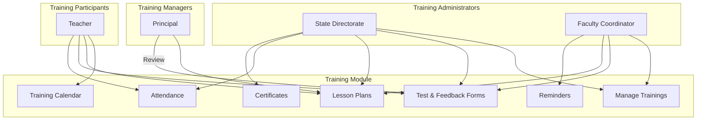

### 1.2 Training Role Hierarchy

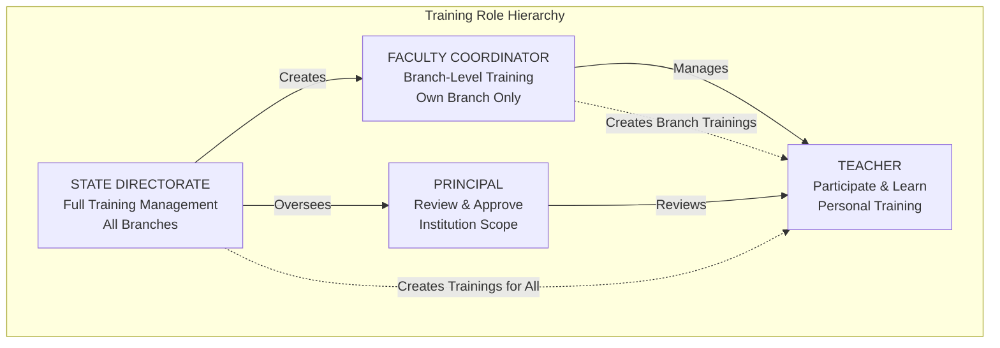

### 1.3 Training Feature Map

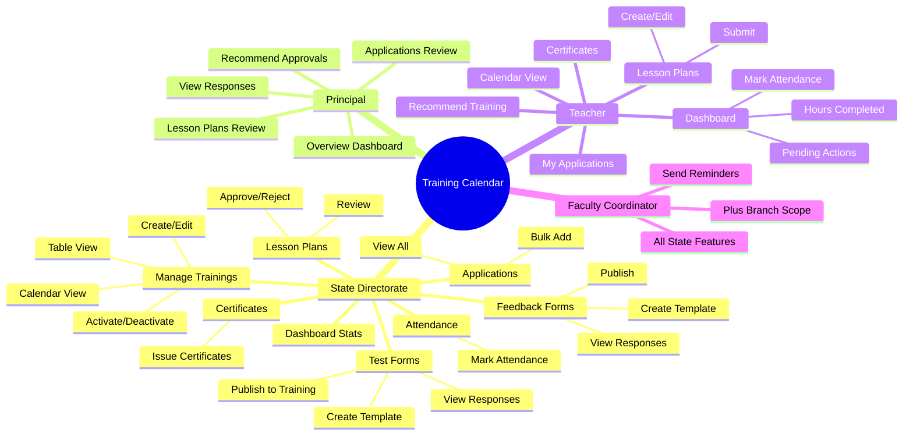

### 1.4 Training Roles Summary

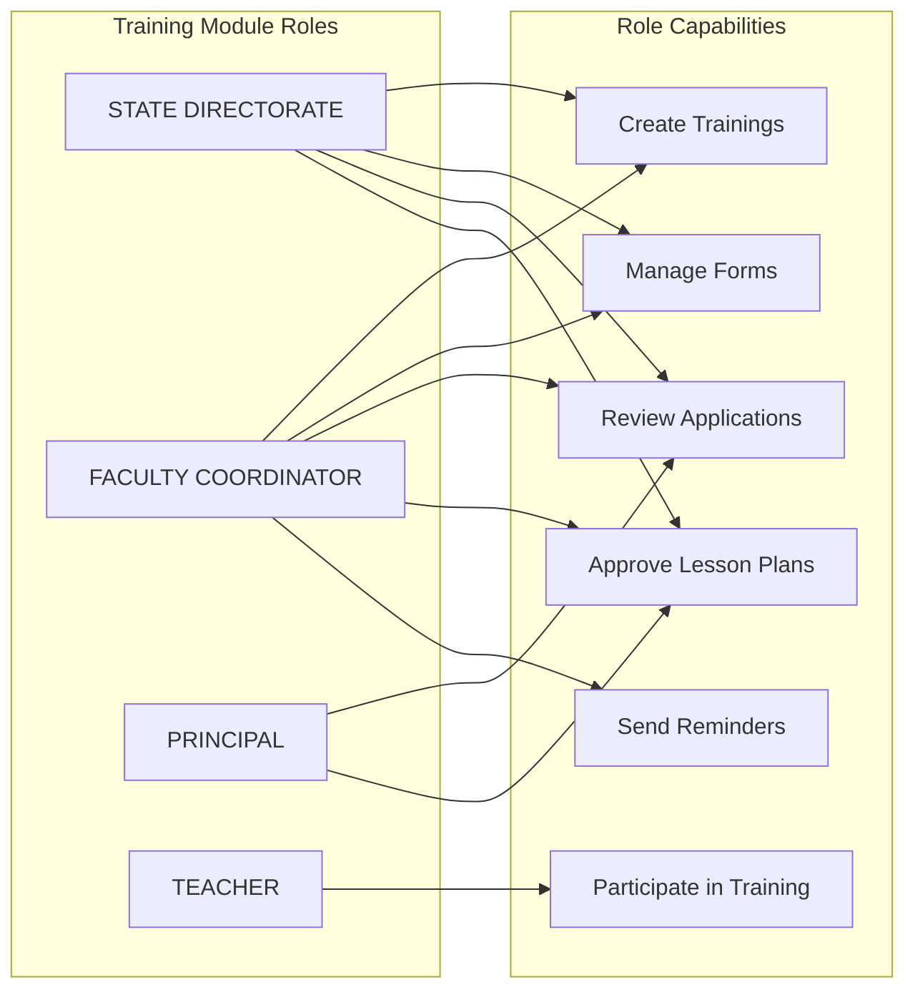

---

## 2. State Directorate Training Flows

### 2.1 Training Dashboard Flow

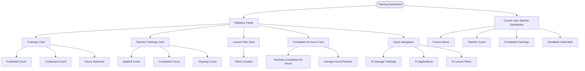

### 2.2 Manage Trainings Flow

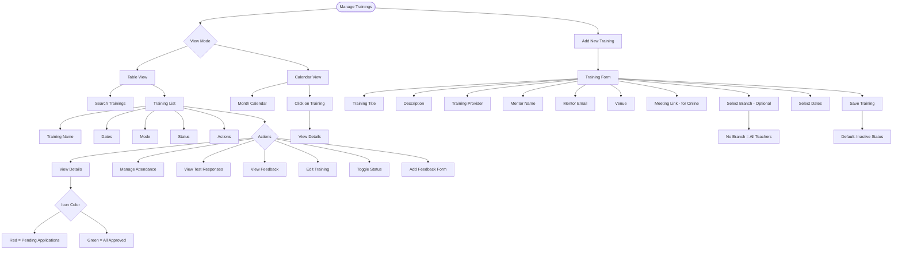

### 2.3 Training Creation Flow

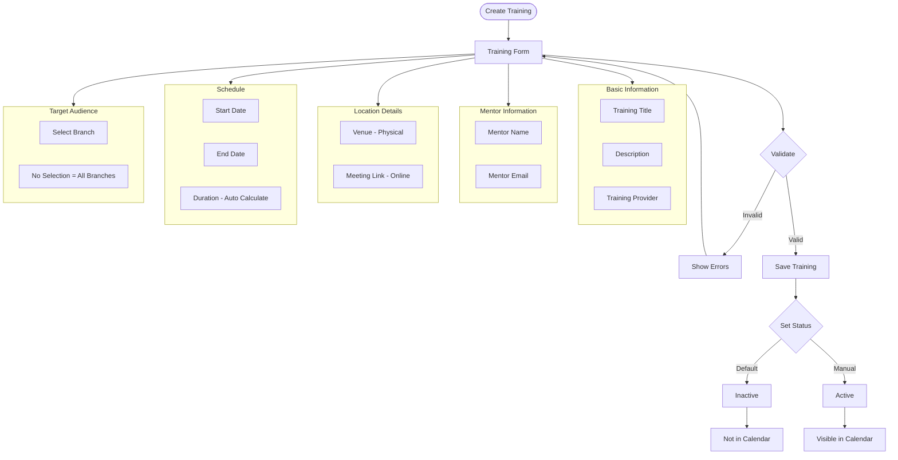

### 2.4 Application Management Flow

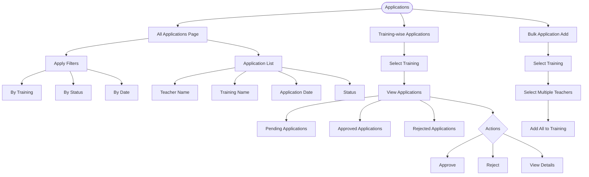

### 2.5 Attendance Management Flow

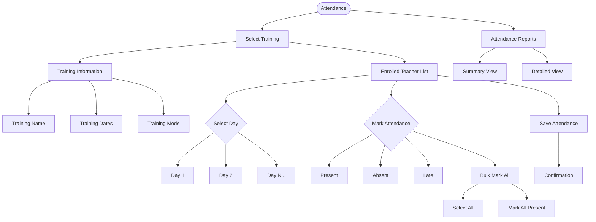

### 2.6 Certificate Management Flow

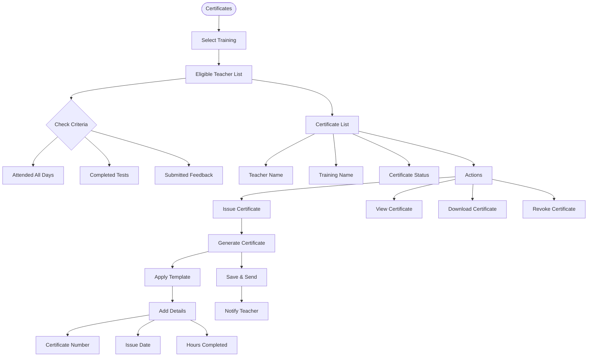

---

## 3. Principal Training Flows

### 3.1 Principal Training Overview Flow

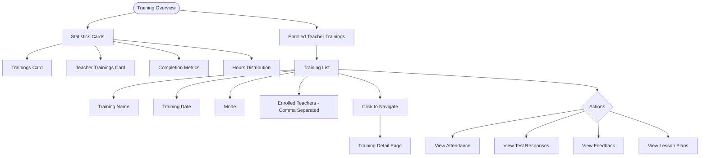

### 3.2 Application Review Flow (Principal)

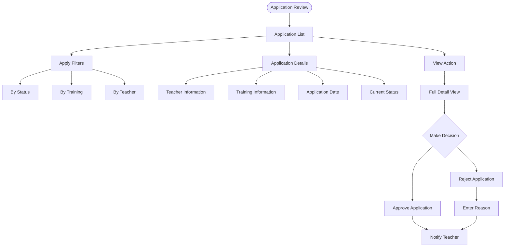

### 3.3 Lesson Plan Review Flow (Principal)

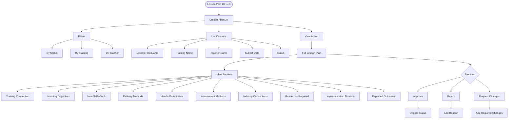

### 3.4 Recommend Training Approval Flow

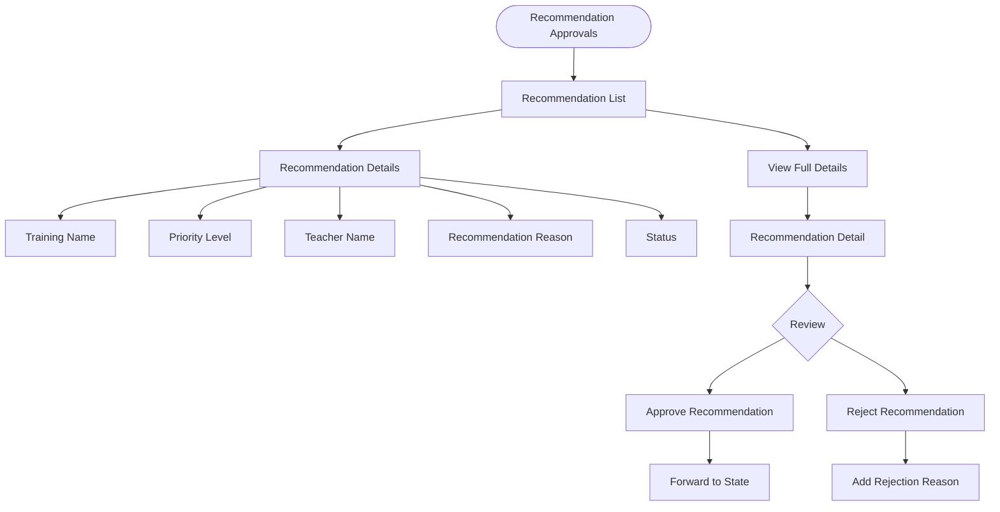

---

## 4. Teacher Training Flows

### 4.1 Teacher Training Dashboard Flow

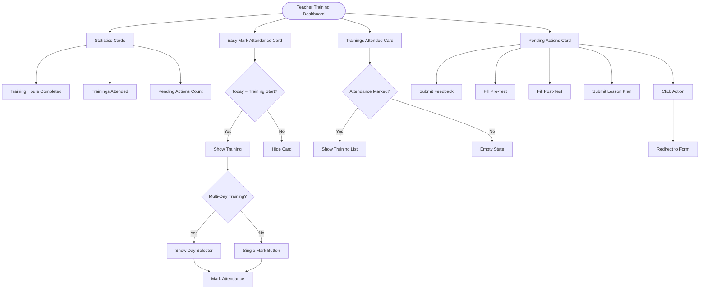

### 4.2 Training Calendar View Flow

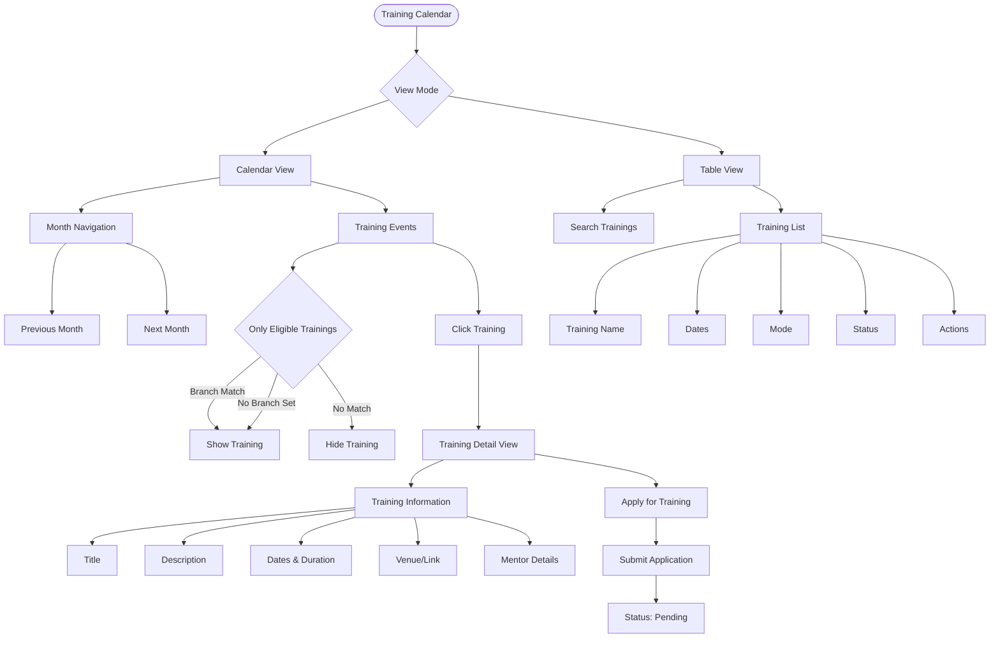

### 4.3 Training Application Flow

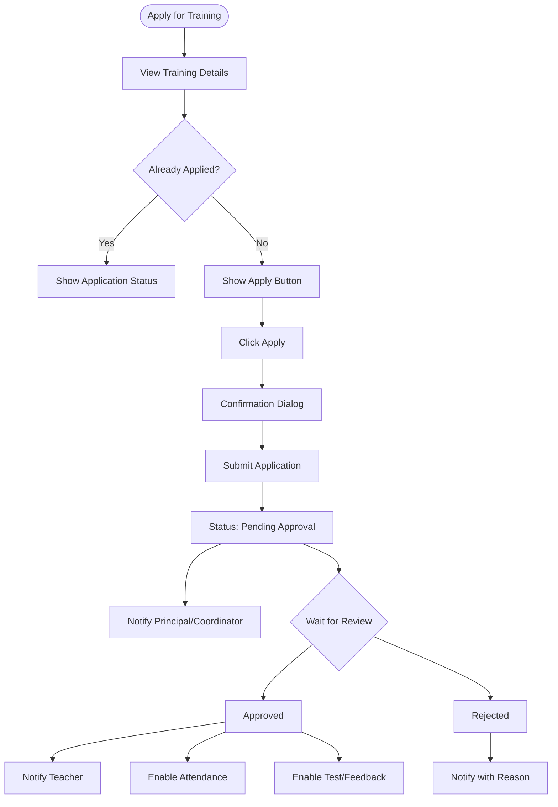

### 4.4 My Applications Flow

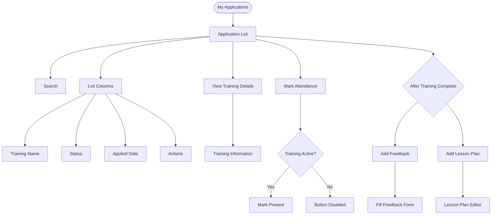

### 4.5 Lesson Plan Creation Flow

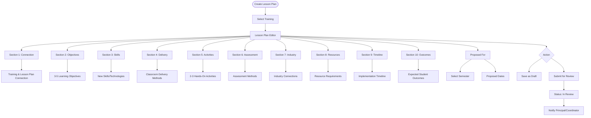

### 4.6 Recommend Training Flow

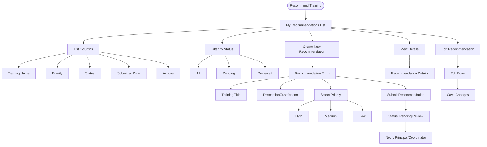

### 4.7 Teacher Certificates Flow

```mermaid
flowchart TD
    CERTS([My Certificates]) --> LIST[Certificate List]

    LIST --> COLS[List Columns]
    COLS --> TRAINING_NAME[Training Name]
    COLS --> ISSUE_DATE[Issue Date]
    COLS --> HOURS[Hours Completed]
    COLS --> CERT_NO[Certificate Number]
    COLS --> ACTIONS[Actions]

    LIST --> VIEW[View Certificate]
    VIEW --> CERT_VIEW[Certificate Preview]

    LIST --> DOWNLOAD[Download Certificate]
    DOWNLOAD --> PDF[Download as PDF]

    LIST --> STATS[Certificate Statistics]
    STATS --> TOTAL_CERTS[Total Certificates]
    STATS --> TOTAL_HOURS[Total Hours Earned]
    STATS --> PROGRESS[Progress to 40 Hours]
```

---

## 5. Faculty Coordinator Flows

### 5.1 Coordinator Dashboard Flow

```mermaid
flowchart TD
    COORD_DASH([Coordinator Dashboard]) --> STATS[Statistics Cards]

    STATS --> TRAININGS[Trainings Card]
    TRAININGS --> PUBLISHED[Published]
    TRAININGS --> CONDUCTED[Conducted]
    TRAININGS --> HOURS[Hours Delivered]

    STATS --> TEACHER_TRAIN[Teacher Trainings]
    TEACHER_TRAIN --> APPLIED[Applied]
    TEACHER_TRAIN --> COMPLETED[Completed]
    TEACHER_TRAIN --> ONGOING[Ongoing]

    STATS --> LESSON_PLAN[Lesson Plans]
    LESSON_PLAN --> CREATED[Plans Created]

    STATS --> COMPLETION[Completion & Hours]
    COMPLETION --> COMP_40[40 Hours Completed]
    COMPLETION --> AVG[Average Hours/Teacher]

    COORD_DASH --> SCOPE[Branch Scope Only]
    SCOPE --> OWN_BRANCH[Own Branch Data]
```

### 5.2 Coordinator Training Management Flow

```mermaid
flowchart TD
    MANAGE([Manage Trainings]) --> SCOPE[Branch Scope Filter]

    SCOPE --> VIEW_MODE{View Mode}
    VIEW_MODE --> TABLE[Table View]
    VIEW_MODE --> CALENDAR[Calendar View]

    MANAGE --> ADD[Add Training]
    ADD --> FORM[Training Form]
    FORM --> BRANCH_AUTO[Branch Auto-Set to Own Branch]

    MANAGE --> LIST[Training List]
    LIST --> ACTIONS{Actions}
    ACTIONS --> VIEW[View]
    ACTIONS --> ATTENDANCE[Attendance]
    ACTIONS --> TEST[Test Responses]
    ACTIONS --> FEEDBACK[Feedback Responses]
    ACTIONS --> EDIT[Edit]
    ACTIONS --> STATUS[Toggle Status]

    MANAGE --> SAME_AS_STATE[Same Features as State]
    SAME_AS_STATE --> BUT_SCOPED[But Scoped to Branch]
```

### 5.3 Coordinator Application Review Flow

```mermaid
flowchart TD
    REVIEW([Review Applications]) --> SCOPE[Branch Scope Only]

    SCOPE --> LIST[Application List]
    LIST --> BRANCH_TEACHER[Only Branch Teacher Applications]

    LIST --> VIEW[View Application]
    VIEW --> DETAILS[Application Details]

    VIEW --> DECISION{Decision}
    DECISION --> APPROVE[Approve]
    DECISION --> REJECT[Reject]

    APPROVE --> NOTIFY[Notify Teacher]
    REJECT --> REASON[Enter Reason]
    REASON --> NOTIFY
```

### 5.4 Coordinator Lesson Plan Review Flow

```mermaid
flowchart TD
    LP_REVIEW([Review Lesson Plans]) --> SCOPE[Branch Scope Only]

    SCOPE --> LIST[Lesson Plan List]
    LIST --> BRANCH_LP[Only Branch Teacher Plans]

    LIST --> VIEW[View Lesson Plan]
    VIEW --> FULL_PLAN[Full Lesson Plan Details]

    VIEW --> DECISION{Decision}
    DECISION --> APPROVE[Approve]
    DECISION --> REJECT[Reject]
    DECISION --> CHANGES[Request Changes]

    APPROVE --> STATUS_UPDATE[Update Status: Approved]
    REJECT --> REASON[Enter Reason]
    CHANGES --> NOTES[Add Required Changes]

    STATUS_UPDATE --> NOTIFY[Notify Teacher]
    REASON --> NOTIFY
    NOTES --> NOTIFY
```

### 5.5 Send Reminders Flow

```mermaid
flowchart TD
    REMIND([Send Reminders]) --> TABS[Reminder Tabs]

    TABS --> ENROLL_TAB[Enrollments]
    TABS --> PRE_TEST_TAB[Pre-Test]
    TABS --> POST_TEST_TAB[Post-Test]
    TABS --> LESSON_TAB[Lesson Plan]
    TABS --> FEEDBACK_TAB[Feedback]

    TABS --> SELECT_TAB[Select Tab]
    SELECT_TAB --> VIEW_LIST[View Teacher List]

    VIEW_LIST --> BULK_SEND[Send Reminder to All]
    BULK_SEND --> ALL_BRANCH[All Branch Teachers]
    ALL_BRANCH --> SPECIFIC_TYPE[For Selected Reminder Type]

    VIEW_LIST --> INDIVIDUAL[Individual Selection]
    INDIVIDUAL --> SELECT_TEACH[Select Teacher]
    INDIVIDUAL --> SELECT_TYPE[Select Reminder Type]
    INDIVIDUAL --> SEND[Send Reminder]

    SEND --> METHOD{Delivery Method}
    METHOD --> IN_APP[In-App Notification]
    METHOD --> EMAIL[Email Notification]
    METHOD --> BOTH[Both]

    SEND --> CONFIRM[Confirmation]
```

### 5.6 Coordinator Recommendations Flow

```mermaid
flowchart TD
    RECS([Training Recommendations]) --> LIST[Recommendation List]

    LIST --> SCOPE[Branch Teachers Only]
    SCOPE --> VIEW_RECS[View Recommendations]

    VIEW_RECS --> DETAILS[Recommendation Details]
    DETAILS --> TRAINING_NAME[Recommended Training]
    DETAILS --> TEACHER_NAME[Teacher Name]
    DETAILS --> PRIORITY[Priority Level]
    DETAILS --> JUSTIFICATION[Justification]

    VIEW_RECS --> DECISION{Decision}
    DECISION --> ACCEPT[Accept]
    DECISION --> REJECT[Reject]

    ACCEPT --> FORWARD[Forward to State]
    REJECT --> REASON[Enter Reason]
    REASON --> NOTIFY[Notify Teacher]
```

---

## 6. Lesson Plan Flows

### 6.1 Complete Lesson Plan Lifecycle

```mermaid
stateDiagram-v2
    [*] --> Draft: Teacher Creates

    Draft --> InReview: Submit for Review
    Draft --> Draft: Edit & Save

    InReview --> Approved: Reviewer Approves
    InReview --> Rejected: Reviewer Rejects
    InReview --> ChangesNeeded: Request Changes

    ChangesNeeded --> Draft: Teacher Revises
    Rejected --> Draft: Teacher Revises

    Approved --> [*]: Complete

    note right of Draft: Teacher can edit freely
    note right of InReview: Waiting for Principal/Coordinator
    note right of Approved: Final state
```

### 6.2 Lesson Plan Review Workflow

```mermaid
flowchart TD
    SUBMIT([Teacher Submits]) --> IN_REVIEW[Status: In Review]

    IN_REVIEW --> WHO{Who Reviews?}

    WHO --> COORDINATOR[Faculty Coordinator]
    WHO --> PRINCIPAL[Principal]

    COORDINATOR --> SCOPE_CHECK{Branch Scope?}
    SCOPE_CHECK --> |Match| REVIEW_C[Coordinator Reviews]
    SCOPE_CHECK --> |No Match| SKIP[Skip to Principal]

    REVIEW_C --> DECISION_C{Decision}
    DECISION_C --> APPROVE_C[Approve]
    DECISION_C --> REJECT_C[Reject]
    DECISION_C --> CHANGES_C[Request Changes]

    PRINCIPAL --> REVIEW_P[Principal Reviews]
    REVIEW_P --> DECISION_P{Decision}
    DECISION_P --> APPROVE_P[Approve]
    DECISION_P --> REJECT_P[Reject]
    DECISION_P --> CHANGES_P[Request Changes]

    APPROVE_C --> APPROVED[Status: Approved]
    APPROVE_P --> APPROVED

    REJECT_C --> REJECTED[Status: Rejected]
    REJECT_P --> REJECTED

    CHANGES_C --> NEEDS_CHANGES[Status: Changes Needed]
    CHANGES_P --> NEEDS_CHANGES

    APPROVED --> NOTIFY_SUCCESS[Notify Teacher - Success]
    REJECTED --> NOTIFY_REJECT[Notify Teacher - Rejection Reason]
    NEEDS_CHANGES --> NOTIFY_CHANGES[Notify Teacher - Required Changes]
```

---

## 7. Test & Feedback Form Flows

### 7.1 Test Form Management Flow

```mermaid
flowchart TD
    TEST_MGMT([Manage Test Forms]) --> LIST[Form List]

    LIST --> VIEW[View Forms]
    VIEW --> PRE_TEST[Pre-Test Forms]
    VIEW --> POST_TEST[Post-Test Forms]

    LIST --> CREATE[Create New Form]
    CREATE --> FORM_BUILDER[Form Builder]

    FORM_BUILDER --> ADD_Q[Add Questions]
    ADD_Q --> Q_TYPES{Question Types}
    Q_TYPES --> MCQ[Multiple Choice]
    Q_TYPES --> TEXT[Text Answer]
    Q_TYPES --> RATING[Rating Scale]
    Q_TYPES --> BOOLEAN[Yes/No]

    FORM_BUILDER --> CONFIGURE[Configure Form]
    CONFIGURE --> TITLE[Form Title]
    CONFIGURE --> TYPE[Pre-Test / Post-Test]
    CONFIGURE --> REQUIRED[Required Questions]

    FORM_BUILDER --> SAVE[Save Template]
    SAVE --> TEMPLATE[Form Template Created]

    TEMPLATE --> PUBLISH[Publish to Training]
    PUBLISH --> SELECT_TRAINING[Select Training]
    SELECT_TRAINING --> LINK[Link Form to Training]

    LINK --> AVAILABLE[Form Available to Teachers]
```

### 7.2 Test Form Filling Flow (Teacher)

```mermaid
flowchart TD
    FILL([Fill Test Form]) --> TYPE{Form Type}

    TYPE --> PRE_TEST[Pre-Test Form]
    TYPE --> POST_TEST[Post-Test Form]

    PRE_TEST --> TIMING_PRE{Timing Check}
    TIMING_PRE --> |Before Training| ALLOW_PRE[Allow Fill]
    TIMING_PRE --> |After Training Started| BLOCK_PRE[Form Closed]

    POST_TEST --> TIMING_POST{Timing Check}
    TIMING_POST --> |After Training Complete| ALLOW_POST[Allow Fill]
    TIMING_POST --> |During/Before Training| BLOCK_POST[Not Available Yet]

    ALLOW_PRE --> OPEN_FORM[Open Form]
    ALLOW_POST --> OPEN_FORM

    OPEN_FORM --> ANSWER[Answer Questions]
    ANSWER --> VALIDATE{All Required Answered?}
    VALIDATE --> |No| HIGHLIGHT[Highlight Missing]
    HIGHLIGHT --> ANSWER
    VALIDATE --> |Yes| SUBMIT[Submit Form]

    SUBMIT --> CONFIRM[Confirmation]
    CONFIRM --> RESPONSES[Response Recorded]
```

### 7.3 Feedback Form Management Flow

```mermaid
flowchart TD
    FEEDBACK_MGMT([Manage Feedback Forms]) --> LIST[Form List]

    LIST --> CREATE[Create New Form]
    CREATE --> BUILDER[Form Builder]

    BUILDER --> QUESTIONS[Add Questions]
    QUESTIONS --> Q1[Relevance to Teaching - 1-5]
    QUESTIONS --> Q2[Trainer Quality - 1-5]
    QUESTIONS --> Q3[Applicability - 1-5]
    QUESTIONS --> Q4[Learning Outcomes Achieved - Y/N/Partial]
    QUESTIONS --> Q5[Industry Alignment - 1-5]
    QUESTIONS --> Q6[Key Takeaways - Text]
    QUESTIONS --> Q7[Improvements - Text]
    QUESTIONS --> Q8[Future Topics - Text]
    QUESTIONS --> Q9[Industry Input - Y/N]
    QUESTIONS --> Q10[Recommend to Colleagues - Y/N]

    BUILDER --> SAVE[Save Template]
    SAVE --> TEMPLATE[Template Created]

    TEMPLATE --> PUBLISH[Publish to Training]
    PUBLISH --> LINK[Link to Training]

    LIST --> VIEW_RESPONSES[View Responses]
    VIEW_RESPONSES --> SELECT_TRAINING[Select Training]
    SELECT_TRAINING --> RESPONSE_LIST[Response List]

    RESPONSE_LIST --> INDIVIDUAL[Individual Responses]
    RESPONSE_LIST --> AGGREGATE[Aggregated Stats]
    AGGREGATE --> AVG_RATING[Average Ratings]
    AGGREGATE --> COMMON_FEEDBACK[Common Feedback Themes]
```

### 7.4 View Responses Flow

```mermaid
flowchart TD
    RESPONSES([View Responses]) --> SELECT{Select Form Type}

    SELECT --> TEST_RESP[Test Responses]
    SELECT --> FEEDBACK_RESP[Feedback Responses]

    TEST_RESP --> SELECT_TRAINING1[Select Training]
    FEEDBACK_RESP --> SELECT_TRAINING2[Select Training]

    SELECT_TRAINING1 --> TEST_LIST[Response List]
    SELECT_TRAINING2 --> FEEDBACK_LIST[Response List]

    TEST_LIST --> COLS_TEST[Columns]
    COLS_TEST --> TEACHER_NAME[Teacher Name]
    COLS_TEST --> SUBMITTED[Submitted Date]
    COLS_TEST --> SCORE[Score]
    COLS_TEST --> VIEW[View Details]

    FEEDBACK_LIST --> COLS_FEEDBACK[Columns]
    COLS_FEEDBACK --> TEACHER_NAME2[Teacher Name]
    COLS_FEEDBACK --> SUBMITTED2[Submitted Date]
    COLS_FEEDBACK --> RATINGS[Ratings Summary]
    COLS_FEEDBACK --> VIEW2[View Details]

    VIEW --> DETAIL1[Full Test Response]
    VIEW2 --> DETAIL2[Full Feedback Response]

    TEST_LIST --> EXPORT1[Export to Excel]
    FEEDBACK_LIST --> EXPORT2[Export to Excel]
```

---

## 8. Training Lifecycle

### 8.1 Complete Training Lifecycle

```mermaid
stateDiagram-v2
    [*] --> Created: Admin Creates Training

    Created --> Inactive: Default State
    Inactive --> Active: Admin Activates

    Active --> ApplicationOpen: Teachers Can Apply
    ApplicationOpen --> ApplicationReview: Applications Submitted

    ApplicationReview --> Approved: Approve Applications
    ApplicationReview --> Rejected: Reject Applications

    Approved --> PreTraining: Before Start Date
    PreTraining --> PreTestOpen: Pre-Test Available

    PreTestOpen --> TrainingDay: Training Starts
    TrainingDay --> Attendance: Mark Attendance
    Attendance --> InProgress: Training In Progress

    InProgress --> MultiDay: Multi-Day Training
    MultiDay --> Attendance
    MultiDay --> TrainingComplete: All Days Done

    InProgress --> TrainingComplete: Single Day Complete

    TrainingComplete --> PostTraining: After Training
    PostTraining --> PostTestOpen: Post-Test Available
    PostTraining --> FeedbackOpen: Feedback Available

    PostTestOpen --> LessonPlanDue: Submit Lesson Plan
    FeedbackOpen --> LessonPlanDue

    LessonPlanDue --> CertificateEligible: All Requirements Met
    CertificateEligible --> CertificateIssued: Issue Certificate

    CertificateIssued --> [*]: Training Complete
```

### 8.2 Training Completion Requirements

```mermaid
flowchart TD
    COMPLETE([Training Completion]) --> REQUIREMENTS[Check Requirements]

    REQUIREMENTS --> REQ1{Attendance Marked?}
    REQ1 --> |No| FAIL1[Not Eligible]
    REQ1 --> |Yes| REQ2{Pre-Test Completed?}

    REQ2 --> |No| FAIL2[Not Eligible]
    REQ2 --> |Yes| REQ3{Post-Test Completed?}

    REQ3 --> |No| FAIL3[Not Eligible]
    REQ3 --> |Yes| REQ4{Feedback Submitted?}

    REQ4 --> |No| FAIL4[Not Eligible]
    REQ4 --> |Yes| REQ5{Lesson Plan Submitted?}

    REQ5 --> |No| OPTIONAL[Optional for Some]
    REQ5 --> |Yes| ELIGIBLE[Fully Eligible]

    OPTIONAL --> CERT_BASIC[Basic Certificate]
    ELIGIBLE --> CERT_FULL[Full Certificate]

    CERT_BASIC --> HOURS_ADD[Add Hours to Profile]
    CERT_FULL --> HOURS_ADD
    HOURS_ADD --> PROGRESS[Update 40 Hours Progress]
```

### 8.3 Teacher Training Journey Timeline

```mermaid
gantt
    title Teacher Training Journey
    dateFormat  YYYY-MM-DD
    section Discovery
    View Available Trainings    :a1, 2026-03-01, 7d
    Apply for Training          :a2, after a1, 1d
    section Pre-Training
    Application Review          :b1, after a2, 3d
    Approval Notification       :b2, after b1, 1d
    Complete Pre-Test           :b3, after b2, 5d
    section Training
    Attend Training Day 1       :c1, 2026-03-15, 1d
    Mark Attendance Day 1       :c2, 2026-03-15, 1d
    Attend Training Day 2       :c3, 2026-03-16, 1d
    Mark Attendance Day 2       :c4, 2026-03-16, 1d
    Attend Training Day 3       :c5, 2026-03-17, 1d
    Mark Attendance Day 3       :c6, 2026-03-17, 1d
    section Post-Training
    Complete Post-Test          :d1, after c6, 3d
    Submit Feedback             :d2, after c6, 5d
    Create Lesson Plan          :d3, after c6, 14d
    section Completion
    Receive Certificate         :e1, after d3, 1d
```

---

## 9. User Journeys

### 9.1 Teacher Complete Training Journey

```mermaid
journey
    title Teacher Training Journey
    section Discovery
      Browse Training Calendar: 4: Teacher
      View Training Details: 4: Teacher
      Check Eligibility: 3: Teacher
    section Application
      Apply for Training: 4: Teacher
      Wait for Approval: 2: Teacher
      Get Approved: 5: Principal
    section Pre-Training
      Complete Pre-Test: 4: Teacher
      Prepare for Training: 4: Teacher
    section Training Day
      Attend Training: 5: Teacher
      Mark Attendance: 4: Teacher
      Participate Actively: 5: Teacher
    section Post-Training
      Complete Post-Test: 4: Teacher
      Submit Feedback: 4: Teacher
      Create Lesson Plan: 3: Teacher
    section Completion
      Receive Certificate: 5: Teacher
      Track Hours Progress: 4: Teacher
```

### 9.2 Training Administrator Journey

```mermaid
journey
    title Training Admin Journey
    section Planning
      Create Training: 4: State
      Set Details & Dates: 4: State
      Create Test Forms: 3: State
      Create Feedback Form: 3: State
    section Publication
      Activate Training: 4: State
      Link Forms to Training: 4: State
    section Management
      Review Applications: 4: State
      Approve Teachers: 4: State
      Bulk Add Participants: 4: State
    section Execution
      Monitor Attendance: 4: State
      View Test Responses: 4: State
    section Completion
      View Feedback: 4: State
      Review Lesson Plans: 4: State
      Issue Certificates: 5: State
```

### 9.3 Principal Training Oversight Journey

```mermaid
journey
    title Principal Training Oversight
    section Monitoring
      View Training Dashboard: 4: Principal
      Check Teacher Participation: 4: Principal
    section Review
      Review Applications: 4: Principal
      Approve/Reject: 4: Principal
      Review Lesson Plans: 3: Principal
    section Approval
      Approve Lesson Plans: 4: Principal
      Approve Recommendations: 4: Principal
    section Analytics
      View Test Responses: 4: Principal
      View Feedback Summary: 4: Principal
```

### 9.4 Faculty Coordinator Journey

```mermaid
journey
    title Faculty Coordinator Journey
    section Management
      Create Branch Training: 4: Coordinator
      Configure Training: 4: Coordinator
      Create Forms: 3: Coordinator
    section Review
      Review Branch Applications: 4: Coordinator
      Approve Teachers: 4: Coordinator
      Review Lesson Plans: 4: Coordinator
    section Communication
      Send Reminders: 4: Coordinator
      Track Compliance: 4: Coordinator
    section Completion
      View Responses: 4: Coordinator
      Monitor Progress: 4: Coordinator
```

---

## 10. Sequence Diagrams

### 10.1 Training Application Sequence

```mermaid
sequenceDiagram
    participant Teacher
    participant Frontend
    participant API
    participant Database
    participant Principal
    participant Notification

    Teacher->>Frontend: View Training Calendar
    Frontend->>API: GET /trainings/eligible
    API->>Database: Query Eligible Trainings
    Database-->>API: Training List
    API-->>Frontend: Display Trainings

    Teacher->>Frontend: Click Apply
    Frontend->>API: POST /trainings/{id}/apply
    API->>Database: Create Application
    Database-->>API: Application Created
    API-->>Frontend: Success

    API->>Notification: Notify Reviewers
    Notification->>Principal: New Application

    Principal->>Frontend: View Applications
    Frontend->>API: GET /trainings/{id}/applications
    API-->>Frontend: Application List

    Principal->>API: POST /applications/{id}/approve
    API->>Database: Update Status
    Database-->>API: Updated
    API->>Notification: Notify Teacher
    Notification->>Teacher: Application Approved
```

### 10.2 Lesson Plan Submission Sequence

```mermaid
sequenceDiagram
    participant Teacher
    participant Frontend
    participant API
    participant Database
    participant Reviewer
    participant Notification

    Teacher->>Frontend: Open Lesson Plan Editor
    Frontend->>Frontend: Load Editor

    Teacher->>Frontend: Fill All Sections
    Teacher->>Frontend: Click Submit
    Frontend->>API: POST /lesson-plans
    API->>Database: Save Lesson Plan
    API->>Database: Set Status: In Review
    Database-->>API: Saved
    API-->>Frontend: Success

    API->>Notification: Notify Reviewers
    Notification->>Reviewer: New Lesson Plan

    Reviewer->>Frontend: View Lesson Plan
    Frontend->>API: GET /lesson-plans/{id}
    API-->>Frontend: Lesson Plan Details

    alt Approve
        Reviewer->>API: POST /lesson-plans/{id}/approve
        API->>Database: Update Status: Approved
        API->>Notification: Notify Teacher
        Notification->>Teacher: Lesson Plan Approved
    else Reject
        Reviewer->>API: POST /lesson-plans/{id}/reject
        API->>Database: Update Status: Rejected
        API->>Notification: Notify with Reason
        Notification->>Teacher: Lesson Plan Rejected
    else Request Changes
        Reviewer->>API: POST /lesson-plans/{id}/changes
        API->>Database: Update Status: Changes Needed
        API->>Notification: Notify with Notes
        Notification->>Teacher: Changes Requested
    end
```

### 10.3 Attendance Marking Sequence

```mermaid
sequenceDiagram
    participant Teacher
    participant Frontend
    participant API
    participant Database
    participant Dashboard

    Teacher->>Frontend: View Training Dashboard
    Frontend->>API: GET /trainings/my/active
    API->>Database: Query Active Trainings
    Database-->>API: Training with Today's Date
    API-->>Frontend: Show Mark Attendance Card

    Teacher->>Frontend: Click Mark Attendance
    Frontend->>Frontend: Show Confirmation
    Teacher->>Frontend: Confirm
    Frontend->>API: POST /attendance/mark
    API->>Database: Record Attendance
    Database-->>API: Attendance Recorded
    API-->>Frontend: Success

    Frontend->>Dashboard: Update Stats
    Dashboard-->>Frontend: Hours Updated
    Frontend->>Frontend: Show Training in Attended List
```

### 10.4 Reminder Sending Sequence

```mermaid
sequenceDiagram
    participant Coordinator
    participant Frontend
    participant API
    participant Database
    participant NotificationService
    participant Teacher

    Coordinator->>Frontend: Open Reminders Page
    Frontend->>API: GET /reminders/pending
    API->>Database: Query Pending Actions
    Database-->>API: Teacher List

    Coordinator->>Frontend: Select Reminder Tab
    Frontend->>Frontend: Filter by Type

    alt Bulk Send
        Coordinator->>Frontend: Click Send to All
        Frontend->>API: POST /reminders/bulk
        API->>NotificationService: Send Batch
        NotificationService->>Teacher: In-App Notification
        NotificationService->>Teacher: Email Notification
    else Individual
        Coordinator->>Frontend: Select Teacher
        Coordinator->>Frontend: Select Reminder Type
        Frontend->>API: POST /reminders/send
        API->>NotificationService: Send Single
        NotificationService->>Teacher: Notification
    end

    API-->>Frontend: Reminders Sent
    Frontend->>Coordinator: Confirmation
```

---

## 11. Data Flow Diagrams

### 11.1 Training Data Flow

```mermaid
flowchart TD
    subgraph Input["Data Input"]
        ADMIN_INPUT[Admin Creates Training]
        COORD_INPUT[Coordinator Creates Training]
        TEACH_INPUT[Teacher Applications]
        ATTEND_INPUT[Attendance Marking]
        FORM_INPUT[Test/Feedback Responses]
        LP_INPUT[Lesson Plan Submissions]
    end

    subgraph Processing["Processing"]
        VALIDATE[Validation]
        APPROVAL[Approval Workflow]
        SCORING[Test Scoring]
        AGGREGATION[Response Aggregation]
    end

    subgraph Storage["Data Storage"]
        DB[(Database)]
        FILES[(File Storage)]
    end

    subgraph Output["Data Output"]
        DASHBOARD[Dashboards]
        REPORTS[Reports]
        CERTS[Certificates]
        NOTIFY[Notifications]
    end

    ADMIN_INPUT --> VALIDATE
    COORD_INPUT --> VALIDATE
    TEACH_INPUT --> VALIDATE
    ATTEND_INPUT --> VALIDATE
    FORM_INPUT --> VALIDATE
    LP_INPUT --> VALIDATE

    VALIDATE --> APPROVAL
    VALIDATE --> SCORING
    VALIDATE --> AGGREGATION

    APPROVAL --> DB
    SCORING --> DB
    AGGREGATION --> DB

    LP_INPUT --> FILES

    DB --> DASHBOARD
    DB --> REPORTS
    DB --> CERTS
    DB --> NOTIFY
```

### 11.2 40 Hours Progress Tracking

```mermaid
flowchart TD
    TRAINING_COMPLETE([Training Completed]) --> CHECK[Check Completion]

    CHECK --> CRITERIA{All Criteria Met?}
    CRITERIA --> |No| NO_HOURS[No Hours Added]
    CRITERIA --> |Yes| GET_HOURS[Get Training Hours]

    GET_HOURS --> ADD[Add to Teacher Profile]
    ADD --> CURRENT[Get Current Total]
    CURRENT --> SUM[Sum Hours]

    SUM --> CHECK_40{Reached 40 Hours?}
    CHECK_40 --> |Yes| MILESTONE[Milestone Achievement]
    CHECK_40 --> |No| UPDATE[Update Progress]

    MILESTONE --> NOTIFY[Notify Teacher]
    MILESTONE --> BADGE[Award Badge]
    MILESTONE --> REPORT[Add to Reports]

    UPDATE --> PROGRESS_BAR[Update Progress Bar]
    PROGRESS_BAR --> DASHBOARD[Show in Dashboard]
```

---

## 12. Entity Relationship Overview

### 12.1 Training Module Entities

```mermaid
erDiagram
    TRAINING ||--o{ APPLICATION : receives
    TRAINING ||--o{ ATTENDANCE : tracks
    TRAINING ||--|| PRE_TEST : has
    TRAINING ||--|| POST_TEST : has
    TRAINING ||--|| FEEDBACK_FORM : has
    TRAINING ||--o{ LESSON_PLAN : generates

    TEACHER ||--o{ APPLICATION : submits
    TEACHER ||--o{ ATTENDANCE : marks
    TEACHER ||--o{ TEST_RESPONSE : submits
    TEACHER ||--o{ FEEDBACK_RESPONSE : submits
    TEACHER ||--o{ LESSON_PLAN : creates
    TEACHER ||--o{ CERTIFICATE : receives
    TEACHER ||--o{ RECOMMENDATION : creates

    APPLICATION }o--|| REVIEWER : reviewed_by
    LESSON_PLAN }o--|| REVIEWER : reviewed_by
    RECOMMENDATION }o--|| REVIEWER : reviewed_by

    INSTITUTION ||--o{ TEACHER : employs
    INSTITUTION ||--|| PRINCIPAL : has

    BRANCH ||--o{ TRAINING : scoped_to
    BRANCH ||--o{ TEACHER : belongs_to

    TEST_FORM ||--o{ QUESTION : contains
    FEEDBACK_FORM ||--o{ QUESTION : contains
```

---

## 13. State Machine Diagrams

### 13.1 Application State Machine

```mermaid
stateDiagram-v2
    [*] --> Submitted: Teacher Applies

    Submitted --> PendingReview: Auto Queue

    PendingReview --> Approved: Reviewer Approves
    PendingReview --> Rejected: Reviewer Rejects

    Approved --> Active: Training Starts
    Active --> Completed: Training Ends

    Completed --> CertificateEligible: Requirements Met
    CertificateEligible --> Certified: Certificate Issued

    Rejected --> [*]: End
    Certified --> [*]: Complete
```

### 13.2 Lesson Plan State Machine

```mermaid
stateDiagram-v2
    [*] --> Draft: Teacher Creates

    Draft --> Draft: Save Changes
    Draft --> InReview: Submit

    InReview --> Approved: Approve
    InReview --> Rejected: Reject
    InReview --> ChangesNeeded: Request Changes

    ChangesNeeded --> Draft: Teacher Revises

    Rejected --> Draft: Teacher Revises

    Approved --> [*]: Final
```

---

## Appendix A: Quick Reference

### Training Module Access Matrix

| Feature | State Directorate | Faculty Coordinator | Principal | Teacher |
|---------|-------------------|---------------------|-----------|---------|
| Create Training | Yes | Yes (Branch) | No | No |
| Edit Training | Yes | Yes (Branch) | No | No |
| View All Trainings | Yes | Yes (Branch) | Yes (Institution) | Yes (Eligible) |
| Review Applications | Yes | Yes (Branch) | Yes (Institution) | No |
| Manage Attendance | Yes | Yes (Branch) | View Only | Mark Own |
| Create Test Forms | Yes | Yes (Branch) | No | No |
| Create Feedback Forms | Yes | Yes (Branch) | No | No |
| View Responses | Yes | Yes (Branch) | Yes (Institution) | No |
| Review Lesson Plans | Yes | Yes (Branch) | Yes (Institution) | No |
| Create Lesson Plans | No | No | No | Yes |
| Apply for Training | No | Yes | No | Yes |
| Send Reminders | Yes | Yes (Branch) | No | No |
| Issue Certificates | Yes | Yes (Branch) | No | No |
| View Certificates | Yes | Yes (Branch) | Yes (Institution) | Yes (Own) |

### Training Status Reference

| Status | Description | Next Actions |
|--------|-------------|--------------|
| Inactive | Training created but not published | Activate |
| Active | Training visible and accepting applications | View applications, Edit |
| In Progress | Training currently running | Mark attendance |
| Completed | Training finished | Issue certificates |
| Archived | Training archived for records | View only |

### Role Reference for Training

| Role | Description | Training Scope |
|------|-------------|----------------|
| STATE_DIRECTORATE | State-level administrator | All branches, all institutions |
| FACULTY_COORDINATOR | Branch coordinator | Own branch only |
| PRINCIPAL | Institution head | Own institution teachers |
| TEACHER | Training participant | Personal training only |

---

*Document generated for PlaceIntern Portal - Training Calendar Feature Documentation*
