# Training Calendar - Role-Wise Flow Diagrams

This document is organized role-wise, similar to the internship portal flow file, and aligned to the current implemented dashboards and routes.

## 1. System Overview

### 1.1 Role to Training Dashboard
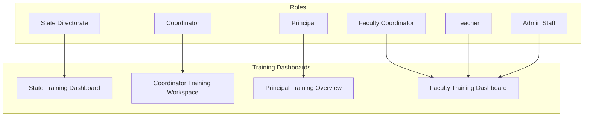
```mermaid
flowchart TD
    subgraph U[Roles]
        SD[State Directorate]
        CO[Coordinator]
        PR[Principal]
        FC[Faculty Coordinator]
        TE[Teacher]
        AS[Admin Staff]
    end

    subgraph D[Training Dashboards]
        SDD[State Training Dashboard]
        COD[Coordinator Training Workspace]
        PRD[Principal Training Overview]
        FTD[Faculty Training Dashboard]
    end

    SD --> SDD
    CO --> COD
    PR --> PRD
    FC --> FTD
    TE --> FTD
    AS --> FTD
```

### 1.2 Training Home Router
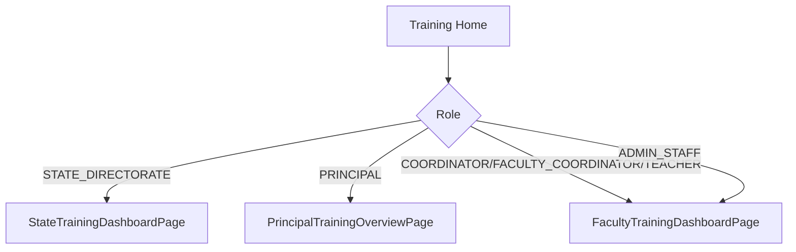
```mermaid
flowchart TD
    A[Training Home] --> B{Role}
    B -->|STATE_DIRECTORATE| C[StateTrainingDashboardPage]
    B -->|PRINCIPAL| D[PrincipalTrainingOverviewPage]
    B -->|COORDINATOR/FACULTY_COORDINATOR/TEACHER| E[FacultyTrainingDashboardPage]
    B -->|ADMIN_STAFF| E
```

### 1.3 Feature Distribution by Role
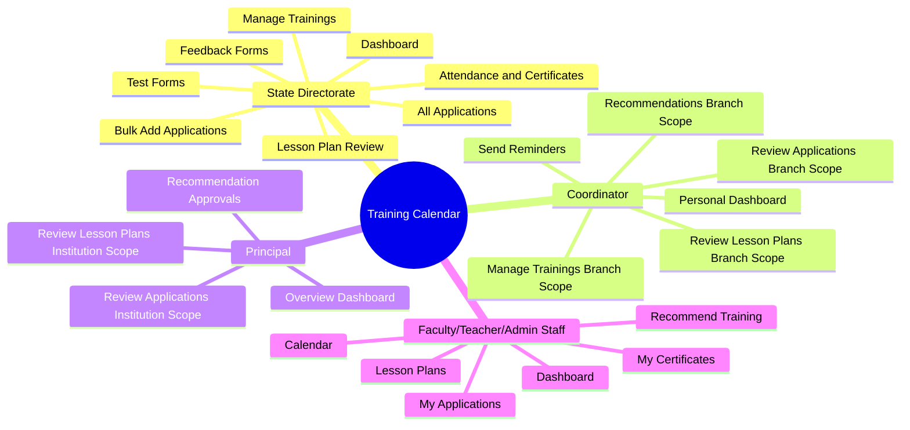
```mermaid
mindmap
  root((Training Calendar))
    State Directorate
      Dashboard
      Manage Trainings
      All Applications
      Bulk Add Applications
      Test Forms
      Feedback Forms
      Lesson Plan Review
      Attendance and Certificates
    Coordinator
      Personal Dashboard
      Manage Trainings Branch Scope
      Review Applications Branch Scope
      Review Lesson Plans Branch Scope
      Recommendations Branch Scope
      Send Reminders
    Principal
      Overview Dashboard
      Review Applications Institution Scope
      Review Lesson Plans Institution Scope
      Recommendation Approvals
    Faculty/Teacher/Admin Staff
      Dashboard
      Calendar
      My Applications
      Lesson Plans
      Recommend Training
      My Certificates
```

---

## 2. State Directorate Flows

### 2.1 Dashboard
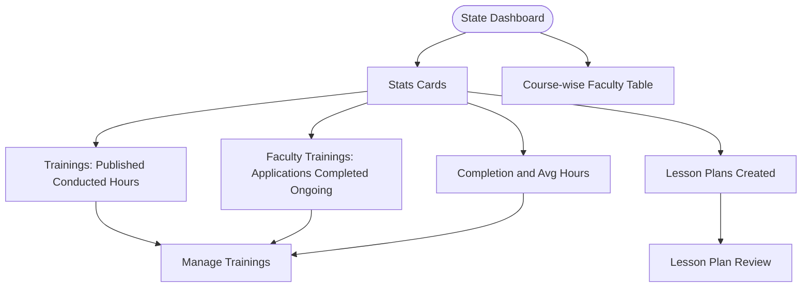
```mermaid
flowchart TD
    A([State Dashboard]) --> B[Stats Cards]
    B --> C[Trainings: Published Conducted Hours]
    B --> D[Faculty Trainings: Applications Completed Ongoing]
    B --> E[Lesson Plans Created]
    B --> F[Completion and Avg Hours]
    A --> G[Course-wise Faculty Table]
    C --> H[Manage Trainings]
    D --> H
    E --> I[Lesson Plan Review]
    F --> H
```

### 2.2 Manage Trainings
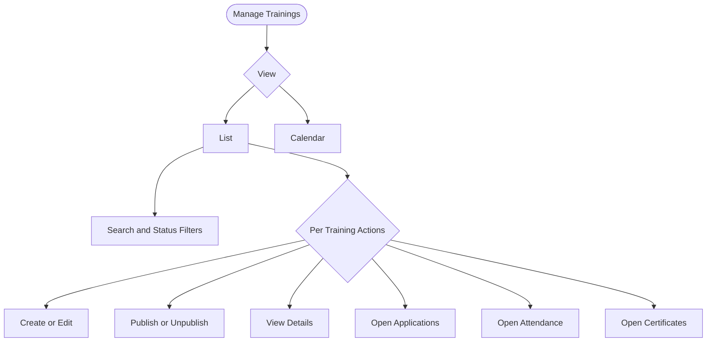
```mermaid
flowchart TD
    A([Manage Trainings]) --> B{View}
    B --> C[List]
    B --> D[Calendar]
    C --> E[Search and Status Filters]
    C --> F{Per Training Actions}
    F --> G[Create or Edit]
    F --> H[Publish or Unpublish]
    F --> I[View Details]
    F --> J[Open Applications]
    F --> K[Open Attendance]
    F --> L[Open Certificates]
```

### 2.3 Applications and Bulk Add
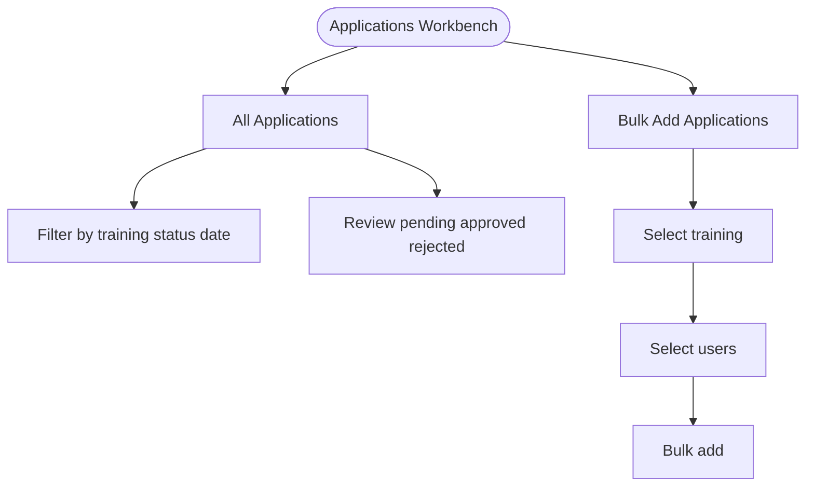
```mermaid
flowchart TD
    A([Applications Workbench]) --> B[All Applications]
    B --> C[Filter by training status date]
    B --> D[Review pending approved rejected]
    A --> E[Bulk Add Applications]
    E --> F[Select training]
    F --> G[Select users]
    G --> H[Bulk add]
```

### 2.4 Forms and Responses
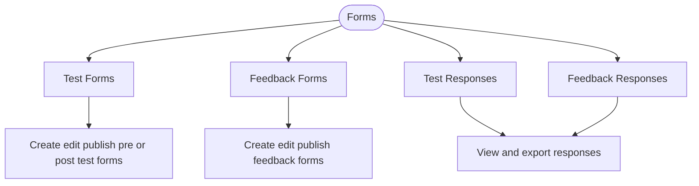
```mermaid
flowchart TD
    A([Forms]) --> B[Test Forms]
    A --> C[Feedback Forms]
    B --> D[Create edit publish pre or post test forms]
    C --> E[Create edit publish feedback forms]
    A --> F[Test Responses]
    A --> G[Feedback Responses]
    F --> H[View and export responses]
    G --> H
```

### 2.5 Attendance and Certificates
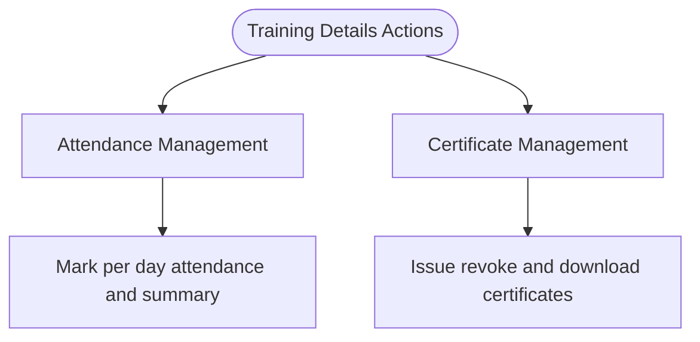
```mermaid
flowchart TD
    A([Training Details Actions]) --> B[Attendance Management]
    A --> C[Certificate Management]
    B --> D[Mark per day attendance and summary]
    C --> E[Issue revoke and download certificates]
```

---

## 3. Principal Flows

### 3.1 Overview Dashboard
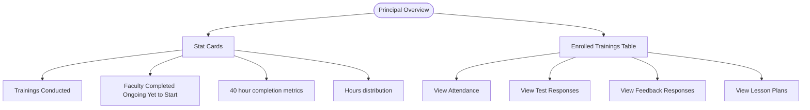
```mermaid
flowchart TD
    A([Principal Overview]) --> B[Stat Cards]
    B --> C[Trainings Conducted]
    B --> D[Faculty Completed Ongoing Yet to Start]
    B --> E[40 hour completion metrics]
    B --> F[Hours distribution]
    A --> G[Enrolled Trainings Table]
    G --> H[View Attendance]
    G --> I[View Test Responses]
    G --> J[View Feedback Responses]
    G --> K[View Lesson Plans]
```

### 3.2 Application Review
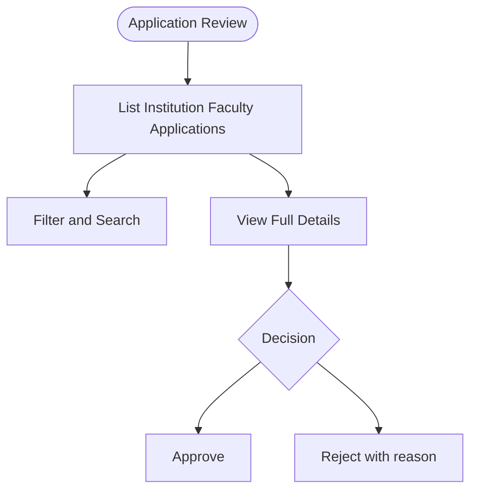
```mermaid
flowchart TD
    A([Application Review]) --> B[List Institution Faculty Applications]
    B --> C[Filter and Search]
    B --> D[View Full Details]
    D --> E{Decision}
    E --> F[Approve]
    E --> G[Reject with reason]
```

### 3.3 Lesson Plan Review
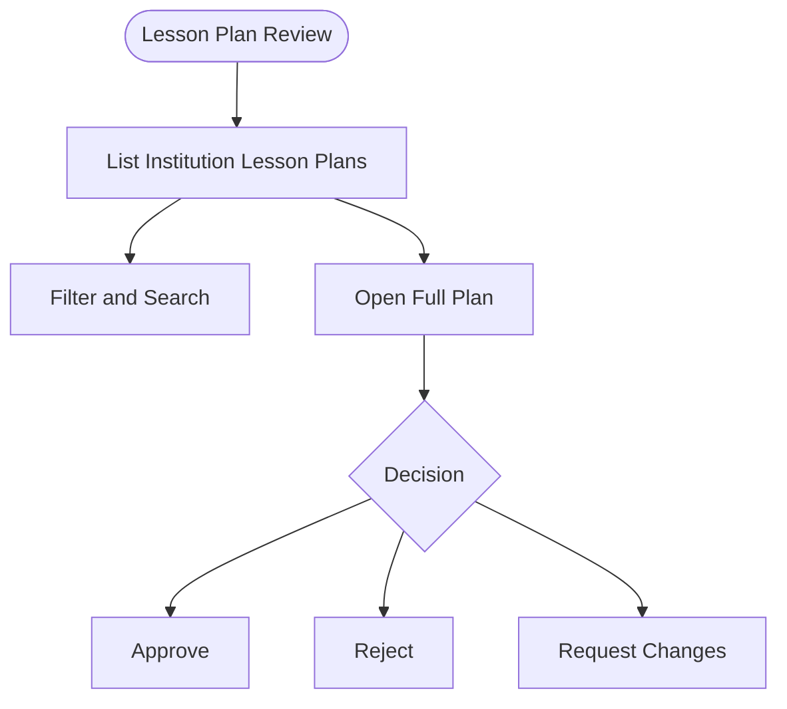
```mermaid
flowchart TD
    A([Lesson Plan Review]) --> B[List Institution Lesson Plans]
    B --> C[Filter and Search]
    B --> D[Open Full Plan]
    D --> E{Decision}
    E --> F[Approve]
    E --> G[Reject]
    E --> H[Request Changes]
```

### 3.4 Recommendation Approvals
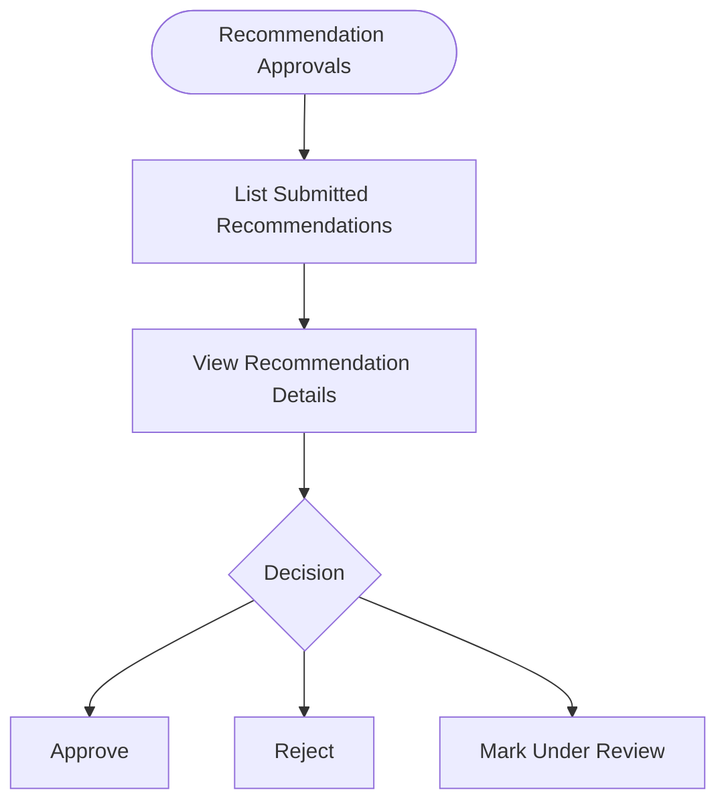
```mermaid
flowchart TD
    A([Recommendation Approvals]) --> B[List Submitted Recommendations]
    B --> C[View Recommendation Details]
    C --> D{Decision}
    D --> E[Approve]
    D --> F[Reject]
    D --> G[Mark Under Review]
```

---

## 4. Coordinator Flows

### 4.1 Dashboard and Personal Training
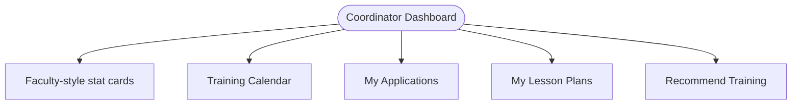
```mermaid
flowchart TD
    A([Coordinator Dashboard]) --> B[Faculty-style stat cards]
    A --> C[Training Calendar]
    A --> D[My Applications]
    A --> E[My Lesson Plans]
    A --> F[Recommend Training]
```

### 4.2 Branch Training Management
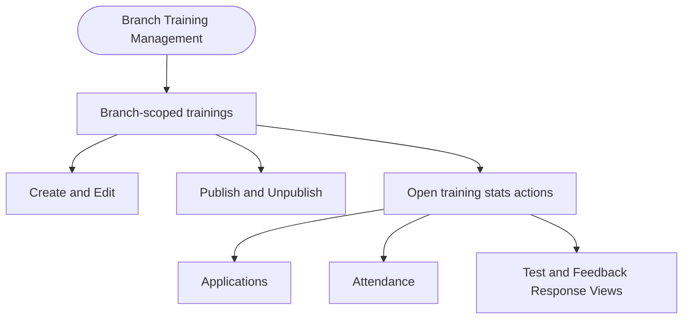
```mermaid
flowchart TD
    A([Branch Training Management]) --> B[Branch-scoped trainings]
    B --> C[Create and Edit]
    B --> D[Publish and Unpublish]
    B --> E[Open training stats actions]
    E --> F[Applications]
    E --> G[Attendance]
    E --> H[Test and Feedback Response Views]
```

### 4.3 Branch Application Review
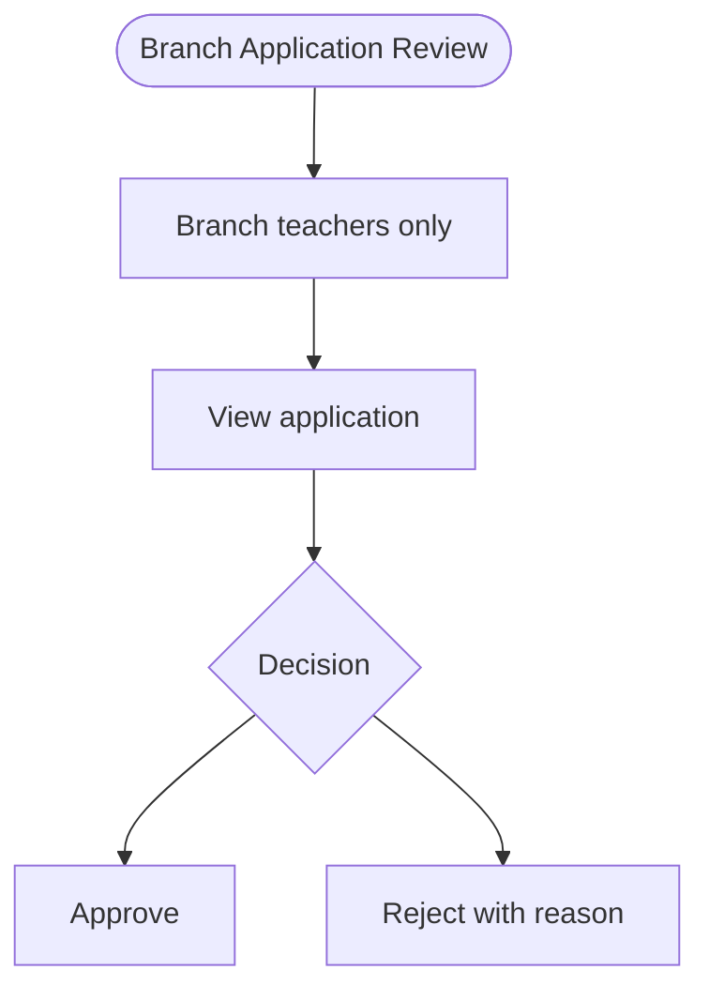
```mermaid
flowchart TD
    A([Branch Application Review]) --> B[Branch teachers only]
    B --> C[View application]
    C --> D{Decision}
    D --> E[Approve]
    D --> F[Reject with reason]
```

### 4.4 Branch Lesson Plan Review
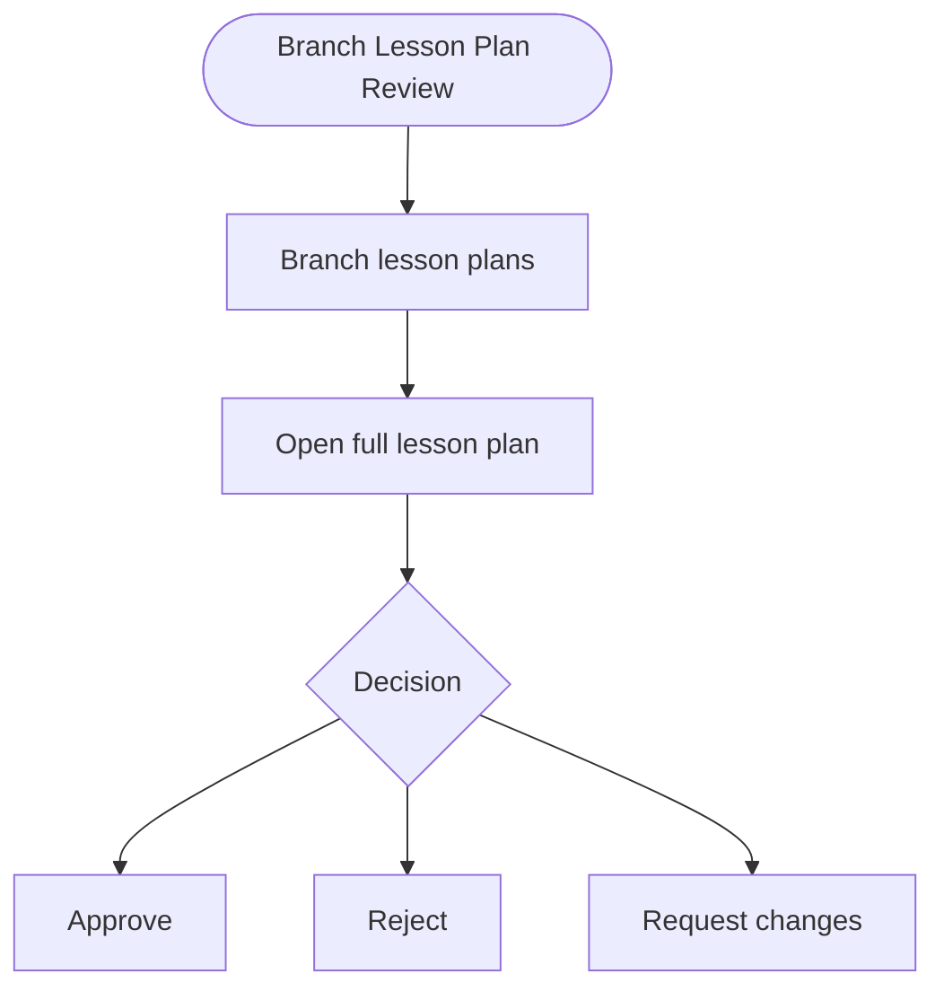
```mermaid
flowchart TD
    A([Branch Lesson Plan Review]) --> B[Branch lesson plans]
    B --> C[Open full lesson plan]
    C --> D{Decision}
    D --> E[Approve]
    D --> F[Reject]
    D --> G[Request changes]
```

### 4.5 Recommendations
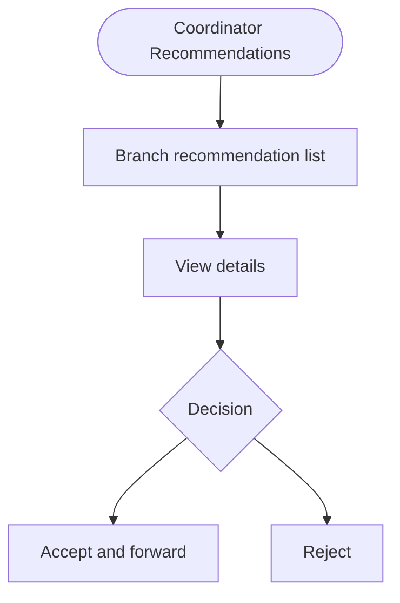
```mermaid
flowchart TD
    A([Coordinator Recommendations]) --> B[Branch recommendation list]
    B --> C[View details]
    C --> D{Decision}
    D --> E[Accept and forward]
    D --> F[Reject]
```

### 4.6 Send Reminders
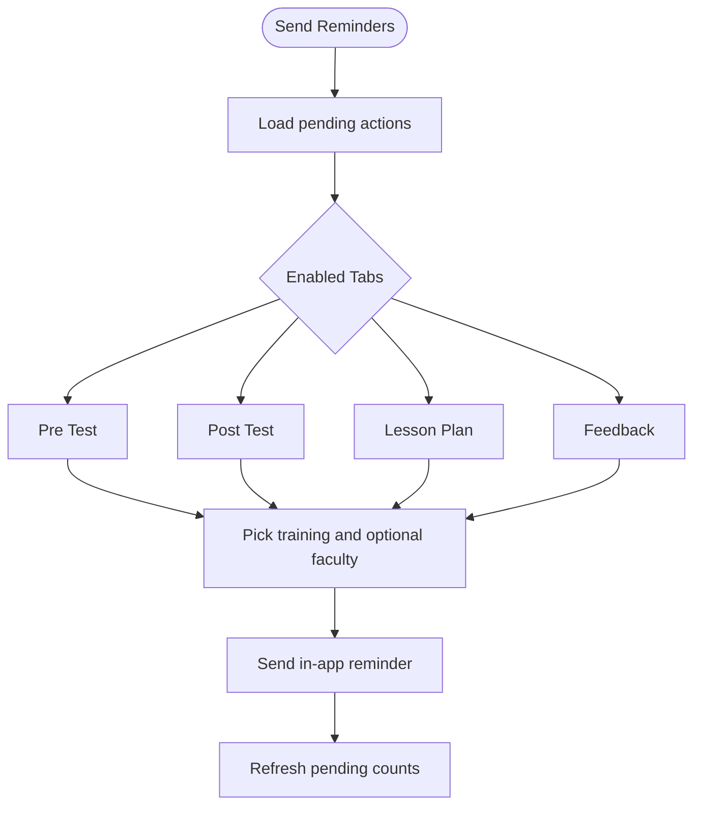
```mermaid
flowchart TD
    A([Send Reminders]) --> B[Load pending actions]
    B --> C{Enabled Tabs}
    C --> D[Pre Test]
    C --> E[Post Test]
    C --> F[Lesson Plan]
    C --> G[Feedback]
    D --> H[Pick training and optional faculty]
    E --> H
    F --> H
    G --> H
    H --> I[Send in-app reminder]
    I --> J[Refresh pending counts]
```

---

## 5. Faculty and Teacher Flows

### 5.1 Dashboard
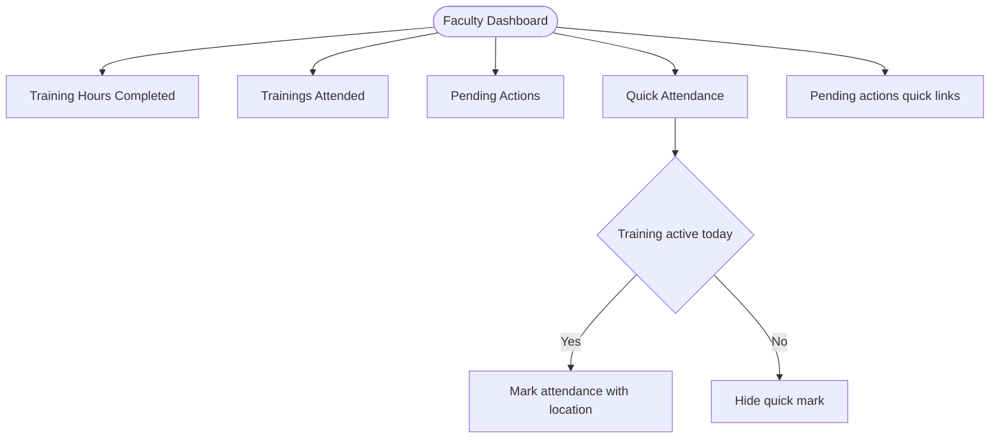
```mermaid
flowchart TD
    A([Faculty Dashboard]) --> B[Training Hours Completed]
    A --> C[Trainings Attended]
    A --> D[Pending Actions]
    A --> E[Quick Attendance]
    E --> F{Training active today}
    F -->|Yes| G[Mark attendance with location]
    F -->|No| H[Hide quick mark]
    A --> I[Pending actions quick links]
```

### 5.2 Calendar
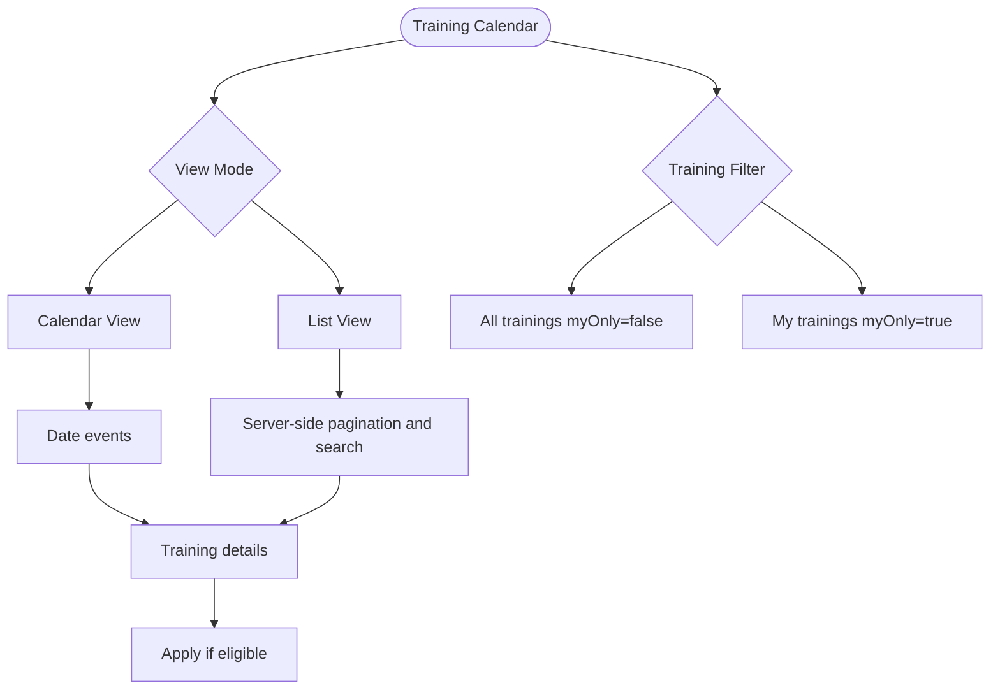
```mermaid
flowchart TD
    A([Training Calendar]) --> B{View Mode}
    B --> C[Calendar View]
    B --> D[List View]
    A --> E{Training Filter}
    E --> F[All trainings myOnly=false]
    E --> G[My trainings myOnly=true]
    C --> H[Date events]
    H --> I[Training details]
    D --> J[Server-side pagination and search]
    J --> I
    I --> K[Apply if eligible]
```

### 5.3 Application and My Applications
```mermaid
flowchart TD
    A([Apply and Track]) --> B[Open training details]
    B --> C{Already applied}
    C -->|No| D[Apply]
    C -->|Yes| E[Show current status]
    D --> F[Pending]
    F --> G{Decision}
    G --> H[Approved]
    G --> I[Rejected]

    A --> J[My Applications]
    J --> K[View details]
    J --> L[Withdraw pending]
    J --> M[Mark attendance when allowed]
    J --> N[Submit feedback]
    J --> O[Create lesson plan]
```

### 5.4 Lesson Plans
```mermaid
flowchart TD
    A([My Lesson Plans]) --> B[List drafts submitted returned]
    B --> C[Create new]
    B --> D[Edit draft or changes needed]
    C --> E[Open New Lesson Plan Form]
    D --> F[Open Edit Lesson Plan Form]
    E --> G[Submit]
    F --> G
```

### 5.5 Recommend Training
```mermaid
flowchart TD
    A([Recommend Training]) --> B[List recommendations]
    B --> C[Create recommendation]
    C --> D[Title description priority]
    D --> E[Submit]
    E --> F[Track pending reviewed approved rejected]
```

### 5.6 Certificates
```mermaid
flowchart TD
    A([My Certificates]) --> B[List earned certificates]
    B --> C[View certificate]
    B --> D[Download PDF]
    B --> E[Track hours and progress]
```

---

## 6. Shared Lifecycles

### 6.1 Training Application States
```mermaid
stateDiagram-v2
    [*] --> NotApplied
    NotApplied --> Pending: Faculty applies
    Pending --> Approved
    Pending --> Rejected
    Approved --> Active: Training starts
    Active --> Completed
    Completed --> CertEligible
    CertEligible --> Certified
    Rejected --> [*]
    Certified --> [*]
```

### 6.2 Lesson Plan States
```mermaid
stateDiagram-v2
    [*] --> Draft
    Draft --> Draft: Save
    Draft --> InReview: Submit
    InReview --> Approved
    InReview --> Rejected
    InReview --> ChangesNeeded
    ChangesNeeded --> Draft
    Rejected --> Draft
    Approved --> [*]
```

### 6.3 Completion and Certificate Eligibility
```mermaid
flowchart TD
    A([Training Complete]) --> B{Attendance complete}
    B -->|No| C[Not eligible]
    B -->|Yes| D{Pre test done}
    D -->|No| C
    D -->|Yes| E{Post test done}
    E -->|No| C
    E -->|Yes| F{Feedback done}
    F -->|No| C
    F -->|Yes| G[Eligible for certificate]
    G --> H[Hours added to profile]
    H --> I[40-hour progress updated]
```

---

## Appendix: Access Matrix

| Feature | State | Coordinator | Principal | Faculty or Teacher | Admin Staff |
|---------|-------|-------------|-----------|--------------------|-------------|
| Dashboard | Yes | Yes | Yes | Yes | Yes |
| Manage Trainings | Yes | Yes branch scope | No | No | No |
| Create and Edit Training | Yes | Yes branch scope | No | No | No |
| Applications Review | Yes | Yes branch scope | Yes institution scope | No | No |
| Calendar | No | Yes | No | Yes | Yes |
| My Applications | No | Yes | No | Yes | Yes |
| Lesson Plans | Yes review | Yes review and own | Yes review | Yes own | Yes own |
| Recommendation Create | No | Yes | No | Yes | Yes |
| Recommendation Approvals | No | No | Yes | No | No |
| Reminders | No | Yes | No | No | No |
| Certificates Issue or Revoke | Yes | Yes scoped | No | No | No |
| My Certificates | No | Yes | No | Yes | Yes |

---

PlaceIntern Portal - Training Calendar Role-Wise Documentation
