# Training Calendar - Flow Diagrams

## 1. System Overview

### 1.1 Architecture
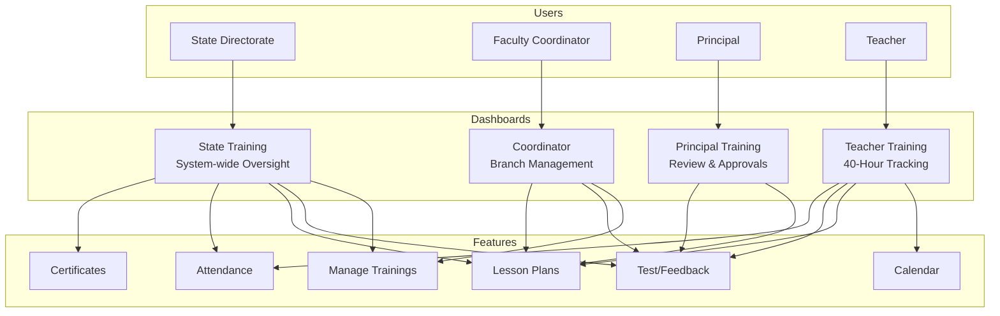
```mermaid
flowchart TD
    subgraph U["Users"]
        SD[State Directorate]
        FC[Faculty Coordinator]
        PR[Principal]
        TE[Teacher]
    end
    subgraph D["Dashboards"]
        SDD["State Training<br/>System-wide Oversight"]
        FCD["Coordinator<br/>Branch Management"]
        PRD["Principal Training<br/>Review & Approvals"]
        TED["Teacher Training<br/>40-Hour Tracking"]
    end
    subgraph F["Features"]
        MG[Manage Trainings]
        CA[Calendar]
        FM[Test/Feedback]
        LP[Lesson Plans]
        AT[Attendance]
        CT[Certificates]
    end
    SD-->SDD
    FC-->FCD
    PR-->PRD
    TE-->TED
    SDD-->MG & FM & LP & AT & CT
    FCD-->MG & FM & LP
    PRD-->LP & FM
    TED-->CA & LP & FM & AT
```

### 1.2 Role Hierarchy
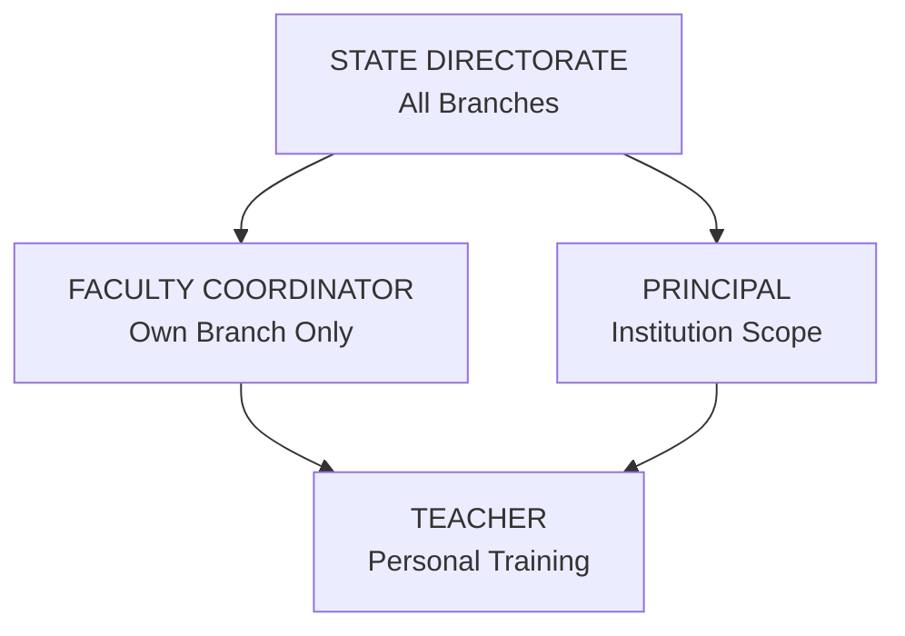
```mermaid
flowchart TD
    A["STATE DIRECTORATE<br/>All Branches"]-->B & C
    B["FACULTY COORDINATOR<br/>Own Branch Only"]-->D
    C["PRINCIPAL<br/>Institution Scope"]-->D
    D["TEACHER<br/>Personal Training"]
```

### 1.3 Feature Map
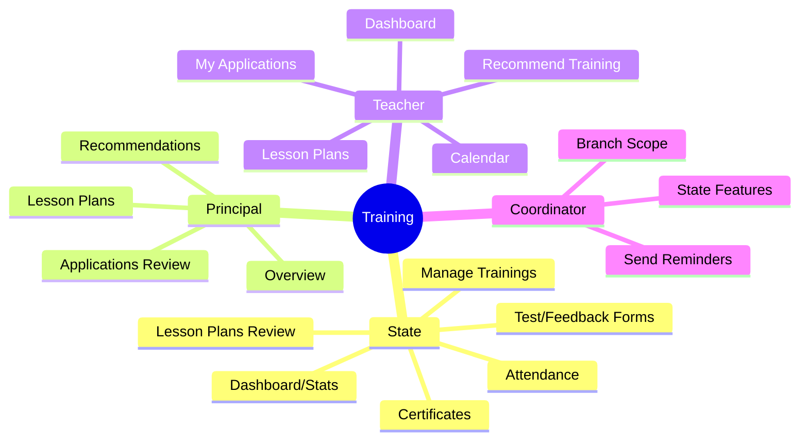
```mermaid
mindmap
  root((Training))
    State
      Dashboard/Stats
      Manage Trainings
      Test/Feedback Forms
      Lesson Plans Review
      Attendance
      Certificates
    Principal
      Overview
      Applications Review
      Lesson Plans
      Recommendations
    Teacher
      Dashboard
      Calendar
      My Applications
      Lesson Plans
      Recommend Training
    Coordinator
      State Features
      Branch Scope
      Send Reminders
```

### 1.4 Roles Summary
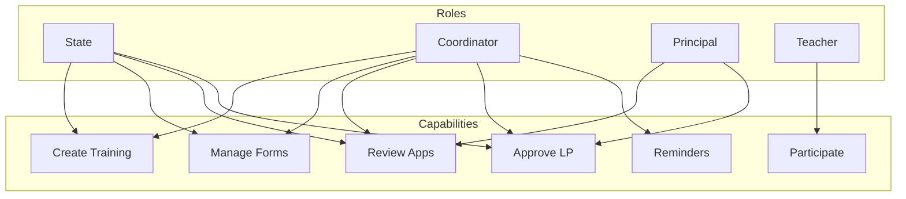
```mermaid
flowchart TD
    subgraph R["Roles"]
        SD[State]
        FC[Coordinator]
        PR[Principal]
        TE[Teacher]
    end
    subgraph C["Capabilities"]
        C1[Create Training]
        C2[Manage Forms]
        C3[Review Apps]
        C4[Approve LP]
        C5[Participate]
        C6[Reminders]
    end
    SD-->C1 & C2 & C3 & C4
    FC-->C1 & C2 & C3 & C4 & C6
    PR-->C3 & C4
    TE-->C5
```

---

## 2. State Directorate Flows

### 2.1 Dashboard
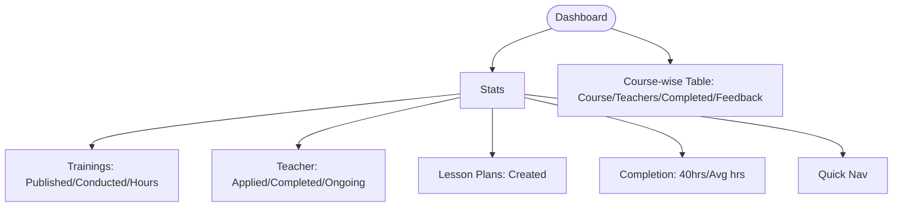
```mermaid
flowchart TD
    A([Dashboard])-->B[Stats]
    B-->C[Trainings: Published/Conducted/Hours]
    B-->D[Teacher: Applied/Completed/Ongoing]
    B-->E[Lesson Plans: Created]
    B-->F[Completion: 40hrs/Avg hrs]
    B-->G[Quick Nav]
    A-->H[Course-wise Table: Course/Teachers/Completed/Feedback]
```

### 2.2 Manage Trainings
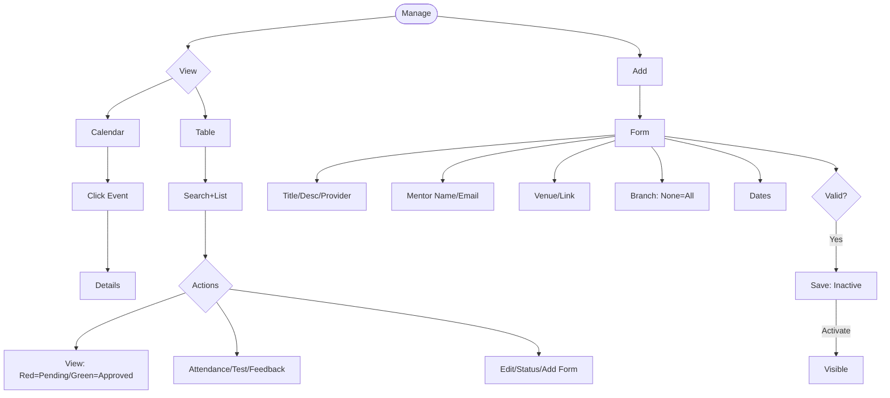
```mermaid
flowchart TD
    A([Manage])-->B{View}
    B-->C[Table]-->D[Search+List]
    B-->E[Calendar]-->F[Click Event]-->G[Details]
    A-->H[Add]-->I[Form]
    I-->J[Title/Desc/Provider]
    I-->K[Mentor Name/Email]
    I-->L[Venue/Link]
    I-->M[Branch: None=All]
    I-->N[Dates]
    I-->O{Valid?}-->|Yes|P[Save: Inactive]-->|Activate|Q[Visible]
    D-->R{Actions}
    R-->S[View: Red=Pending/Green=Approved]
    R-->T[Attendance/Test/Feedback]
    R-->U[Edit/Status/Add Form]
```

### 2.3 Create Training
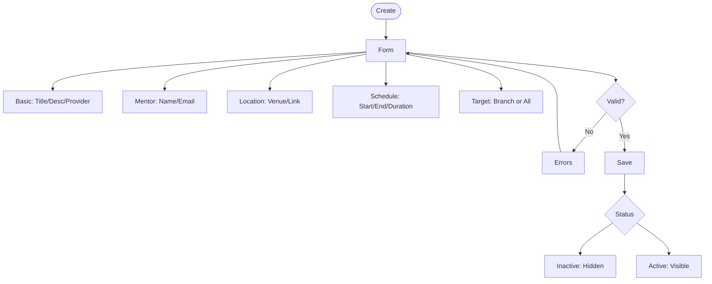
```mermaid
flowchart TD
    A([Create])-->B[Form]
    B-->C[Basic: Title/Desc/Provider]
    B-->D[Mentor: Name/Email]
    B-->E[Location: Venue/Link]
    B-->F[Schedule: Start/End/Duration]
    B-->G[Target: Branch or All]
    B-->H{Valid?}
    H-->|No|I[Errors]-->B
    H-->|Yes|J[Save]-->K{Status}
    K-->L[Inactive: Hidden]
    K-->M[Active: Visible]
```

### 2.4 Applications
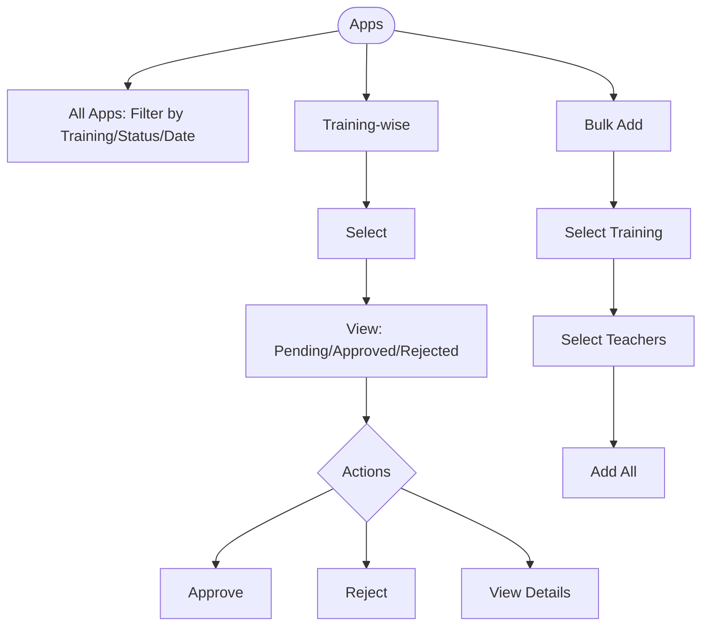
```mermaid
flowchart TD
    A([Apps])-->B[All Apps: Filter by Training/Status/Date]
    A-->C[Training-wise]-->D[Select]-->E[View: Pending/Approved/Rejected]
    E-->F{Actions}
    F-->G[Approve]
    F-->H[Reject]
    F-->I[View Details]
    A-->J[Bulk Add]-->K[Select Training]-->L[Select Teachers]-->M[Add All]
```

### 2.5 Attendance
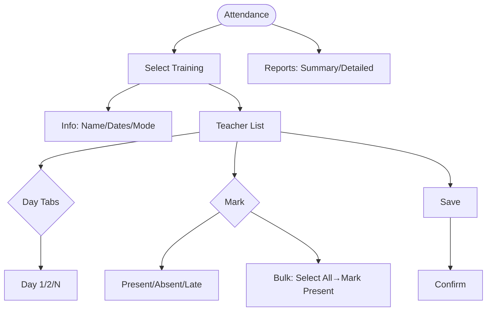
```mermaid
flowchart TD
    A([Attendance])-->B[Select Training]-->C[Info: Name/Dates/Mode]
    B-->D[Teacher List]-->E{Day Tabs}
    E-->F[Day 1/2/N]
    D-->G{Mark}
    G-->H[Present/Absent/Late]
    G-->I[Bulk: Select All→Mark Present]
    D-->J[Save]-->K[Confirm]
    A-->L[Reports: Summary/Detailed]
```

### 2.6 Certificates
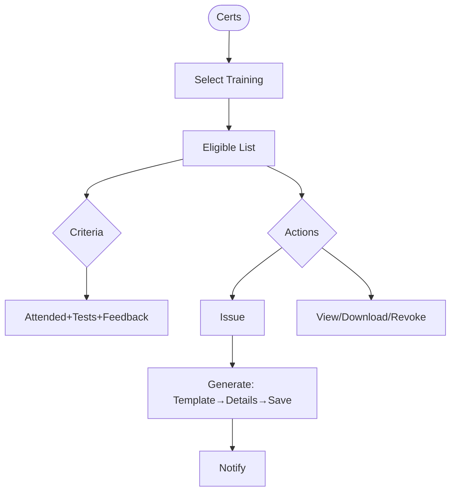
```mermaid
flowchart TD
    A([Certs])-->B[Select Training]-->C[Eligible List]
    C-->D{Criteria}
    D-->E[Attended+Tests+Feedback]
    C-->F{Actions}
    F-->G[Issue]-->H[Generate: Template→Details→Save]-->I[Notify]
    F-->J[View/Download/Revoke]
```

---

## 3. Principal Flows

### 3.1 Overview
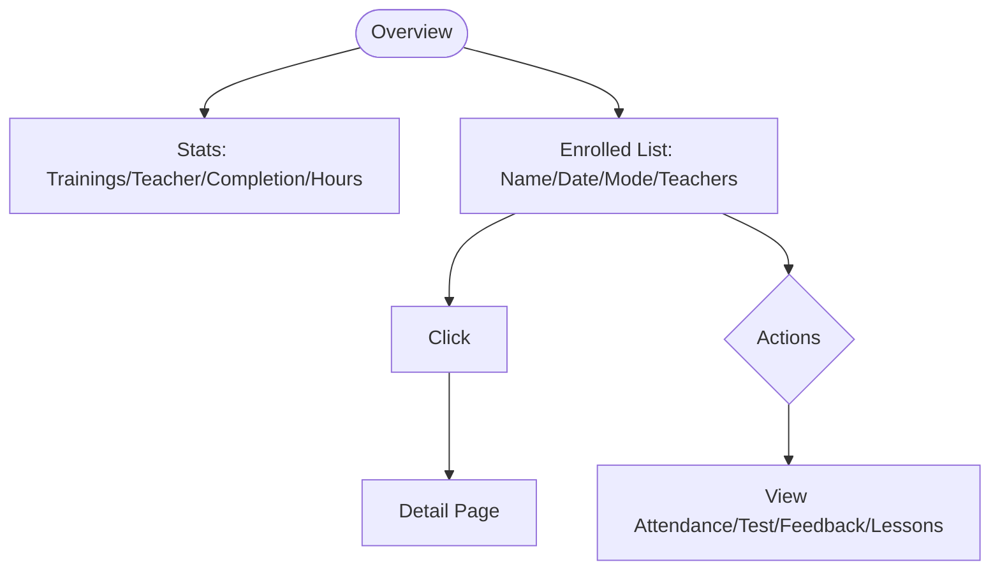
```mermaid
flowchart TD
    A([Overview])-->B[Stats: Trainings/Teacher/Completion/Hours]
    A-->C[Enrolled List: Name/Date/Mode/Teachers]
    C-->D[Click]-->E[Detail Page]
    C-->F{Actions}
    F-->G[View Attendance/Test/Feedback/Lessons]
```

### 3.2 Application Review
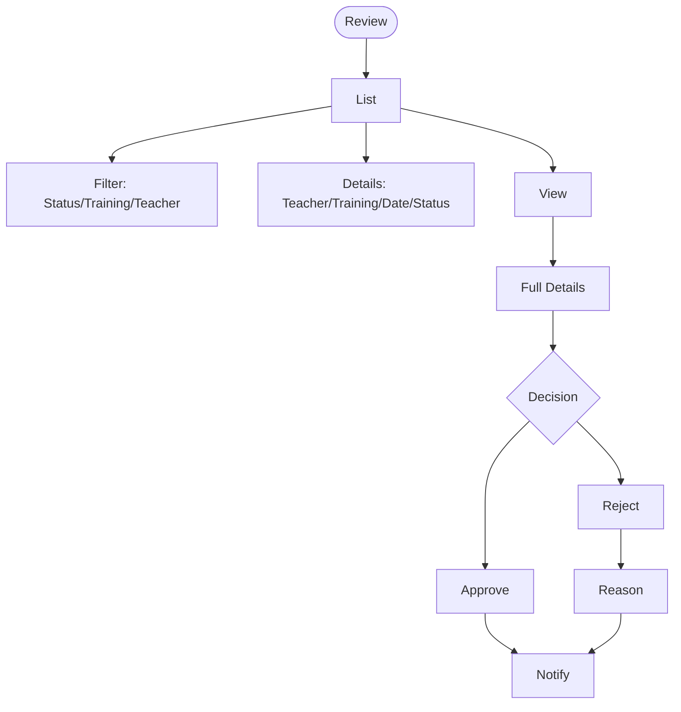
```mermaid
flowchart TD
    A([Review])-->B[List]-->C[Filter: Status/Training/Teacher]
    B-->D[Details: Teacher/Training/Date/Status]
    B-->E[View]-->F[Full Details]-->G{Decision}
    G-->H[Approve]-->I[Notify]
    G-->J[Reject]-->K[Reason]-->I
```

### 3.3 Lesson Plan Review
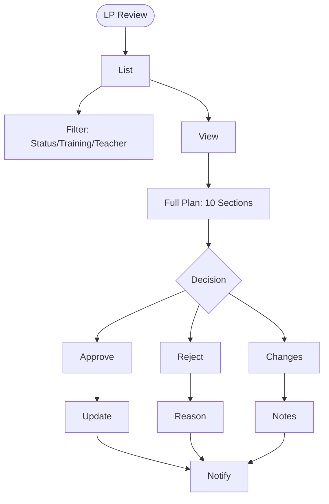
```mermaid
flowchart TD
    A([LP Review])-->B[List]-->C[Filter: Status/Training/Teacher]
    B-->D[View]-->E[Full Plan: 10 Sections]
    E-->F{Decision}
    F-->G[Approve]-->H[Update]-->I[Notify]
    F-->J[Reject]-->K[Reason]-->I
    F-->L[Changes]-->M[Notes]-->I
```

### 3.4 Recommendations
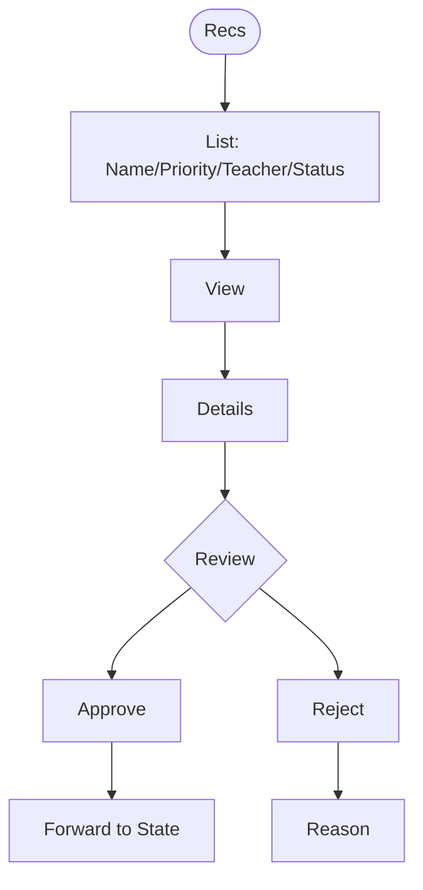
```mermaid
flowchart TD
    A([Recs])-->B[List: Name/Priority/Teacher/Status]
    B-->C[View]-->D[Details]-->E{Review}
    E-->F[Approve]-->G[Forward to State]
    E-->H[Reject]-->I[Reason]
```

---

## 4. Teacher Flows

### 4.1 Dashboard
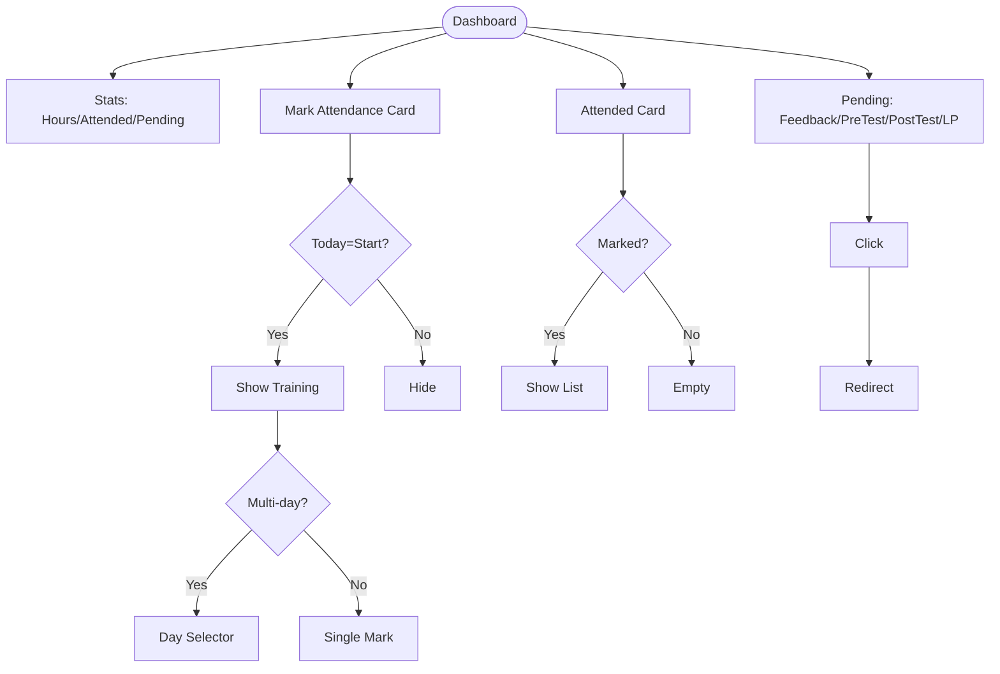
```mermaid
flowchart TD
    A([Dashboard])-->B[Stats: Hours/Attended/Pending]
    A-->C[Mark Attendance Card]-->D{Today=Start?}
    D-->|Yes|E[Show Training]-->F{Multi-day?}
    F-->|Yes|G[Day Selector]
    F-->|No|H[Single Mark]
    D-->|No|I[Hide]
    A-->J[Attended Card]-->K{Marked?}
    K-->|Yes|L[Show List]
    K-->|No|M[Empty]
    A-->N[Pending: Feedback/PreTest/PostTest/LP]-->O[Click]-->P[Redirect]
```

### 4.2 Calendar View
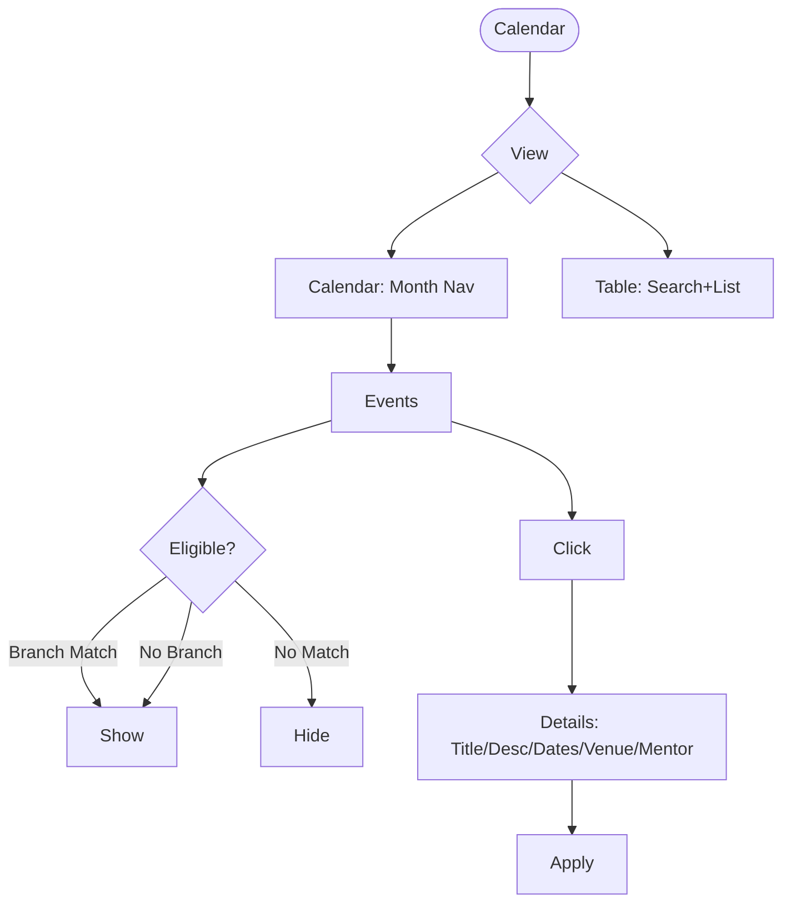
```mermaid
flowchart TD
    A([Calendar])-->B{View}
    B-->C[Calendar: Month Nav]-->D[Events]-->E{Eligible?}
    E-->|Branch Match|F[Show]
    E-->|No Branch|F
    E-->|No Match|G[Hide]
    D-->H[Click]-->I[Details: Title/Desc/Dates/Venue/Mentor]-->J[Apply]
    B-->K[Table: Search+List]
```

### 4.3 Application
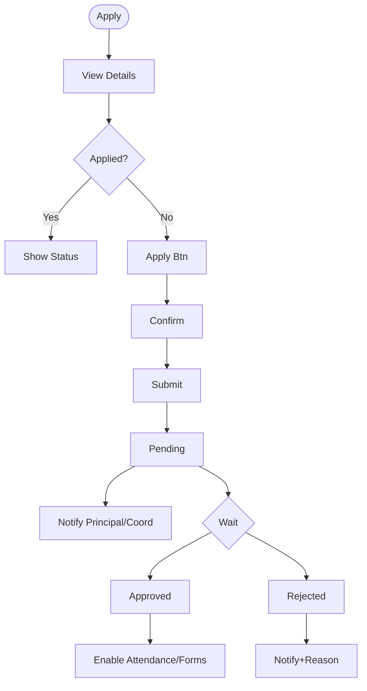
```mermaid
flowchart TD
    A([Apply])-->B[View Details]-->C{Applied?}
    C-->|Yes|D[Show Status]
    C-->|No|E[Apply Btn]-->F[Confirm]-->G[Submit]
    G-->H[Pending]-->I[Notify Principal/Coord]
    H-->J{Wait}
    J-->K[Approved]-->L[Enable Attendance/Forms]
    J-->M[Rejected]-->N[Notify+Reason]
```

### 4.4 My Applications
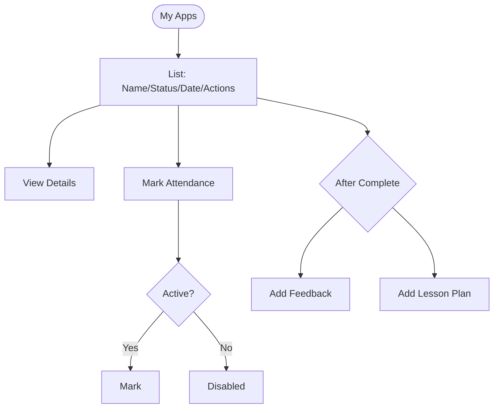
```mermaid
flowchart TD
    A([My Apps])-->B[List: Name/Status/Date/Actions]
    B-->C[View Details]
    B-->D[Mark Attendance]-->E{Active?}
    E-->|Yes|F[Mark]
    E-->|No|G[Disabled]
    B-->H{After Complete}
    H-->I[Add Feedback]
    H-->J[Add Lesson Plan]
```

### 4.5 Lesson Plan Creation
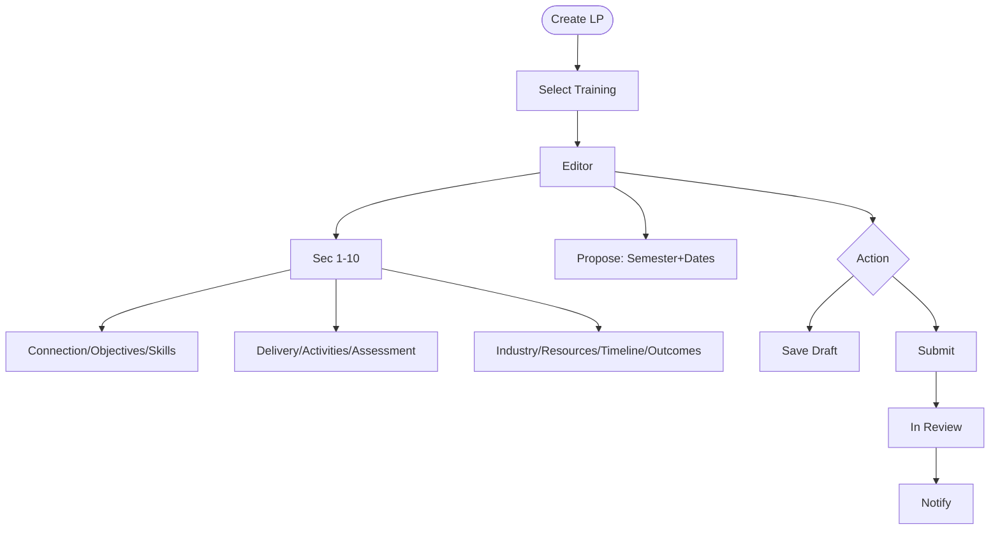
```mermaid
flowchart TD
    A([Create LP])-->B[Select Training]-->C[Editor]
    C-->D[Sec 1-10]
    D-->E[Connection/Objectives/Skills]
    D-->F[Delivery/Activities/Assessment]
    D-->G[Industry/Resources/Timeline/Outcomes]
    C-->H[Propose: Semester+Dates]
    C-->I{Action}
    I-->J[Save Draft]
    I-->K[Submit]-->L[In Review]-->M[Notify]
```

### 4.6 Recommend Training
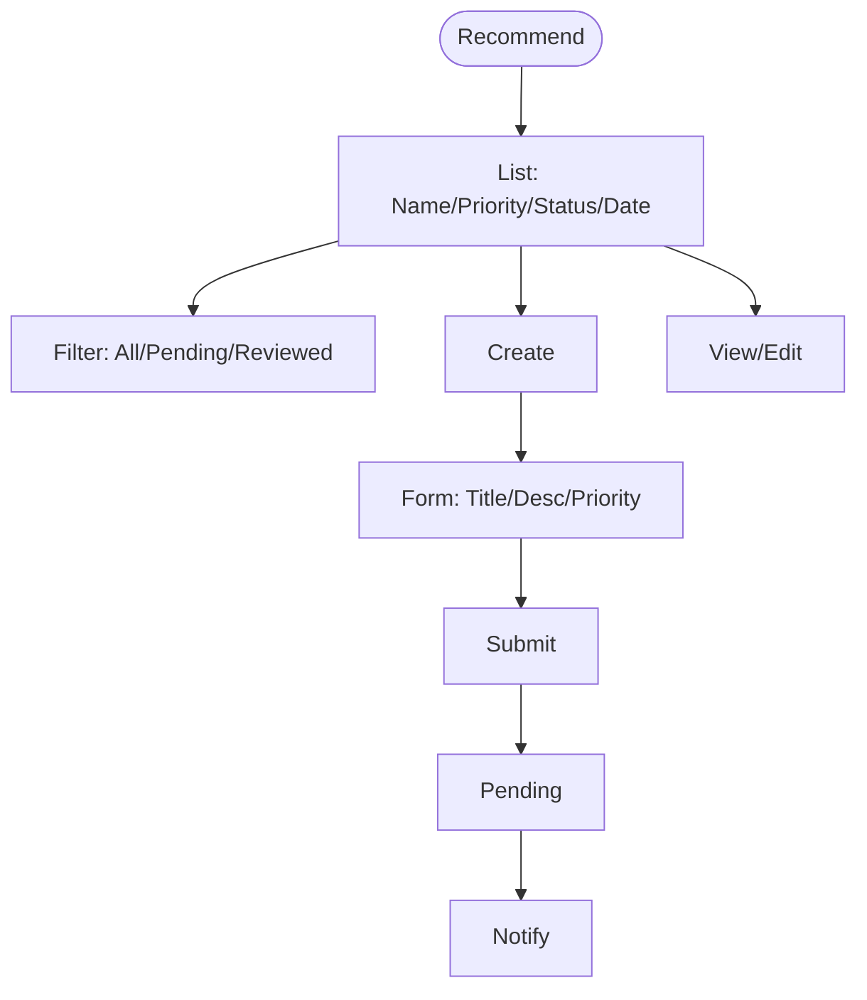
```mermaid
flowchart TD
    A([Recommend])-->B[List: Name/Priority/Status/Date]
    B-->C[Filter: All/Pending/Reviewed]
    B-->D[Create]-->E[Form: Title/Desc/Priority]-->F[Submit]-->G[Pending]-->H[Notify]
    B-->I[View/Edit]
```

### 4.7 Certificates
```mermaid
flowchart TD
    A([My Certs])-->B[List: Training/Date/Hours/CertNo]
    B-->C[View]-->D[Preview]
    B-->E[Download PDF]
    B-->F[Stats: Total Certs/Hours/Progress to 40]
```

---

## 5. Faculty Coordinator Flows

### 5.1 Dashboard
```mermaid
flowchart TD
    A([Coord Dash])-->B[Stats: Same as State]
    B-->C[Trainings/Teacher/LP/Completion]
    A-->D[Scope: Own Branch Only]
```

### 5.2 Manage Trainings
```mermaid
flowchart TD
    A([Manage])-->B[Branch Scope]-->C{View}
    C-->D[Table/Calendar]
    A-->E[Add]-->F[Form: Branch Auto-Set]
    A-->G[List]-->H{Actions: View/Attend/Test/Feedback/Edit/Status}
    A-->I[Same as State but Scoped]
```

### 5.3 Application Review
```mermaid
flowchart TD
    A([Review])-->B[Branch Scope]-->C[List: Branch Teachers Only]
    C-->D[View]-->E[Details]-->F{Decision}
    F-->G[Approve]-->H[Notify]
    F-->I[Reject]-->J[Reason]-->H
```

### 5.4 Lesson Plan Review
```mermaid
flowchart TD
    A([LP Review])-->B[Branch Scope]-->C[List: Branch Teachers]
    C-->D[View]-->E[Full Plan]-->F{Decision}
    F-->G[Approve]-->H[Update]-->I[Notify]
    F-->J[Reject]-->K[Reason]-->I
    F-->L[Changes]-->M[Notes]-->I
```

### 5.5 Send Reminders
```mermaid
flowchart TD
    A([Reminders])-->B{Tabs}
    B-->C[Enrollments]
    B-->D[PreTest/PostTest]
    B-->E[Lesson Plan/Feedback]
    B-->F[Select Tab]-->G[Teacher List]
    G-->H[Bulk: Send to All Branch]
    G-->I[Individual: Select Teacher+Type]
    H & I-->J[Send]-->K{Method}
    K-->L[In-App/Email/Both]
    J-->M[Confirm]
```

### 5.6 Recommendations
```mermaid
flowchart TD
    A([Recs])-->B[Branch Scope]-->C[List]-->D[Details]
    D-->E{Decision}
    E-->F[Accept]-->G[Forward to State]
    E-->H[Reject]-->I[Reason]-->J[Notify]
```

---

## 6. Lesson Plan Lifecycle

### 6.1 States
```mermaid
stateDiagram-v2
    [*]-->Draft: Create
    Draft-->Draft: Edit
    Draft-->InReview: Submit
    InReview-->Approved
    InReview-->Rejected
    InReview-->ChangesNeeded
    ChangesNeeded-->Draft: Revise
    Rejected-->Draft: Revise
    Approved-->[*]
```

### 6.2 Review Workflow
```mermaid
flowchart TD
    A([Submit])-->B[In Review]-->C{Who?}
    C-->D[Coordinator]-->E{Branch?}
    E-->|Match|F[Reviews]
    E-->|No|G[Skip to Principal]
    C-->H[Principal]-->I[Reviews]
    F & I-->J{Decision}
    J-->K[Approve]-->L[Done]-->M[Notify Success]
    J-->N[Reject]-->O[Notify+Reason]
    J-->P[Changes]-->Q[Notify+Notes]
```

---

## 7. Test & Feedback Forms

### 7.1 Test Form Management
```mermaid
flowchart TD
    A([Test Forms])-->B[List: Pre/Post]
    B-->C[Create]-->D[Builder]
    D-->E{Q Types: MCQ/Text/Rating/YesNo}
    D-->F[Config: Title/Type/Required]
    D-->G[Save Template]-->H[Publish to Training]-->I[Available]
```

### 7.2 Test Fill (Teacher)
```mermaid
flowchart TD
    A([Fill])-->B{Type}
    B-->C[PreTest]-->D{Before Training?}
    D-->|Yes|E[Allow]
    D-->|No|F[Closed]
    B-->G[PostTest]-->H{After Complete?}
    H-->|Yes|E
    H-->|No|I[Not Available]
    E-->J[Answer]-->K{All Required?}
    K-->|No|L[Highlight]-->J
    K-->|Yes|M[Submit]-->N[Recorded]
```

### 7.3 Feedback Form Management
```mermaid
flowchart TD
    A([Feedback])-->B[List]-->C[Create]-->D[Builder]
    D-->E[Questions: Relevance/Quality/Applicability/Outcomes...]
    D-->F[Save]-->G[Publish]-->H[Link to Training]
    B-->I[View Responses]-->J[Select Training]-->K[List]
    K-->L[Individual]
    K-->M[Aggregate: Avg/Themes]
```

### 7.4 View Responses
```mermaid
flowchart TD
    A([Responses])-->B{Type}
    B-->C[Test]-->D[Select Training]-->E[List: Teacher/Date/Score/View]
    B-->F[Feedback]-->G[Select Training]-->H[List: Teacher/Date/Ratings/View]
    E & H-->I[Details]
    E & H-->J[Export Excel]
```

---

## 8. Training Lifecycle

### 8.1 Complete Lifecycle
```mermaid
stateDiagram-v2
    [*]-->Created
    Created-->Inactive: Default
    Inactive-->Active: Activate
    Active-->AppOpen: Teachers Apply
    AppOpen-->Review
    Review-->Approved
    Review-->Rejected
    Approved-->PreTraining
    PreTraining-->PreTest
    PreTest-->TrainingDay
    TrainingDay-->Attendance
    Attendance-->InProgress
    InProgress-->MultiDay: Repeat
    InProgress-->Complete
    Complete-->PostTraining
    PostTraining-->PostTest & Feedback
    PostTest-->LPDue
    Feedback-->LPDue
    LPDue-->CertEligible
    CertEligible-->Certified
    Certified-->[*]
```

### 8.2 Completion Requirements
```mermaid
flowchart TD
    A([Complete])-->B{Attended?}
    B-->|No|C[Not Eligible]
    B-->|Yes|D{PreTest?}
    D-->|No|C
    D-->|Yes|E{PostTest?}
    E-->|No|C
    E-->|Yes|F{Feedback?}
    F-->|No|C
    F-->|Yes|G{LP?}
    G-->|No|H[Basic Cert]
    G-->|Yes|I[Full Cert]
    H & I-->J[Add Hours]-->K[Update 40hr Progress]
```

### 8.3 Timeline
```mermaid
gantt
    title Training Journey
    dateFormat YYYY-MM-DD
    section Discovery
    View Trainings: a1, 2026-03-01, 7d
    Apply: a2, after a1, 1d
    section PreTraining
    Review: b1, after a2, 3d
    Approval: b2, after b1, 1d
    PreTest: b3, after b2, 5d
    section Training
    Day 1-3: c1, 2026-03-15, 3d
    section PostTraining
    PostTest: d1, after c1, 3d
    Feedback: d2, after c1, 5d
    Lesson Plan: d3, after c1, 14d
    Certificate: e1, after d3, 1d
```

---

## 9. User Journeys

### 9.1 Teacher Journey
```mermaid
journey
    title Teacher Training
    section Discovery
      Browse Calendar: 4: Teacher
      Check Eligibility: 3: Teacher
    section Application
      Apply: 4: Teacher
      Get Approved: 5: Principal
    section Training
      Complete PreTest: 4: Teacher
      Attend: 5: Teacher
      Mark Attendance: 4: Teacher
    section Completion
      PostTest+Feedback: 4: Teacher
      Create LP: 3: Teacher
      Get Certificate: 5: Teacher
```

### 9.2 Admin Journey
```mermaid
journey
    title Training Admin
    section Planning
      Create Training: 4: State
      Create Forms: 3: State
    section Publication
      Activate: 4: State
      Link Forms: 4: State
    section Management
      Review Apps: 4: State
      Monitor Attendance: 4: State
    section Completion
      View Feedback: 4: State
      Issue Certs: 5: State
```

### 9.3 Principal Journey
```mermaid
journey
    title Principal Oversight
    section Monitor
      View Dashboard: 4: Principal
      Check Participation: 4: Principal
    section Review
      Review Apps: 4: Principal
      Review LPs: 3: Principal
    section Analytics
      View Responses: 4: Principal
```

### 9.4 Coordinator Journey
```mermaid
journey
    title Coordinator
    section Manage
      Create Training: 4: Coordinator
      Create Forms: 3: Coordinator
    section Review
      Review Apps: 4: Coordinator
      Review LPs: 4: Coordinator
    section Communicate
      Send Reminders: 4: Coordinator
      Track Progress: 4: Coordinator
```

---

## 10. Sequences

### 10.1 Application
```mermaid
sequenceDiagram
    Teacher->>Frontend: View Calendar
    Frontend->>API: GET /trainings/eligible
    API-->>Frontend: List
    Teacher->>Frontend: Apply
    Frontend->>API: POST /trainings/{id}/apply
    API-->>Frontend: Created
    API->>Principal: Notify
    Principal->>API: Approve
    API->>Teacher: Notify Approved
```

### 10.2 Lesson Plan Submit
```mermaid
sequenceDiagram
    Teacher->>Frontend: Fill LP
    Frontend->>API: POST /lesson-plans
    API->>DB: Save + InReview
    API->>Reviewer: Notify
    Reviewer->>API: GET LP
    alt Approve
        Reviewer->>API: Approve
    else Reject
        Reviewer->>API: Reject+Reason
    else Changes
        Reviewer->>API: Changes+Notes
    end
    API->>Teacher: Notify
```

### 10.3 Attendance
```mermaid
sequenceDiagram
    Teacher->>Frontend: Dashboard
    Frontend->>API: GET /trainings/my/active
    API-->>Frontend: Today's Training
    Teacher->>Frontend: Mark Attendance
    Frontend->>API: POST /attendance/mark
    API-->>Frontend: Recorded
    Frontend->>Frontend: Update Hours
```

### 10.4 Reminders
```mermaid
sequenceDiagram
    Coordinator->>Frontend: Reminders Page
    Frontend->>API: GET /reminders/pending
    API-->>Frontend: Teacher List
    alt Bulk
        Coordinator->>API: POST /reminders/bulk
    else Individual
        Coordinator->>API: POST /reminders/send
    end
    API->>NotifySvc: Send
    NotifySvc->>Teacher: InApp+Email
    API-->>Coordinator: Sent
```

---

## 11. Data Flow

### 11.1 Training Data
```mermaid
flowchart TD
    subgraph I["Input"]
        A[Admin Creates]
        B[Coord Creates]
        C[Teacher Apps]
        D[Attendance]
        E[Form Responses]
        F[Lesson Plans]
    end
    subgraph P["Process"]
        G[Validate]
        H[Approval]
        I[Scoring]
        J[Aggregate]
    end
    subgraph S["Storage"]
        K[(DB)]
        L[(Files)]
    end
    subgraph O["Output"]
        M[Dashboard]
        N[Reports]
        O[Certs]
        P[Notify]
    end
    A & B & C & D & E & F-->G
    G-->H & I & J-->K
    F-->L
    K-->M & N & O & P
```

### 11.2 40 Hours Tracking
```mermaid
flowchart TD
    A([Complete])-->B{All Criteria?}
    B-->|No|C[No Hours]
    B-->|Yes|D[Get Hours]-->E[Add to Profile]-->F[Sum Total]
    F-->G{≥40?}
    G-->|Yes|H[Milestone]-->I[Notify+Badge+Report]
    G-->|No|J[Update Progress Bar]-->K[Dashboard]
```

---

## 12. Entity Relationships
```mermaid
erDiagram
    TRAINING ||--o{ APPLICATION : receives
    TRAINING ||--o{ ATTENDANCE : tracks
    TRAINING ||--|| PRE_TEST : has
    TRAINING ||--|| POST_TEST : has
    TRAINING ||--|| FEEDBACK_FORM : has
    TRAINING ||--o{ LESSON_PLAN : generates
    TEACHER ||--o{ APPLICATION : submits
    TEACHER ||--o{ ATTENDANCE : marks
    TEACHER ||--o{ TEST_RESPONSE : submits
    TEACHER ||--o{ CERTIFICATE : receives
    TEACHER ||--o{ RECOMMENDATION : creates
    APPLICATION }o--|| REVIEWER : reviewed
    LESSON_PLAN }o--|| REVIEWER : reviewed
    INSTITUTION ||--o{ TEACHER : employs
    BRANCH ||--o{ TRAINING : scoped
```

---

## 13. State Machines

### 13.1 Application States
```mermaid
stateDiagram-v2
    [*]-->Submitted
    Submitted-->Pending: Queue
    Pending-->Approved
    Pending-->Rejected
    Approved-->Active: Training Starts
    Active-->Completed
    Completed-->CertEligible
    CertEligible-->Certified
    Rejected-->[*]
    Certified-->[*]
```

### 13.2 Lesson Plan States
```mermaid
stateDiagram-v2
    [*]-->Draft
    Draft-->Draft: Save
    Draft-->InReview: Submit
    InReview-->Approved
    InReview-->Rejected
    InReview-->ChangesNeeded
    ChangesNeeded-->Draft
    Rejected-->Draft
    Approved-->[*]
```

---

## Appendix: Access Matrix

| Feature | State | Coordinator | Principal | Teacher |
|---------|-------|-------------|-----------|---------|
| Create Training | Yes | Yes (Branch) | No | No |
| Edit Training | Yes | Yes (Branch) | No | No |
| View Trainings | Yes | Yes (Branch) | Yes (Inst) | Yes (Eligible) |
| Review Apps | Yes | Yes (Branch) | Yes (Inst) | No |
| Manage Attendance | Yes | Yes (Branch) | View | Mark Own |
| Create Forms | Yes | Yes (Branch) | No | No |
| View Responses | Yes | Yes (Branch) | Yes (Inst) | No |
| Review LPs | Yes | Yes (Branch) | Yes (Inst) | No |
| Create LPs | No | No | No | Yes |
| Apply | No | Yes | No | Yes |
| Send Reminders | Yes | Yes (Branch) | No | No |
| Issue Certs | Yes | Yes (Branch) | No | No |

## Role Reference

| Role | Description | Scope |
|------|-------------|-------|
| STATE_DIRECTORATE | State admin | All branches |
| FACULTY_COORDINATOR | Branch coordinator | Own branch |
| PRINCIPAL | Institution head | Own institution |
| TEACHER | Participant | Personal only |

---

*PlaceIntern Portal - Training Calendar Documentation*
